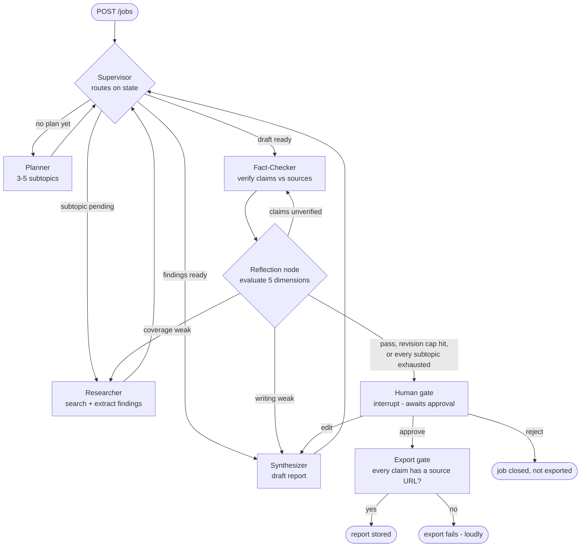

# CLAUDE.md — Multi-Agent Competitive Research Assistant

## What this is

A competitive research system. You give it a question — *"compare TCS and Infosys on cloud
strategy"* — and five agents plan the research, search the web, write a report, and check every
claim against its sources. A human approves the report before it is exported. Every claim in the
exported report traces back to a URL.

> **Status: Phases 1 and 2 are complete.** Phase 1 core on 2026-08-13 and its production-hardening
> pass on 2026-08-15; **Phase 2 on 2026-08-16**. Phase 3 onwards is not built.
>
> **Phase 1** put the graph on its feet locally, end to end, in memory — five agents, the reflection
> node, the tool boundary, the LLM client, in-memory checkpointing, and a test suite that makes no
> network calls.
>
> **The hardening pass is closed. Four changes, each implemented, tested offline, and verified against
> real jobs:**
>
> | Change | Verified by |
> |---|---|
> | [ADR 0002](docs/adr/0002-concurrent-page-extraction-in-the-researcher.md) — concurrent page extraction in the Researcher | A controlled A/B/A on one subtopic (141.9s → 43.7s → 111.1s), then the n=20 run: Researcher share **45.2% → 33.1%** |
> | [ADR 0003](docs/adr/0003-finding-ids-are-a-per-job-sequence.md) — finding ids are a per-job sequence | `measure-04` re-run to `approved`, then **zero `report_cites_unknown_findings` across all 20 jobs** of 2026-08-14 (585 claims over 969 findings) |
> | [ADR 0004](docs/adr/0004-no-op-researcher-retries-after-evidence-exhaustion.md) — reflection does not retry an exhausted subtopic | n=20: 8 re-research decisions naming 12 targets, **0 of them `unresearched`**; substitution fired 4 times |
> | Shared `LLMClient` / `wrap_openai` lifecycle fix | `tests/test_measure_jobs.py` offline, then **0 nested `llm` spans across 590 leaf spans** in the n=20 traces |
>
> **Two n=20 runs against the real endpoint and the real web, both reaching 16 `approved`**: the
> **reference baseline of 2026-08-12/13**, and the **post-hardening run of 2026-08-14**, the same 20
> questions re-run with the four changes above in place. The second **supplements** the first rather
> than replacing it, and the two are never merged into one number. Latency, calls, node shares,
> revisions and cache come from the post-hardening run; its tokens were **recovered from LangSmith**
> (the per-job rows carry none) and published only after a reconciliation that matched 544 successful
> calls to 544 token-bearing spans. Both runs are maintained in `docs/engineering-guidelines.md`
> §13–§14, and both are measurements rather than estimates.
>
> **Phase 2 closed on 2026-08-16**, its seven steps verified against the repository by a completion
> audit rather than declared from a green suite. What it added:
>
> | Capability | Steps · record |
> |---|---|
> | Five application tables — `jobs`, `findings`, `claims`, `claim_sources`, `audit_events` — with an Alembic migration, and a test that fails if the migration and `database/schema.py` ever drift | 13 |
> | The **Postgres checkpointer**, so a job survives a restart and an approval two days later costs only the export | 14 |
> | The audit trail written **while the job runs**, one transaction per node event, keyed so a replayed node converges, loud on failure | 15 · [ADR 0005](docs/adr/0005-graph-time-persistence-semantics.md) |
> | The export gate's durable answer — the approved body in `jobs.report_json`, `exported_at` stamped in the same transaction | 16 |
> | The **reviewer-edit path**: one Synthesizer pass over existing evidence, back to the gate, never research, bounded at 3 edits and refused when the live budget cannot fund it | 17 · [ADR 0006](docs/adr/0006-reviewer-edit-returns-to-the-human-gate.md) |
> | **Five FastAPI routes with API-key authentication** on all but `/health`, two roles, one error envelope, and server-derived idempotency on `POST /jobs` | 18 |
> | **One decision per gate visit** — keyed `(job_id, calls_used)`, a same-decision retry that continues the graph, `409 gate_already_decided` for a different one, and `jobs.status` reconciled from the checkpoint even when a resume dies | 18 · [ADR 0007](docs/adr/0007-reviewer-decision-idempotency-and-gate-resume-failure.md) |
> | The Phase 2 test set — every item on `docs/engineering-guidelines.md` §18's shipping list, still with **no network calls** | 19 |
>
> **Invariant 7 is now satisfied rather than promised:** the gate is authenticated, and every decision
> carries the `user_id` its API key maps to.
>
> **Both durable stores stay injected and optional.** With neither, the graph behaves exactly as Phase
> 1 did — which is what the offline suite and `scripts/measure_jobs.py` still run on.
>
> **Phase 3 onwards is not built:** no worker, no queue, no Redis, no S3, no AWS, no CI, no eval set.
> Four Phase-2-adjacent items are **deliberately deferred and recorded**, not forgotten — the
> real-PostgreSQL integration test (Phase 3, with Compose), gate expiry (Phase 5 sweep), Secrets
> Manager (Phase 5), and a failed job's durable `failure_reason`
> ([ADR 0008](docs/adr/0008-a-failed-jobs-reason-lives-in-the-checkpoint-for-phase-2.md): it lives in
> the checkpoint until Phase 3 gives it a row).
> **Tracing is the one partial exception** — see the stack table below.
>
> **Neither baseline is a production-default benchmark.** Both runs used the NIM development overrides
> in `.env` — `MAX_REVISIONS=3`, `MAX_SUPERVISOR_HOPS=30`, `LLM_MAIN_TIMEOUT_S=180`,
> `MAX_JOB_RUNTIME=1800` — not the defaults in the environment table below, which are unchanged and
> remain the production values. Which of those overrides could have moved a measured number, and which
> could not: `docs/engineering-guidelines.md` §14 "Measurement context". The 2026-08-14 run
> additionally ran through a **local DNS outage that cost three of its twenty jobs**, and both its
> all-jobs p95 and its all-jobs token p50 land on failed jobs — §14 carries every caveat, and the
> approved-only figures next to them. **Cost is derived throughout, never provider spend:** actual NIM
> development spend is $0. The next useful measurement is a **production-default** run at the
> documented defaults, which answers a different question and is not another re-baseline of these two.
>
> Every section below marks what is **built** versus **planned**. If you are reading this and the two
> disagree, the code wins and this file must be corrected — a doc that claims working code is worse
> than no doc.

Global engineering rules live in `~/.claude/CLAUDE.md`. This file holds the facts about *this*
project. Detailed standards live in `docs/engineering-guidelines.md`.

> **Two documents referenced below are not published in this repository.**
> `docs/engineering-guidelines.md` and `docs/interview-prep.md` are gitignored local working
> documents — they carry personal interview-preparation material alongside the engineering
> standards. Every reference to them here resolves on a local checkout and nowhere else, which is
> why they are named in plain text rather than linked.

---

## The five agents

Five agents, each with one job. Reflection is a separate evaluation and routing node in the graph,
covered in the next section.

| Agent | Responsibility | Input | Output schema | Tools | Call budget | On failure |
|---|---|---|---|---|---|---|
| **Supervisor** | Names the next agent from state. The route is computed in code; the LLM proposal is **advisory** ([ADR 0001](docs/adr/0001-supervisor-llm-routing-is-advisory.md)) | `ResearchState` | `SupervisorDecision{next, reason}` | none | 1 per hop, max 24 hops | Advisory failure or disagreement → logged, routing continues on state. `rate_limited` / `budget_exceeded` still fail the job |
| **Planner** | Breaks the question into 3–5 researchable subtopics | question | `ResearchPlan{subtopics[], success_criteria}` | none | 2 (1 + 1 retry) | Empty plan → fail the job; do not research an unplanned question |
| **Researcher** | Searches and extracts findings for one subtopic. Sources are chosen and fetched one at a time; the extraction calls then run concurrently ([ADR 0002](docs/adr/0002-concurrent-page-extraction-in-the-researcher.md)) | one subtopic | `Finding[]{claim, evidence, url, retrieved_at, content_hash}` | web search, page fetch | 3 per subtopic, max 5 subtopics | Zero findings after retries → mark subtopic `unresearched`, continue, report the gap |
| **Synthesizer** | Writes the report from findings only | `Finding[]` | `Report{sections[], claims[], sources[]}` | none | 2 per pass, max 3 passes | Empty `sources` → hard failure, never an unsourced report |
| **Fact-Checker** | Verifies each claim against its cited source text | `Report`, `Finding[]` | `Verdict[]{claim_id, supported, quote, note}` | page fetch (re-fetch only) | 1 batched call per pass (+1 retry) | Unreachable source → `supported=false`, never a guess |

Per-job ceiling: **60 LLM calls** (`MAX_LLM_CALLS_PER_JOB`). Exceeding it fails the job loudly.

**The per-component caps do not sum below 60 — they sum to 79** for the automatic workflow (5
subtopics researched three times over, 24 hops, 3 report-producing passes, no reviewer edits). So
**60 is the binding guard, not headroom above a worst case** — it is the one that catches "everything
else". Measured max was 44 on the 2026-08-13 reference run and **53** on the 2026-08-14
post-hardening run — a call is an attempt, so a retried transport failure spends budget too.

Reviewer edits add 3 calls each and are **not bounded yet**: the planned `MAX_REVIEWER_EDITS` = 3
gives 88, and 91 is only what today's hop margin would permit at 4 edits — an artefact, not a design
target. Full derivation, the three cases, and the correction of the earlier 41/44 figure:
`docs/engineering-guidelines.md` §13.

### What each agent must never do

- The **Supervisor** never routes based on text fetched from the web. It reads state, nothing else —
  and since ADR 0001 the route is `allowed_target(state)` in plain Python, so the LLM has no
  authority over control flow at all.
- The **Researcher** never writes prose for the report. It produces findings.
- The **Synthesizer** never introduces a fact that is not in a finding.
- The **Fact-Checker** never infers. It quotes the source or marks the claim unsupported.

---

## Reflection

**Reflection is an LLM-powered evaluation and routing node, not an independent agent.** It evaluates
the current report against the reflection rubric, identifies failed dimensions, and routes the graph
to the appropriate specialist for a bounded retry.

It has no tools, no persona, and no goal of its own, and it performs no research. It is LangGraph
control flow that happens to use an LLM to score, which is why it is not one of the five agents.

The important design point: **route back by which dimension failed**, not a blind rerun.

| Failing dimension | Route back to |
|---|---|
| Thin or missing coverage | Researcher, for the specific subtopic — unless that subtopic is already `unresearched` ([ADR 0004](docs/adr/0004-no-op-researcher-retries-after-evidence-exhaustion.md)) |
| Weak structure or writing | Synthesizer |
| Unverified or unsupported claims | Fact-Checker |

**A subtopic already marked `unresearched` is not a Researcher target — the retry is aimed at an
eligible subtopic instead.** It would otherwise be re-researched from the same planned query and the
same cached search results, with no unread source to reach. **The route itself usually still fires:**
while one eligible subtopic remains it is the fallback target, so the guard changes *which* subtopic
is retried far more often than *whether* the retry happens. Only when **every** subtopic is
`unresearched` is there no target at all — then reflection acts on the next failing dimension, or
reaches the human gate with `quality_flag="below_threshold"`. Either way the evidence gap travels to
the reviewer, and is never turned into a pass. **This is a revision-budget heuristic, not a proof:**
extraction is a fresh LLM call, so such a retry can still find something — 2 of 6 measured ones did —
and [ADR 0004](docs/adr/0004-no-op-researcher-retries-after-evidence-exhaustion.md) records the trade,
with its 2026-08-15 correction recording how rare the no-target case is: 0 of 20 measured jobs.

It scores five dimensions, 1–5: **Research completeness · Source correctness · Citation coverage ·
Factual consistency · Report quality.** These are the same five dimensions the offline evaluation
uses, deliberately — one vocabulary, used inline as a gate and offline as a measurement.

A **revision** is one automatic improvement cycle triggered by reflection *after* the initial report.
Bounded by `MAX_REVISIONS` (default 2, so two improvement cycles and at most 3 passes). A reviewer
`edit` is not a revision. Hitting the cap is invariant 2 below — a visible outcome, never a silent
pass. A cycle that could not change anything is not started at all, so a job can reach the gate with
cycles unspent — though that needs every subtopic exhausted, and no measured job has hit it. A
Researcher route invalidates the draft, so new findings always re-enter through the Synthesizer.

Full rubric, weights, thresholds, and what exactly happens at the cap:
`docs/engineering-guidelines.md` §6.

---

## Graph shape



Diamonds route; boxes do the work. The Supervisor is both an agent and the main router. The
reflection node is a router only — it evaluates and redirects.

---

## Stack

A row that cannot name the requirement it serves gets deleted.

| Layer | Technology | Why |
|---|---|---|
| LLM | Production LLM API; NVIDIA NIM in development | Reasoning |
| Agent framework | LangGraph | Stateful orchestration with checkpointing |
| Tool protocol | MCP | External research tools behind one interface |
| Web search | Tavily, behind the tool boundary | Returns cleaned page content **and** the URL — the audit trail needs both |
| API | FastAPI | Backend |
| Async jobs | SQS | Research runs for minutes; a request cannot hold the connection |
| Short-term state | Redis / ElastiCache | Cache, URL dedupe, rate limiting |
| Persistent data | PostgreSQL / RDS | Facts and the audit trail |
| Artifacts | S3 | Exported reports |
| Containers | Docker + ECR | Packaging |
| Compute | ECS Fargate | Deployment |
| API entry | API Gateway | Exposure and rate limiting |
| AI observability | LangSmith | Agent and LLM tracing. **Partially built** — see below |
| Infra observability | CloudWatch | AWS logs, metrics, alarms |
| Evaluation | LangSmith Evaluation | Research quality |
| Testing | pytest | Application tests |
| Auth | API keys (Phase 2) → Cognito JWT (Phase 5) | The approval gate is an authorization decision |
| Migrations | Alembic | Tracks which migrations ran, and in what order |
| CI/CD | GitHub Actions | Enforces the eval gate that §15 asks for |

**Built so far:** the LLM row, the agent framework row, the web-search row, the testing row, the
**persistent-data row and the migrations row** (`database/`, steps 13–16, 2026-08-15), the **API row**
and the **auth row** (`routes/`, `app.py`, step 18, 2026-08-16), plus **part of the AI-observability
row**, which is the one entry that is neither fully built nor untouched. PostgreSQL now holds `jobs`,
`findings`, `claims`, `claim_sources`, and `audit_events`, and LangGraph's checkpointer owns its own
tables beside them. **Every remaining row is Phase 3 or later and has no code behind it yet** — async
jobs, short-term state, artifacts, containers, compute, API entry, infra observability, evaluation,
and CI/CD.

**What "partially built" means for tracing, stated precisely, because the two halves ship in different
phases.**

| | Status |
|---|---|
| **Client and graph tracing** | **Built and verified.** `llm_client.py` applies `wrap_openai` when `LANGSMITH_TRACING` is on, LangGraph emits a run tree per job, and `thread_id` carries the job id. `config.py` validates the credentials, and `tests/test_config.py` and `tests/test_measure_jobs.py` cover it offline. The 2026-08-14 reconciliation read 590 leaf spans back out of the project |
| **The standardized metadata contract** | **Not built.** Nothing sets `job_id`, `agent`, `model`, or `revision` under those names — what a query gets is whatever LangGraph and `wrap_openai` happen to record (`docs/engineering-guidelines.md` §14 has the mapping). `revision_count` reaches no run at all |
| **Evaluation and the release gate** | **Not built.** No eval dataset, no calibrated rubric, no CI gate. Phase 4 |

So tracing is **usable for debugging and was load-bearing for the token reconciliation**, and it is
**not** the production observability contract Phase 4 specifies. Do not describe LangSmith as done, and
do not describe it as absent.

**The tool-protocol row is the one to read carefully.** `tools/` is one boundary with one place for
argument validation, timeouts, size limits, and the injection wrapper — which is the property MCP was
chosen for — but it is **in-process. There is no MCP client, no MCP server, and no protocol hop**, and
none is scheduled. Do not describe MCP as integrated (`docs/engineering-guidelines.md` §7).

**Not used:** vector memory (no measurement says it is needed) · DeepEval (deferred; see
`docs/engineering-guidelines.md` §15). Coordination between agents is the Supervisor's job and goes
through `ResearchState` — agents never message each other directly, so no inter-agent protocol is
needed.

---

## Model configuration

One OpenAI-compatible client. **No provider classes, no provider abstraction.** NVIDIA NIM is
OpenAI-compatible at `https://integrate.api.nvidia.com/v1` with tool calling and JSON mode, so the
same client covers development and production.

| Variable | Purpose |
|---|---|
| `LLM_BASE_URL` | Endpoint. NIM in development, the production API in production |
| `LLM_MODEL` | Main model — planning, research extraction, writing, fact-checking |
| `LLM_FAST_MODEL` | Cheap model — Supervisor routing and reflection scoring only |
| `LLM_API_KEY` | Credential for whichever endpoint is configured |

> **Swapping a model is a config change plus a preflight plus an eval run — never a code change.**

**Development rate limit:** the NIM free tier allows roughly **40 requests per minute**, with
per-model ceilings NVIDIA does not publish. One report plausibly fires 40–80 calls. So a shared rate
limiter, batched fact-checking, a per-job call budget, and 429 backoff are load-bearing
requirements, not polish. Details in `docs/engineering-guidelines.md` §13.

**A job now holds more than one request open.** Since
[ADR 0002](docs/adr/0002-concurrent-page-extraction-in-the-researcher.md) a subtopic's page
extractions run concurrently, so a job can have up to `RESEARCHER_CONCURRENCY` (3) requests in
flight. Everything else stays sequential — nodes run one at a time, one subtopic per Researcher
visit, one job at a time. **The shared rate limiter does not exist yet** (it arrives with Redis in
Phase 3), so that setting is currently the only bound on in-job concurrency, and two concurrent jobs
against the development tier is the combination to avoid.

---

## Repository layout

Flat. No directory exists to hold one small file. A directory arrives with the phase that needs it.

```text
config.py        env vars → one validated Config. Built
schemas.py       every boundary type: plan, finding, report, verdict, score, tool results. Built
llm_client.py    the one OpenAI-compatible client — structured output, retries, 429, call budget,
                 and `wrap_openai` for LangSmith when tracing is on. Built
agents/          one module per agent — supervisor, planner, researcher, synthesizer, fact_checker. Built
graph/           state.py, reflection.py, build.py — the nine nodes and the checkpointer. Built
tools/           search (Tavily), fetch, argument validation, the untrusted-content wrapper,
                 the failure vocabulary and cache interfaces. Built — in-process, not MCP
scripts/         check_model.py the preflight; measure_jobs.py the real-job measurement
                 harness. Both built
tests/           pytest suite, plus harness.py — FakeLLM and the recorded web. Built
docs/            ARCHITECTURE.md, adr/. Built. engineering-guidelines.md and interview-prep.md
                 exist locally but are gitignored — not published in this repository

database/        schema.py the five tables, queries.py the statements, migrations/ Alembic.
                 Built (steps 13-16). The checkpointer is in graph/build.py, next to the
                 in-memory one it replaces
app.py           the API entrypoint - `uvicorn app:app`. Built (step 18)
routes/          api.py the five endpoints, auth.py the API keys and the two roles.
                 Built (step 18)
eval/            dataset, evaluators, run script — Phase 4
observability/   LangSmith tracing setup, structured logging — Phase 4
.github/         workflows — lint, types, tests, image build, conditional eval gate — Phase 3
```

---

## Commands

These run today.

```bash
pytest
```

```bash
python scripts/check_model.py
```

```bash
python scripts/measure_jobs.py --summary
```

```bash
ruff check . && ruff format --check . && mypy --strict .
```

```bash
alembic upgrade head
```

`pytest` is the whole suite, and it makes **no network calls** — the LLM, Tavily, and DNS are all
replaced by the test harness, so it needs no credentials and no running service. **That includes the
database tests:** they run the real migration and the real statements against a temporary SQLite file,
which proves the columns, keys, foreign keys, CHECK constraints, and indexes, and proves nothing
PostgreSQL-specific. Verifying those needs a PostgreSQL, which Compose provides in Phase 3.

`alembic upgrade head` applies the migrations in `database/migrations/`. It reads `DATABASE_URL` — the
ordinary libpq string, `postgresql://user:pw@host/db` — and nothing else, so a migration does not need
an LLM key. In deployment it runs as its own task and must exit 0 **before** the new service revision
starts (`docs/engineering-guidelines.md` §19).

`check_model.py` is the preflight: it confirms the configured endpoint answers, supports tool
calling and JSON mode, and reports the observed rate limit. It needs real `LLM_*` credentials. Run it
after any model change.

`measure_jobs.py` runs real jobs against the real endpoint and the real web, and is the only thing
here that does. `--summary` rebuilds the published baseline from `measurements/jobs.jsonl` and makes
no network calls. Jobs run one at a time — two concurrent jobs saturate the 40 RPM development tier
(`docs/engineering-guidelines.md` §13) — and each result is written the moment its job ends, so the
run is resumable and a failure is kept as data. **Per-request detail is in LangSmith, not in a file
here** — the `measurements/requests.jsonl` sink and the `CallRecord` machinery behind it were removed
once LangSmith became the LLM observability mechanism, so `prompt_tokens` and `completion_tokens` are
no longer recorded in a row. `measurements/` is gitignored: the rows carry fetched third-party page
text and report bodies, and only the summary table is published.

The lint, format, and type commands are what CI will run once CI exists in Phase 3.

```bash
uvicorn app:app --reload
```

`uvicorn app:app` serves the five routes in `routes/api.py`. It needs `DATABASE_URL`, `AUTH_KEYS`, and
the `LLM_*` credentials, because the API resumes the graph at the gate itself until the Phase 3 worker
takes that over. **No job runs on its own yet:** `POST /jobs` records the job, and nothing dequeues it
until Phase 3.

These do **not** run yet — there is no worker, no compose file, and no eval set:

```text
docker compose up -d        # Phase 3
python -m worker            # Phase 3
python -m eval.run          # Phase 4
```

---

## Environment variables

| Variable | Purpose | Default |
|---|---|---|
| `LLM_BASE_URL` | LLM endpoint | *(required)* |
| `LLM_MODEL` | Main model id | *(required)* |
| `LLM_FAST_MODEL` | Routing and scoring model id | falls back to `LLM_MODEL` |
| `LLM_API_KEY` | LLM credential | *(required)* |
| `LLM_RPM_LIMIT` | Shared client-side rate limit | `40` |
| `LLM_MAIN_TIMEOUT_S` | Request timeout for **every** main-tier caller — Planner, Researcher extraction, Synthesizer, Fact-Checker. There is no per-agent timeout. Raise only where the endpoint is slow — NIM development uses `180` | `60` |
| `TAVILY_API_KEY` | Web search credential | *(required)* |
| `DATABASE_URL` | PostgreSQL connection string | *(required from Phase 2)* |
| `REDIS_URL` | Redis connection string | `redis://localhost:6379/0` |
| `SQS_QUEUE_URL` | Job queue | *(required from Phase 3)* |
| `S3_BUCKET` | Exported report storage | *(required from Phase 3)* |
| `AWS_REGION` | AWS region | `ap-south-1` |
| `LANGSMITH_TRACING` | Enable tracing | `false` |
| `LANGSMITH_API_KEY` | LangSmith credential | *(required when tracing)* |
| `LANGSMITH_PROJECT` | Trace project name | `competitive-research` |
| `MAX_REVISIONS` | Reflection loop retry cap | `2` |
| `MAX_SUPERVISOR_HOPS` | Routing loop guard. 20 is the automatic workflow's derived maximum; a reviewer edit legitimately costs +1 hop, so the bound of 3 edits accepted in [ADR 0006](docs/adr/0006-reviewer-edit-returns-to-the-human-gate.md) puts the ceiling at 23. **24 stays**, as the ceiling plus one | `24` |
| `MAX_LLM_CALLS_PER_JOB` | Per-job call budget | `60` |
| `MAX_REVIEWER_EDITS` | How many times a reviewer may send one job back for an edit ([ADR 0006](docs/adr/0006-reviewer-edit-returns-to-the-human-gate.md)). Each edit costs 3 calls and 1 hop. Enforced at `POST /jobs/{id}/approve` **before the graph is resumed**, so a refused edit spends nothing; counted from the audit trail, so a retried decision cannot spend one ([ADR 0007](docs/adr/0007-reviewer-decision-idempotency-and-gate-resume-failure.md)) | `3` |
| `MAX_JOB_RUNTIME` | Whole-job runtime bound, seconds. **Configured only — nothing enforces it until the Phase 3 worker** | `1200` |
| `REFLECTION_PASS_THRESHOLD` | Weighted score needed to pass | `3.5` |
| `MAX_FETCH_BYTES` | Response cap on a page fetch | `2097152` (2 MB) |
| `MAX_PAGE_CHARS` | Cleaned text kept per page, ≈6k tokens | `24000` |
| `RESEARCHER_CONCURRENCY` | How many of one subtopic's page extractions run at once ([ADR 0002](docs/adr/0002-concurrent-page-extraction-in-the-researcher.md)). Refused outside 1–3 at startup. `1` restores sequential extraction | `3` |
| `AUTH_KEYS_SECRET_ID` | Secrets Manager id holding hashed API keys and their roles. **Read from Phase 5**; the same payload comes from `AUTH_KEYS` before then | *(required from Phase 5)* |
| `AUTH_KEYS` | The hashed API keys themselves, as JSON: `{"<sha256 of the key>": {"user_id", "role"}}`. Secrets are environment variables locally and Secrets Manager in AWS (`docs/engineering-guidelines.md` §16) | *(required from Phase 2)* |
| `RETENTION_DAYS` | How long jobs, findings, and audit rows are kept | `365` |
| `APP_ENV` | `local` \| `dev` \| `prod` | `local` |
| `LOG_LEVEL` | Log verbosity | `INFO` |

---

## Project invariants

These are the non-negotiables. If a change breaks one, the change is wrong.

1. **Every claim in an exported report traces to at least one source URL, or export fails.** Not a
   warning. The export does not happen.
2. **Revisions are bounded by `MAX_REVISIONS`.** Hitting the cap is a visible outcome carried in the
   response, never a silent pass.
3. **Every job has an LLM call budget.** Exceeding `MAX_LLM_CALLS_PER_JOB` fails the job.
4. **Fetched web content is untrusted data.** It may never reach a tool argument, and it may never
   reach the Supervisor — the Supervisor reads state, not page text. The reflection node is the one
   component that unavoidably reads report text derived from fetched pages, because scoring a report
   means reading it. Its exposure is **bounded and tested rather than eliminated**
   (`docs/engineering-guidelines.md` §8).
5. **`ResearchState` is the contract between agents.** Agents communicate through state, never by
   calling each other directly.
6. **No export before the human gate.** The gate is the backstop for everything the automated checks
   miss.
7. **The gate is authenticated, and every decision records who made it.** An approval with no
   identity behind it is not a backstop — it is a formality (`docs/engineering-guidelines.md` §16).
8. **There are exactly five agents, and reflection is not one of them.** It stays an LLM-powered
   evaluation and routing node: no tools, no research, no goal of its own. Giving it any of those
   changes the architecture, so it needs an ADR before it needs code
   (`docs/engineering-guidelines.md` §6).

---

## Phase plan

| Phase | Scope | Status |
|---|---|---|
| 0 | Documentation — this file, engineering guidelines, architecture | **Done** |
| 1 | Local graph: 5 agents + the reflection node, tool boundary, LLM client, in-memory state, no persistence | **Done.** Core on **2026-08-13** — twelve steps, plus the human-gate and export nodes, the test suite, and the 20-job reference baseline. **Production-hardening pass on 2026-08-15** — ADR 0002, ADR 0003, ADR 0004, the shared-`LLMClient` fix, the post-hardening n=20 run of 2026-08-14, and the LangSmith token reconciliation. Both are in the status block above |
| 2 | Postgres checkpointer, Alembic migrations, audit tables, the gate's **API side** — `POST /jobs/{id}/approve`, the reviewer payload, expiry — FastAPI routes, **API-key auth on every route except `/health`** | **Done, 2026-08-16.** Steps 13–16 on **2026-08-15** ([ADR 0005](docs/adr/0005-graph-time-persistence-semantics.md)); steps 17–19 on **2026-08-16** — the reviewer-edit path ([ADR 0006](docs/adr/0006-reviewer-edit-returns-to-the-human-gate.md)), the five routes with API-key auth, gate-decision idempotency ([ADR 0007](docs/adr/0007-reviewer-decision-idempotency-and-gate-resume-failure.md)), and the §18 test set. Closed by a completion audit against the repository, which found and fixed two blockers: reviewer-text edge cleaning (ADR 0006 decision 8) and the undecided `failure_reason` ([ADR 0008](docs/adr/0008-a-failed-jobs-reason-lives-in-the-checkpoint-for-phase-2.md)). **Gate expiry is the one listed item deliberately not built** — it waits for the Phase 5 sweep |
| 3 | Docker Compose (Postgres 16, Redis 7, LocalStack for SQS + S3), async worker, **CI: lint, types, tests, image build** | Planned |
| 4 | LangSmith tracing, eval dataset of 30–50 questions, eval as a release gate | Planned |
| 5 | AWS: ECS Fargate, RDS, ElastiCache, real SQS + S3, API Gateway, CloudWatch alarms, **Cognito JWT** | Planned |

**Single tenant** for now. Every table still carries `user_id`, so tenant scoping is a later additive
change rather than a migration. The **human gate is API-only** in Phase 2 —
`POST /jobs/{id}/approve`, no web UI.

**What Phase 2 added to the gate, and what it still does not do.** Phase 1 built the graph node that
pauses for a reviewer: `interrupt()` holds the job, and a resume decision routes approve → export,
reject → finalize, edit → one Synthesizer pass. Phase 2 built everything around it — the authenticated
endpoint, the identity on every decision, the durable checkpoint that lets a job survive a restart, the
audit rows, and one decision per gate visit. **`invariant 7` is satisfied by the code now, not by a
plan.** What the gate still does not have is expiry: a job can wait at it indefinitely, because the
7-day sweep is Phase 5's (step 32).

**Known gaps carried forward, so they are not rediscovered as bugs:**

- **Nothing runs a job on its own yet.** `POST /jobs` writes the row and returns `202`; the queue and
  the worker that would pick it up are Phase 3 (step 20). Until then a job is started by whatever
  process holds the graph, and the API resumes it at the gate in-process rather than enqueuing a
  resume message as `docs/ARCHITECTURE.md` §12 describes.
- **The reflection rubric is uncalibrated.** Until the hand-scoring pass in Phase 4 runs, the pass
  threshold is a reasonable heuristic, not a measured one.
- **Traces recorded before 2026-08-14 carry inflated token totals.** `scripts/measure_jobs.py` built
  one `OpenAI` client and a new `LLMClient` per job, and `LLMClient.__init__` applies `wrap_openai` to
  whatever client it is handed. That wrapper patches in place with no idempotency guard, so job *N*
  ran under *N* layers and emitted *N* nested spans per request, the outermost reporting a running
  total — job 3 of a 6-job run traced 1,597,176 prompt tokens against a real 266,196. **Behaviour was
  never affected:** httpx logged one POST per counted call, so no extra spend, rate pressure, or
  retries. **Fixed on 2026-08-14** — the harness now builds one `LLMClient` in `main()` and shares it,
  which `tests/test_measure_jobs.py` pins, and the n=20 traces then showed **0 nested `llm` spans
  across 590 leaf spans**. The old traces still have to be read off their leaf spans.
- **Some published evidence exists only as LangSmith traces, and nothing in this repository can
  reproduce it.** Two sets: the **2026-08-14 token and derived-cost figures** — `measurements/jobs.jsonl`
  carries `null` in both token columns, so §13–§14's token rows were recovered from the traces — and
  the **`smoke-e2e-*` cases** behind `docs/ARCHITECTURE.md` §22 items 5 and 6, which were driven
  interactively and wrote no measurement row or log line at all. Both were confirmed present on
  2026-08-15. **If those traces age out of the LangSmith project, the figures become unverifiable from
  the repo alone** — the retention window that applies has not been checked, so treat the risk as real
  and undated. The durable fix is to capture what still matters into the Phase 4 eval set rather than
  to keep citing traces; until then, re-run the question rather than reconstructing a number from prose.

**Future enhancement: adaptive Researcher query rewriting after evidence exhaustion.**

[ADR 0004](docs/adr/0004-no-op-researcher-retries-after-evidence-exhaustion.md) stops reflection
retrying a subtopic that produced nothing, because the retry re-issues the same planned query against
the same cached results with no unread source to reach. That spends the revision budget better; it
does not fill the evidence gap, which is reported to the reviewer instead. A future change might have the
Researcher generate a **bounded** alternative query, search again, and judge whether the new evidence
is genuinely better.

**Not implemented in the current production-hardening change.** The open questions — how the rewrite
is generated, how many are allowed, how different one has to be, whether it bypasses the search cache,
what the extra search costs, how "better evidence" is judged against an uncalibrated rubric, and above
all the injection risk if fetched page text could influence a search query (invariant 4) — are written
out in `docs/ARCHITECTURE.md` §22 item 4 and in ADR 0004's own future-work section.

---

## Where to look next

| Question | File |
|---|---|
| What is actually built right now? | `docs/ARCHITECTURE.md` §1 "Built vs planned", and §22 of the guidelines |
| How does an agent's contract work in detail? | `docs/engineering-guidelines.md` §2 |
| How is state designed and persisted? | `docs/engineering-guidelines.md` §4 |
| How do we defend against prompt injection, and what is the honest claim? | `docs/engineering-guidelines.md` §8 |
| How is the system tested, and what is the FakeLLM? | `docs/engineering-guidelines.md` §18 |
| What are the API endpoints and their contracts? | `docs/engineering-guidelines.md` §12 |
| Who is allowed to call what, and who may approve? | `docs/engineering-guidelines.md` §16 |
| How is research quality measured? | `docs/engineering-guidelines.md` §15 — planned |
| How does a change get built, migrated, deployed, or rolled back? | `docs/engineering-guidelines.md` §19 — planned |
| Why was a decision made this way? | `docs/ARCHITECTURE.md` §20 for decisions settled before implementation; `docs/adr/` for the ones taken since |
| How do I explain this project out loud? | `docs/interview-prep.md` |

ADRs follow the format `docs/adr/NNNN-kebab-case-title.md` with a `README.md` index.
