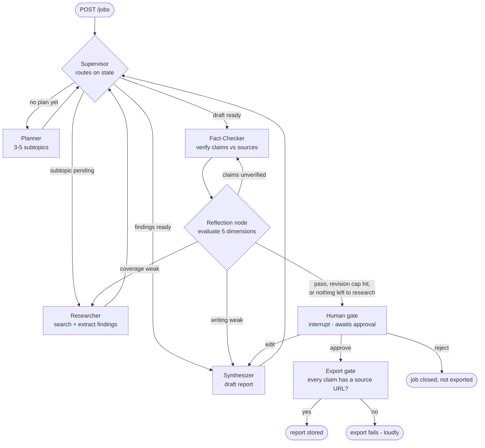

# CLAUDE.md — Multi-Agent Competitive Research Assistant

## What this is

A competitive research system. You give it a question — *"compare TCS and Infosys on cloud
strategy"* — and five agents plan the research, search the web, write a report, and check every
claim against its sources. A human approves the report before it is exported. Every claim in the
exported report traces back to a URL.

> **Status: Phase 1 is complete, and measured.** The graph runs locally, end to end, in memory — five
> agents, the reflection node, the tool boundary, the LLM client, in-memory checkpointing, and a test
> suite that makes no network calls. **20 real jobs ran against the real endpoint and the real web on
> 2026-08-12/13; 16 reached `approved`**, and the latency, token, call, and cost baselines in
> `docs/engineering-guidelines.md` §13–§14 are measurements rather than estimates.
> **Phase 2 onwards is not built:** no API, no database, no worker, no Redis, no S3, no AWS, no
> tracing, no eval set.
>
> **That baseline is not a production-default benchmark.** Those 20 jobs ran under the NIM
> development overrides in `.env` — `MAX_REVISIONS=3`, `MAX_SUPERVISOR_HOPS=30`,
> `LLM_MAIN_TIMEOUT_S=180`, `MAX_JOB_RUNTIME=1800` — not under the defaults in the environment table
> below, which are unchanged and remain the production values. Which of those overrides could have
> moved a measured number, and which could not: `docs/engineering-guidelines.md` §14 "Measurement
> context".
>
> Every section below marks what is **built** versus **planned**. If you are reading this and the two
> disagree, the code wins and this file must be corrected — a doc that claims working code is worse
> than no doc.

Global engineering rules live in `~/.claude/CLAUDE.md`. This file holds the facts about *this*
project. Detailed standards live in `docs/engineering-guidelines.md`.

> **Two documents referenced below are not published in this repository.**
> `docs/engineering-guidelines.md` and `docs/interview-prep.md` are gitignored local working
> documents — they carry personal interview-preparation material alongside the engineering
> standards. Every reference to them here resolves on a local checkout and nowhere else, which is
> why they are named in plain text rather than linked.

---

## The five agents

Five agents, each with one job. Reflection is a separate evaluation and routing node in the graph,
covered in the next section.

| Agent | Responsibility | Input | Output schema | Tools | Call budget | On failure |
|---|---|---|---|---|---|---|
| **Supervisor** | Names the next agent from state. The route is computed in code; the LLM proposal is **advisory** ([ADR 0001](docs/adr/0001-supervisor-llm-routing-is-advisory.md)) | `ResearchState` | `SupervisorDecision{next, reason}` | none | 1 per hop, max 24 hops | Advisory failure or disagreement → logged, routing continues on state. `rate_limited` / `budget_exceeded` still fail the job |
| **Planner** | Breaks the question into 3–5 researchable subtopics | question | `ResearchPlan{subtopics[], success_criteria}` | none | 2 (1 + 1 retry) | Empty plan → fail the job; do not research an unplanned question |
| **Researcher** | Searches and extracts findings for one subtopic. Sources are chosen and fetched one at a time; the extraction calls then run concurrently ([ADR 0002](docs/adr/0002-concurrent-page-extraction-in-the-researcher.md)) | one subtopic | `Finding[]{claim, evidence, url, retrieved_at, content_hash}` | web search, page fetch | 3 per subtopic, max 5 subtopics | Zero findings after retries → mark subtopic `unresearched`, continue, report the gap |
| **Synthesizer** | Writes the report from findings only | `Finding[]` | `Report{sections[], claims[], sources[]}` | none | 2 per pass, max 3 passes | Empty `sources` → hard failure, never an unsourced report |
| **Fact-Checker** | Verifies each claim against its cited source text | `Report`, `Finding[]` | `Verdict[]{claim_id, supported, quote, note}` | page fetch (re-fetch only) | 1 batched call per pass (+1 retry) | Unreachable source → `supported=false`, never a guess |

Per-job ceiling: **60 LLM calls** (`MAX_LLM_CALLS_PER_JOB`). Exceeding it fails the job loudly.

**The per-component caps do not sum below 60 — they sum to 79** for the automatic workflow (5
subtopics researched three times over, 24 hops, 3 report-producing passes, no reviewer edits). So
**60 is the binding guard, not headroom above a worst case** — it is the one that catches "everything
else". Measured max over 20 real jobs was 44.

Reviewer edits add 3 calls each and are **not bounded yet**: the planned `MAX_REVIEWER_EDITS` = 3
gives 88, and 91 is only what today's hop margin would permit at 4 edits — an artefact, not a design
target. Full derivation, the three cases, and the correction of the earlier 41/44 figure:
`docs/engineering-guidelines.md` §13.

### What each agent must never do

- The **Supervisor** never routes based on text fetched from the web. It reads state, nothing else —
  and since ADR 0001 the route is `allowed_target(state)` in plain Python, so the LLM has no
  authority over control flow at all.
- The **Researcher** never writes prose for the report. It produces findings.
- The **Synthesizer** never introduces a fact that is not in a finding.
- The **Fact-Checker** never infers. It quotes the source or marks the claim unsupported.

---

## Reflection

**Reflection is an LLM-powered evaluation and routing node, not an independent agent.** It evaluates
the current report against the reflection rubric, identifies failed dimensions, and routes the graph
to the appropriate specialist for a bounded retry.

It has no tools, no persona, and no goal of its own, and it performs no research. It is LangGraph
control flow that happens to use an LLM to score, which is why it is not one of the five agents.

The important design point: **route back by which dimension failed**, not a blind rerun.

| Failing dimension | Route back to |
|---|---|
| Thin or missing coverage | Researcher, for the specific subtopic — unless that subtopic is already `unresearched` ([ADR 0004](docs/adr/0004-no-op-researcher-retries-after-evidence-exhaustion.md)) |
| Weak structure or writing | Synthesizer |
| Unverified or unsupported claims | Fact-Checker |

**A Researcher route is only taken when some subtopic still has a source left to read.** A subtopic
that already produced nothing would be re-researched from the same planned query and the same cached
search results, with no unread source to reach, so it is not a target. With no target left, reflection
acts on the next failing dimension, or reaches the human gate with `quality_flag="below_threshold"` —
the evidence gap travels to the reviewer, and is never turned into a pass. **This is a revision-budget
heuristic, not a proof:** extraction is a fresh LLM call, so such a retry can still find something —
2 of 6 measured ones did — and [ADR 0004](docs/adr/0004-no-op-researcher-retries-after-evidence-exhaustion.md)
records the trade.

It scores five dimensions, 1–5: **Research completeness · Source correctness · Citation coverage ·
Factual consistency · Report quality.** These are the same five dimensions the offline evaluation
uses, deliberately — one vocabulary, used inline as a gate and offline as a measurement.

A **revision** is one automatic improvement cycle triggered by reflection *after* the initial report.
Bounded by `MAX_REVISIONS` (default 2, so two improvement cycles and at most 3 passes). A reviewer
`edit` is not a revision. Hitting the cap is invariant 2 below — a visible outcome, never a silent
pass. A cycle that could not change anything is not started at all, so a job can reach the gate with
cycles unspent. A Researcher route invalidates the draft, so new findings always re-enter through the
Synthesizer.

Full rubric, weights, thresholds, and what exactly happens at the cap:
`docs/engineering-guidelines.md` §6.

---

## Graph shape



Diamonds route; boxes do the work. The Supervisor is both an agent and the main router. The
reflection node is a router only — it evaluates and redirects.

---

## Stack

A row that cannot name the requirement it serves gets deleted.

| Layer | Technology | Why |
|---|---|---|
| LLM | Production LLM API; NVIDIA NIM in development | Reasoning |
| Agent framework | LangGraph | Stateful orchestration with checkpointing |
| Tool protocol | MCP | External research tools behind one interface |
| Web search | Tavily, behind the tool boundary | Returns cleaned page content **and** the URL — the audit trail needs both |
| API | FastAPI | Backend |
| Async jobs | SQS | Research runs for minutes; a request cannot hold the connection |
| Short-term state | Redis / ElastiCache | Cache, URL dedupe, rate limiting |
| Persistent data | PostgreSQL / RDS | Facts and the audit trail |
| Artifacts | S3 | Exported reports |
| Containers | Docker + ECR | Packaging |
| Compute | ECS Fargate | Deployment |
| API entry | API Gateway | Exposure and rate limiting |
| AI observability | LangSmith | Agent and LLM tracing |
| Infra observability | CloudWatch | AWS logs, metrics, alarms |
| Evaluation | LangSmith Evaluation | Research quality |
| Testing | pytest | Application tests |
| Auth | API keys (Phase 2) → Cognito JWT (Phase 5) | The approval gate is an authorization decision |
| Migrations | Alembic | Tracks which migrations ran, and in what order |
| CI/CD | GitHub Actions | Enforces the eval gate that §15 asks for |

**Built so far:** the LLM row, the agent framework row, the web-search row, and the testing row.
Everything else in the table is Phase 2 or later and has no code behind it yet.

**The tool-protocol row is the one to read carefully.** `tools/` is one boundary with one place for
argument validation, timeouts, size limits, and the injection wrapper — which is the property MCP was
chosen for — but it is **in-process. There is no MCP client, no MCP server, and no protocol hop**, and
none is scheduled. Do not describe MCP as integrated (`docs/engineering-guidelines.md` §7).

**Not used:** vector memory (no measurement says it is needed) · DeepEval (deferred; see
`docs/engineering-guidelines.md` §15). Coordination between agents is the Supervisor's job and goes
through `ResearchState` — agents never message each other directly, so no inter-agent protocol is
needed.

---

## Model configuration

One OpenAI-compatible client. **No provider classes, no provider abstraction.** NVIDIA NIM is
OpenAI-compatible at `https://integrate.api.nvidia.com/v1` with tool calling and JSON mode, so the
same client covers development and production.

| Variable | Purpose |
|---|---|
| `LLM_BASE_URL` | Endpoint. NIM in development, the production API in production |
| `LLM_MODEL` | Main model — planning, research extraction, writing, fact-checking |
| `LLM_FAST_MODEL` | Cheap model — Supervisor routing and reflection scoring only |
| `LLM_API_KEY` | Credential for whichever endpoint is configured |

> **Swapping a model is a config change plus a preflight plus an eval run — never a code change.**

**Development rate limit:** the NIM free tier allows roughly **40 requests per minute**, with
per-model ceilings NVIDIA does not publish. One report plausibly fires 40–80 calls. So a shared rate
limiter, batched fact-checking, a per-job call budget, and 429 backoff are load-bearing
requirements, not polish. Details in `docs/engineering-guidelines.md` §13.

**A job now holds more than one request open.** Since
[ADR 0002](docs/adr/0002-concurrent-page-extraction-in-the-researcher.md) a subtopic's page
extractions run concurrently, so a job can have up to `RESEARCHER_CONCURRENCY` (3) requests in
flight. Everything else stays sequential — nodes run one at a time, one subtopic per Researcher
visit, one job at a time. **The shared rate limiter does not exist yet** (it arrives with Redis in
Phase 3), so that setting is currently the only bound on in-job concurrency, and two concurrent jobs
against the development tier is the combination to avoid.

---

## Repository layout

Flat. No directory exists to hold one small file. A directory arrives with the phase that needs it.

```text
config.py        env vars → one validated Config. Built
schemas.py       every boundary type: plan, finding, report, verdict, score, tool results. Built
llm_client.py    the one OpenAI-compatible client — structured output, retries, 429, call budget,
                 and `wrap_openai` for LangSmith when tracing is on. Built
agents/          one module per agent — supervisor, planner, researcher, synthesizer, fact_checker. Built
graph/           state.py, reflection.py, build.py — the nine nodes and the checkpointer. Built
tools/           search (Tavily), fetch, argument validation, the untrusted-content wrapper,
                 the failure vocabulary and cache interfaces. Built — in-process, not MCP
scripts/         check_model.py the preflight; measure_jobs.py the real-job measurement
                 harness. Both built
tests/           pytest suite, plus harness.py — FakeLLM and the recorded web. Built
docs/            ARCHITECTURE.md, adr/. Built. engineering-guidelines.md and interview-prep.md
                 exist locally but are gitignored — not published in this repository

database/        schema, Alembic migrations, queries for jobs / findings / claims / audit — Phase 2
routes/          FastAPI endpoints — submit job, poll status, approve, fetch report, health — Phase 2
eval/            dataset, evaluators, run script — Phase 4
observability/   LangSmith tracing setup, structured logging — Phase 4
.github/         workflows — lint, types, tests, image build, conditional eval gate — Phase 3
```

---

## Commands

These run today.

```bash
pytest
```

```bash
python scripts/check_model.py
```

```bash
python scripts/measure_jobs.py --summary
```

```bash
ruff check . && ruff format --check . && mypy --strict .
```

`pytest` is the whole suite, and it makes **no network calls** — the LLM, Tavily, and DNS are all
replaced by the test harness, so it needs no credentials and no running service.

`check_model.py` is the preflight: it confirms the configured endpoint answers, supports tool
calling and JSON mode, and reports the observed rate limit. It needs real `LLM_*` credentials. Run it
after any model change.

`measure_jobs.py` runs real jobs against the real endpoint and the real web, and is the only thing
here that does. `--summary` rebuilds the published baseline from `measurements/jobs.jsonl` and makes
no network calls. Jobs run one at a time — two concurrent jobs saturate the 40 RPM development tier
(`docs/engineering-guidelines.md` §13) — and each result is written the moment its job ends, so the
run is resumable and a failure is kept as data. **Per-request detail is in LangSmith, not in a file
here** — the `measurements/requests.jsonl` sink and the `CallRecord` machinery behind it were removed
once LangSmith became the LLM observability mechanism, so `prompt_tokens` and `completion_tokens` are
no longer recorded in a row. `measurements/` is gitignored: the rows carry fetched third-party page
text and report bodies, and only the summary table is published.

The lint, format, and type commands are what CI will run once CI exists in Phase 3.

These do **not** run yet — there is no app, no worker, no compose file, and no eval set:

```text
uvicorn app:app --reload    # Phase 2
docker compose up -d        # Phase 3
python -m worker            # Phase 3
python -m eval.run          # Phase 4
```

---

## Environment variables

| Variable | Purpose | Default |
|---|---|---|
| `LLM_BASE_URL` | LLM endpoint | *(required)* |
| `LLM_MODEL` | Main model id | *(required)* |
| `LLM_FAST_MODEL` | Routing and scoring model id | falls back to `LLM_MODEL` |
| `LLM_API_KEY` | LLM credential | *(required)* |
| `LLM_RPM_LIMIT` | Shared client-side rate limit | `40` |
| `LLM_MAIN_TIMEOUT_S` | Request timeout for **every** main-tier caller — Planner, Researcher extraction, Synthesizer, Fact-Checker. There is no per-agent timeout. Raise only where the endpoint is slow — NIM development uses `180` | `60` |
| `TAVILY_API_KEY` | Web search credential | *(required)* |
| `DATABASE_URL` | PostgreSQL connection string | *(required from Phase 2)* |
| `REDIS_URL` | Redis connection string | `redis://localhost:6379/0` |
| `SQS_QUEUE_URL` | Job queue | *(required from Phase 3)* |
| `S3_BUCKET` | Exported report storage | *(required from Phase 3)* |
| `AWS_REGION` | AWS region | `ap-south-1` |
| `LANGSMITH_TRACING` | Enable tracing | `false` |
| `LANGSMITH_API_KEY` | LangSmith credential | *(required when tracing)* |
| `LANGSMITH_PROJECT` | Trace project name | `competitive-research` |
| `MAX_REVISIONS` | Reflection loop retry cap | `2` |
| `MAX_SUPERVISOR_HOPS` | Routing loop guard. 20 is the derived legitimate maximum; +4 is temporary margin for the unbounded reviewer-edit path | `24` |
| `MAX_LLM_CALLS_PER_JOB` | Per-job call budget | `60` |
| `MAX_JOB_RUNTIME` | Whole-job runtime bound, seconds. **Configured only — nothing enforces it until the Phase 3 worker** | `1200` |
| `REFLECTION_PASS_THRESHOLD` | Weighted score needed to pass | `3.5` |
| `MAX_FETCH_BYTES` | Response cap on a page fetch | `2097152` (2 MB) |
| `MAX_PAGE_CHARS` | Cleaned text kept per page, ≈6k tokens | `24000` |
| `RESEARCHER_CONCURRENCY` | How many of one subtopic's page extractions run at once ([ADR 0002](docs/adr/0002-concurrent-page-extraction-in-the-researcher.md)). Refused outside 1–3 at startup. `1` restores sequential extraction | `3` |
| `AUTH_KEYS_SECRET_ID` | Secrets Manager id holding hashed API keys and their roles | *(required from Phase 2)* |
| `RETENTION_DAYS` | How long jobs, findings, and audit rows are kept | `365` |
| `APP_ENV` | `local` \| `dev` \| `prod` | `local` |
| `LOG_LEVEL` | Log verbosity | `INFO` |

---

## Project invariants

These are the non-negotiables. If a change breaks one, the change is wrong.

1. **Every claim in an exported report traces to at least one source URL, or export fails.** Not a
   warning. The export does not happen.
2. **Revisions are bounded by `MAX_REVISIONS`.** Hitting the cap is a visible outcome carried in the
   response, never a silent pass.
3. **Every job has an LLM call budget.** Exceeding `MAX_LLM_CALLS_PER_JOB` fails the job.
4. **Fetched web content is untrusted data.** It may never reach a tool argument, and it may never
   reach the Supervisor — the Supervisor reads state, not page text. The reflection node is the one
   component that unavoidably reads report text derived from fetched pages, because scoring a report
   means reading it. Its exposure is **bounded and tested rather than eliminated**
   (`docs/engineering-guidelines.md` §8).
5. **`ResearchState` is the contract between agents.** Agents communicate through state, never by
   calling each other directly.
6. **No export before the human gate.** The gate is the backstop for everything the automated checks
   miss.
7. **The gate is authenticated, and every decision records who made it.** An approval with no
   identity behind it is not a backstop — it is a formality (`docs/engineering-guidelines.md` §16).
8. **There are exactly five agents, and reflection is not one of them.** It stays an LLM-powered
   evaluation and routing node: no tools, no research, no goal of its own. Giving it any of those
   changes the architecture, so it needs an ADR before it needs code
   (`docs/engineering-guidelines.md` §6).

---

## Phase plan

| Phase | Scope | Status |
|---|---|---|
| 0 | Documentation — this file, engineering guidelines, architecture | **Done** |
| 1 | Local graph: 5 agents + the reflection node, tool boundary, LLM client, in-memory state, no persistence | **Done** — plus the human-gate and export nodes, the test suite, and the 20-job measured baseline (2026-08-13) |
| 2 | Postgres checkpointer, Alembic migrations, audit tables, the gate's **API side** — `POST /jobs/{id}/approve`, the reviewer payload, expiry — FastAPI routes, **API-key auth on every route except `/health`** | Planned |
| 3 | Docker Compose (Postgres 16, Redis 7, LocalStack for SQS + S3), async worker, **CI: lint, types, tests, image build** | Planned |
| 4 | LangSmith tracing, eval dataset of 30–50 questions, eval as a release gate | Planned |
| 5 | AWS: ECS Fargate, RDS, ElastiCache, real SQS + S3, API Gateway, CloudWatch alarms, **Cognito JWT** | Planned |

**Single tenant** for now. Every table still carries `user_id`, so tenant scoping is a later additive
change rather than a migration. The **human gate is API-only** in Phase 2 —
`POST /jobs/{id}/approve`, no web UI.

**What "Phase 1 done" does and does not mean.** The graph node that pauses for a reviewer exists and
works: `interrupt()` holds the job, and a resume decision routes approve → export, reject → finalize,
edit → one Synthesizer pass. What Phase 2 adds is everything around it — the authenticated endpoint,
the identity on the decision, the durable checkpoint that lets a job survive a restart, and the audit
row. Until then the gate is real control flow with nothing outside the process able to reach it, and
`invariant 7` is a requirement Phase 2 has to satisfy rather than one the code satisfies today.

**Known gaps carried forward, so they are not rediscovered as bugs:**

- **`reviewer_edit_text` is written but never consumed.** The gate sets it on an `edit` decision, and
  the state contract says the next Synthesizer pass consumes it and clears it. The Synthesizer does
  neither today — it does not read the field, and `SynthesizerUpdate` has no such key. The reviewer's
  text therefore reaches state and does not reach the prompt. It belongs with the gate's Phase 2 work.
- **Whether reflection may start a cycle on the reviewer-`edit` path** is decided in
  `docs/ARCHITECTURE.md` §12 and recorded as low-stakes-open in its §22.
- **The reflection rubric is uncalibrated.** Until the hand-scoring pass in Phase 4 runs, the pass
  threshold is a reasonable heuristic, not a measured one.
- **Traces recorded before 2026-08-14 carry inflated token totals.** `scripts/measure_jobs.py` built
  one `OpenAI` client and a new `LLMClient` per job, and `LLMClient.__init__` applies `wrap_openai` to
  whatever client it is handed. That wrapper patches in place with no idempotency guard, so job *N*
  ran under *N* layers and emitted *N* nested spans per request, the outermost reporting a running
  total — job 3 of a 6-job run traced 1,597,176 prompt tokens against a real 266,196. **Behaviour was
  never affected:** httpx logged one POST per counted call, so no extra spend, rate pressure, or
  retries. **Fixed on 2026-08-14** — the harness now builds one `LLMClient` in `main()` and shares it,
  which `tests/test_measure_jobs.py` pins. The old traces still have to be read off their leaf spans.

**Future enhancement: adaptive Researcher query rewriting after evidence exhaustion.**

[ADR 0004](docs/adr/0004-no-op-researcher-retries-after-evidence-exhaustion.md) stops reflection
retrying a subtopic that produced nothing, because the retry re-issues the same planned query against
the same cached results with no unread source to reach. That spends the revision budget better; it
does not fill the evidence gap, which is reported to the reviewer instead. A future change might have the
Researcher generate a **bounded** alternative query, search again, and judge whether the new evidence
is genuinely better.

**Not implemented in the current production-hardening change.** The open questions — how the rewrite
is generated, how many are allowed, how different one has to be, whether it bypasses the search cache,
what the extra search costs, how "better evidence" is judged against an uncalibrated rubric, and above
all the injection risk if fetched page text could influence a search query (invariant 4) — are written
out in `docs/ARCHITECTURE.md` §22 item 4 and in ADR 0004's own future-work section.

---

## Where to look next

| Question | File |
|---|---|
| What is actually built right now? | `docs/ARCHITECTURE.md` §1 "Built vs planned", and §22 of the guidelines |
| How does an agent's contract work in detail? | `docs/engineering-guidelines.md` §2 |
| How is state designed and persisted? | `docs/engineering-guidelines.md` §4 |
| How do we defend against prompt injection, and what is the honest claim? | `docs/engineering-guidelines.md` §8 |
| How is the system tested, and what is the FakeLLM? | `docs/engineering-guidelines.md` §18 |
| What are the API endpoints and their contracts? | `docs/engineering-guidelines.md` §12 — planned |
| Who is allowed to call what, and who may approve? | `docs/engineering-guidelines.md` §16 — planned |
| How is research quality measured? | `docs/engineering-guidelines.md` §15 — planned |
| How does a change get built, migrated, deployed, or rolled back? | `docs/engineering-guidelines.md` §19 — planned |
| Why was a decision made this way? | `docs/ARCHITECTURE.md` §20 for decisions settled before implementation; `docs/adr/` for the ones taken since |
| How do I explain this project out loud? | `docs/interview-prep.md` |

ADRs follow the format `docs/adr/NNNN-kebab-case-title.md` with a `README.md` index.
