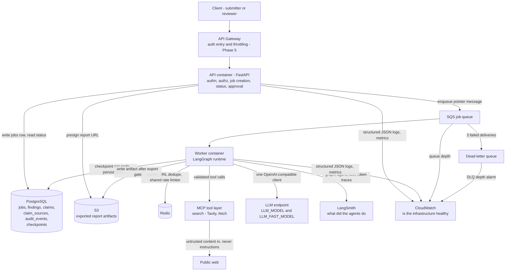
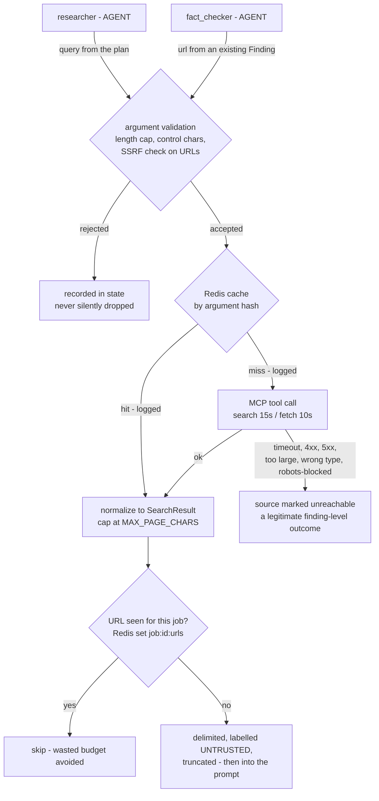
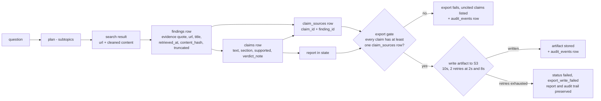
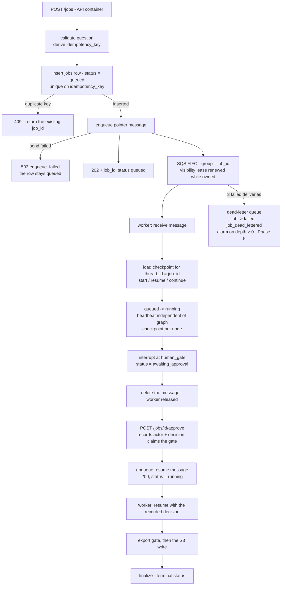
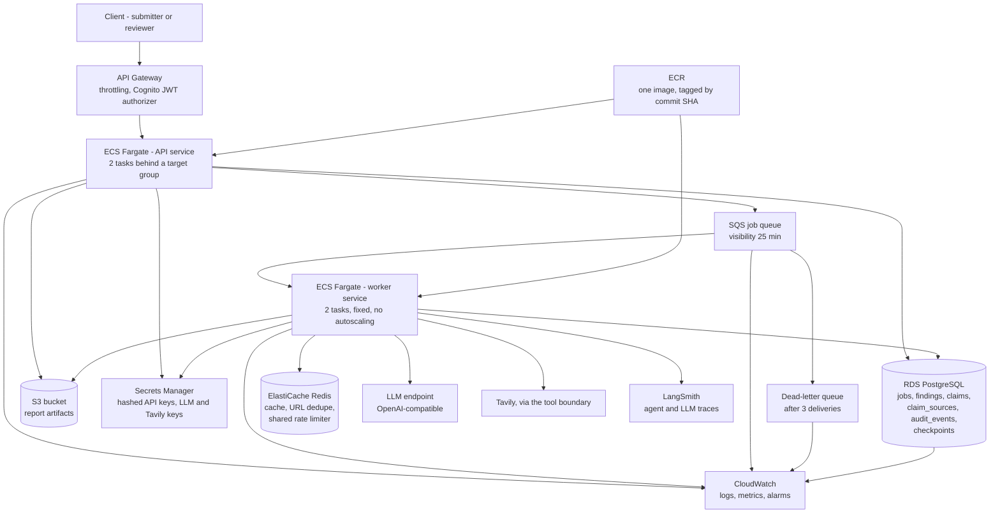

# ARCHITECTURE — Multi-Agent Competitive Research Assistant

> **Status: Phases 1 and 2 are built, and Phase 3 is under way.** The graph runs end to end
> (`config.py`, `schemas.py`, `llm_client.py`, `tools/`, `agents/`, `graph/`); PostgreSQL holds the
> five application tables and the checkpointer's own (`database/`); the six routes and API-key auth
> are up (`routes/`, `app.py`); and since **2026-08-17** a job is dispatched through **SQS and run by
> `python -m worker`** (`jobqueue.py`, `worker.py`), with the Compose stack behind it.
>
> Since **2026-08-18** the export node **writes the report to S3** and `GET /jobs/{id}/report`
> answers a presigned URL (`artifacts.py`, step 22a), which is [ADR
> 0009](adr/0009-recovering-an-export-that-failed-after-approval.md) built.
>
> Also since **2026-08-18**, both processes run from **one application image** with two commands
> (`Dockerfile`, step 22b/c), and Compose's `app` profile runs them beside the infrastructure. Step
> 22 is complete.
>
> **What is not built:** no AWS deployment, registry publishing, evaluation set, or Phase 4/5
> operational layer. Step 23 CI verifies the local repository contracts only; it builds the image
> but pushes it nowhere.
> no AWS at all (Phase 5), and no eval set (Phase 4). §1's "built vs planned" table is
> the per-capability answer, and every section below marks what is implemented where the distinction
> matters.
>
> This document is the **blueprint the implementation is written against**. If code exists and this
> document disagrees with it, this document is wrong and must be corrected.

**Source of truth.** `CLAUDE.md` states what the project is and what must never break.
`docs/engineering-guidelines.md` states how each part is built and why. This file adds nothing new;
it turns those two into an implementable plan and points at the section that authorises each choice.
Citations look like *(gl §7)* for the guidelines and *(CLAUDE.md)* for the project file.

**`docs/engineering-guidelines.md` is not published in this repository.** It is a gitignored local
working document, so every *(gl §N)* citation below resolves on a local checkout and nowhere else.
That is also why those citations are plain text rather than links.

Where the guidance is silent and a choice had to be made, the choice is marked **[derived]** and
recorded in §20. Where the guidance is genuinely ambiguous, nothing was invented — it is listed in
§22 instead.

**This document has been through one architecture review.** Nine of the ten questions it raised are
decided and applied; §22 lists what is still open. Where a decision made a statement in `CLAUDE.md` or
`docs/engineering-guidelines.md` untrue — the `/health` auth rule, the revision inequality, the
call-budget wording — that statement was corrected in place, because two documents disagreeing is the
failure mode all three files were written to avoid.

---

## 1. System Overview

### What it does

You ask a competitive-research question — *"compare TCS and Infosys on cloud strategy"*. The system
plans the research, searches the web, writes a report, checks every claim against the page it came
from, scores the result, and stops for a human to approve it. Only then is the report exported. Every
claim in an exported report traces back to a URL.

### The problem it solves

A single LLM call answering that question produces confident prose with no sources. You cannot tell
which sentence came from a real page and which the model made up. This system makes that
distinguishable: a claim is stored with the URL and the verbatim quote it came from, and a report
with an uncited claim cannot be exported at all (gl §9).

### The five agents and the three control-flow nodes

**Agents** — five, each with one job (gl §2):

1. **Supervisor** — decides which agent runs next, reading state only.
2. **Planner** — turns the question into 3–5 researchable subtopics.
3. **Researcher** — searches and extracts findings for one subtopic.
4. **Synthesizer** — writes the report from findings only.
5. **Fact-Checker** — verifies each claim against its cited source text.

**Control-flow nodes** — not agents. They have no tools, no persona, and no goal of their own:

- **Reflection** — an LLM-powered evaluation and routing node. It scores the report on five
  dimensions and routes a targeted retry to the specialist that can fix the failing dimension
  (CLAUDE.md, gl §6).
- **Human approval gate** — a LangGraph `interrupt()` that pauses the graph until an authenticated
  reviewer decides (gl §10).
- **Export** — the claim-to-URL gate plus the S3 write (gl §9).
- **Finalize** — the single terminal node that records the outcome (gl §5 names it as a
  Supervisor routing target).

Reflection is **not** a sixth agent. It is LangGraph control flow that happens to use an LLM to
score. Giving it tools, research, or a goal changes the architecture and needs an ADR first
(CLAUDE.md invariant 8).

### Major execution stages

```text
intake → plan → research (per subtopic) → synthesize → fact-check → reflect
       → [targeted retry, bounded] → human gate → export gate → artifact stored
```

### End-to-end request lifecycle

1. `POST /jobs` with a question. The API authenticates the caller, validates the question, writes a
   `jobs` row, enqueues a **pointer** message to SQS, and returns `202` with a `job_id` (gl §12).
2. A worker receives the message, loads or creates the checkpoint for `thread_id = job_id`, and runs
   the LangGraph graph.
3. The Supervisor routes to the Planner, then to the Researcher once per pending subtopic, then to
   the Synthesizer, then to the Fact-Checker.
4. A fixed graph edge carries the Fact-Checker's output to the reflection node. Reflection scores
   five dimensions and either routes one targeted retry or passes the report to the gate.
5. The gate `interrupt()`s. The checkpoint is persisted, the worker is released, `status` becomes
   `awaiting_approval`.
6. `POST /jobs/{id}/approve` records the reviewer's identity and decision. The graph resumes from
   the checkpoint — completed nodes are not re-executed (gl §10).
7. On approve, the export gate checks that every claim has at least one `claim_sources` row. All
   cited → the artifact is written to S3 and an audit event is recorded. Any uncited → **export
   fails, loudly** (gl §9).
8. `GET /jobs/{id}/report` returns a 15-minute presigned S3 URL. Report bytes never stream through
   the API.

### Phase 1 today

> **Superseded for the API and the worker as of 2026-08-17.** Phase 3 stage 2 made a job's execution a
> **two-process** affair: `uvicorn app:app` writes a row and enqueues a pointer, and `python -m worker`
> is what invokes the graph. The paragraph below still describes what the offline suite and
> `scripts/measure_jobs.py` do — one process, both durable stores absent — and that is why it stays.

**One Python process, no infrastructure.** A job is a call to `build_graph()` and `invoke()`: the
Supervisor routes, the five agents run, the reflection node scores, the graph pauses at the human
gate with `interrupt()`, and a resume decision carries it through the export gate to `finalize`.
State lives in a checkpointer keyed on `thread_id = job_id`. **Since step 14 that checkpointer is a
parameter:** a process that has to survive a restart passes the Postgres one, and everything else -
the offline suite, `scripts/measure_jobs.py` - gets the in-memory one and dies with the process, which
is acceptable there because neither is what durability is for (CLAUDE.md phase plan).

The lifecycle above is the Phase 3+ shape, and it now exists end to end: the API (step 18), the
database (steps 13–16), the queue and worker (stage 2, step 20), Redis (step 21), and the S3 artifact
write with its presigned URL (step 22a). What is still missing around it is operational — there is no
application image, no CI and no AWS.

### Eventual AWS production shape (Phase 5)

API Gateway → FastAPI on ECS Fargate → SQS → worker on ECS Fargate → RDS PostgreSQL, ElastiCache
Redis, S3, an OpenAI-compatible LLM endpoint, Tavily behind the tool boundary, LangSmith for agent
traces, CloudWatch for infrastructure health. Detail in §18. No service appears there that is not in
the CLAUDE.md stack table. **None of it is deployed.**

### Built vs planned

| Capability | Phase | Status |
|---|---|---|
| Five agents, reflection node, graph routing, in-memory checkpointer | 1 | **Built** — `agents/`, `graph/` |
| Tool boundary: search, fetch, SSRF, size caps, untrusted wrapper | 1 | **Built** — `tools/` |
| LLM client: structured output, retries, 429 backoff, per-job budget | 1 | **Built** — `llm_client.py` |
| Per-request telemetry: one record per request, carrying the calling node | 1 | **Built** — `llm_client.py`; the sink is injected, and a durable one arrives in Phase 2 (gl §14) |
| Human gate node and export gate, as graph nodes | 1 | **Built** — `graph/build.py`; the endpoint and the audit rows are Phase 2 |
| Test suite: unit, agent contract, graph, integration, injection | 1 | **Built** — `tests/`, zero network calls |
| MCP protocol client or server | — | **Not built, and not scheduled.** The boundary is in-process (§7) |
| Postgres checkpointer; `jobs` / `findings` / `claims` / `claim_sources` / `audit_events` and their Alembic migration; the audit trail written as the graph runs; the export gate's write to `jobs.report_json` | 2 | **Built** (2026-08-15, steps 13–16) — `database/`, `graph/build.py`. Both stores are injected: the graph runs exactly as it did in Phase 1 without them ([ADR 0005](adr/0005-graph-time-persistence-semantics.md)) |
| `POST /jobs/{id}/approve`, the reviewer payload, the API and API-key auth | 2 | **Built** (2026-08-16, steps 17–18) — `routes/`, `app.py`. The gate's resume moved to the worker on 2026-08-17 ([ADR 0011](adr/0011-the-human-gate-resume-moves-to-the-worker.md)) |
| Docker Compose: PostgreSQL 16, Redis 7, LocalStack for SQS + S3 | 3 | **Built** (2026-08-17, stage 1) — `docker-compose.yml`, `docker/`. The application services joined them at step 22b/c, behind the `app` profile |
| The queue and the async worker: pointer messages, FIFO groups, `queued`, the worker's start/resume/continue, the runtime bound, the DLQ path | 3 | **Built** (2026-08-17, stage 2, step 20) — `jobqueue.py`, `worker.py`, `rev_0002`. Against LocalStack, not AWS |
| The API stops holding a graph or an LLM client | 3 | **Built** (2026-08-17) — [ADR 0012](adr/0012-the-api-stops-holding-a-compiled-graph.md). `uvicorn app:app` starts with no LLM or Tavily credential |
| The S3 artifact write, `exported_at` meaning the artifact exists, the presigned-URL route, and the operator re-export | 3 | **Built** (2026-08-18, step 22a) — `artifacts.py`, `rev_0003`, `scripts/reexport_job.py`. [ADR 0009](adr/0009-recovering-an-export-that-failed-after-approval.md), verified against LocalStack S3 |
| The application image and its two entrypoints | 3 | **Built** (2026-08-18, step 22b/c) — `Dockerfile`, `.dockerignore`, and the `migrate`/`api`/`worker` services. One image, three commands, a non-root user, and a fifth `container` test layer. Built locally; never pushed to a registry |
| CI | 3 | Built locally — step 23, GitHub Actions verification only; first hosted run pending, with no publishing or deployment |
| Redis: shared rate limiter, caches, URL dedupe | 3 | **Built** (2026-08-17, step 21) — `redisstore.py`. Fail-open caches and URL set, fail-closed limiter (§20 row 29), verified against a real Redis 7 |
| The offline evaluation subsystem: benchmark schema, DEV benchmark, twelve deterministic metrics, the optional structured judge, and `python -m eval.run` | 4 | **Built** (2026-08-19, block A+B) — `eval/`, [ADR 0017](adr/0017-deterministic-evaluators-and-a-custom-structured-judge.md), `docs/evaluation.md`. It scores **already-produced outputs** and never runs the graph. The judge is off by default, so the default run needs no credential. **The DEV benchmark is fixture-backed and does not yet measure this system's research quality** (evaluation.md §5) |
| LangSmith trace metadata (`job_id` / `agent` / `model` / `revision` under those names), structured JSON logging | 4 | Planned — steps 24 and 25. Evaluation was built not to depend on either: linkage is by `thread_id`, which LangGraph already sets |
| The evaluation regression gate in CI, and the manual judge workflow | 4 | **Built** (2026-08-19, block C) — `eval/gate.py`, a seventh `eval` CI job, and `.github/workflows/eval-judge.yml`. **It gates the framework and the committed benchmark contract, not any score**: no percentage, no judge threshold ([ADR 0018](adr/0018-the-ci-evaluation-gate-protects-the-contract-not-the-quality.md)) |
| Rubric calibration, and eval as a **semantic-quality** release gate | 4 | Planned — steps 27 and 28. Still deferred after block C, and for the same reason: the benchmark it would gate contains no real research, so there is nothing to threshold (evaluation.md §14, §15) |
| Prometheus / Grafana, or any runtime metrics surface | 4/5 | **Not built, deliberately.** The repository exposes no metrics endpoint and has no client library; the recommended counters are written down for Phase 5's CloudWatch work instead (evaluation.md §18) |
| AWS deployment, Cognito JWT, CloudWatch alarms | 5 | Planned |

---

## 2. High-Level Architecture

Two containers, one graph, four stores, two external services. Every box below is in the CLAUDE.md
stack table; nothing has been added.



Reading the diagram:

- **The API never runs the graph.** It validates, persists, enqueues, and reads. §19 explains why.
- **The message is a pointer.** `job_id`, `user_id`, `idempotency_key`, `attempt` — never the state
  (gl §12). State lives in Postgres, so a redelivered message resumes instead of restarting.
- **Only the worker talks to the LLM, MCP, and LangSmith.** That is where the call budget and the
  rate limiter live.
- **Web content enters at exactly one place** — the tool layer (`tools/`, in-process today; §7) — and
  is data from there on (gl §8).
- **The two observability layers do not overlap.** Agent reasoning goes to LangSmith. Infrastructure
  health goes to CloudWatch (gl §14).

---

## 3. LangGraph Architecture

### Node inventory

| Node | Kind | LLM | Tools |
|---|---|---|---|
| `supervisor` | **Agent** | `LLM_FAST_MODEL` | none |
| `planner` | **Agent** | `LLM_MODEL` | none |
| `researcher` | **Agent** | `LLM_MODEL` | `search`, `fetch` |
| `synthesizer` | **Agent** | `LLM_MODEL` | none |
| `fact_checker` | **Agent** | `LLM_MODEL` | `fetch` (re-fetch only) |
| `reflection` | **Control flow** | `LLM_FAST_MODEL` | none |
| `human_gate` | **Control flow** | none | none |
| `export` | **Control flow** | none | none |
| `finalize` | **Control flow** | none | none |

Five agents. Four control-flow nodes. `reflection` scores and routes; it never researches, never
writes, and never holds a tool.

> **Status — built, and this section describes the code.** All nine nodes and every edge below are
> wired in `graph/build.py`, compiled with an **in-memory** checkpointer (`InMemorySaver`) whose
> serializer is told the five Pydantic types that travel in state — a model it was not told about
> comes back as a plain dict and fails later on a resumed job. `run_config(job_id)` sets
> `thread_id = job_id`.
>
> Three nodes route by returning `Command(goto=..., update=...)` — `supervisor`, `reflection`, and
> `human_gate` — and each declares its targets, so the compiled graph draws the shape below and
> reports those edges as conditional. Everything else is a fixed `add_edge`.
>
> `tests/test_graph_build.py` reads the topology back off the compiled graph, including the two
> assertions that are invariants rather than wiring details: nothing reaches `export` except through
> `human_gate`, and the Supervisor cannot name `reflection`. `tests/test_graph_integration.py` then
> runs whole jobs through it with the real agents.
>
> **Phase 2 replaces one line:** `InMemorySaver` becomes the Postgres checkpointer, keeping the same
> serde — what a checkpoint may rebuild does not depend on where it is stored.

### The graph


### Entry point

`START → supervisor`. There is no other entry. A resumed job re-enters at whatever node the
checkpoint stopped at, which for the gate is `human_gate`.

### Normal execution path

`supervisor → planner → supervisor → researcher (×N subtopics, one at a time) → supervisor →
synthesizer → supervisor → fact_checker → reflection → human_gate → export → finalize`.

The Supervisor is visited between agents. That is what makes routing a state decision rather than an
agent handing off to another agent (CLAUDE.md invariant 5).

### Conditional routing

Two conditional edges, and only two:

1. **After `supervisor`** — target comes from `SupervisorDecision.next`, but only after a plain
   Python check against the gl §5 transition table. The model proposes; the code disposes.
2. **After `reflection`** — target comes from the failed-dimension table in gl §6, computed in code
   from the five dimension scores. See §6 of this document.

Every other edge is fixed: `planner → supervisor`, `researcher → supervisor`, `synthesizer →
supervisor`, and `fact_checker → reflection`.

**`fact_checker → reflection` is a fixed edge, not a Supervisor decision.** `reflection` is absent
from the `SupervisorDecision.next` literal on purpose. The Supervisor cannot choose it, so reflection
stays control flow and never becomes a delegation target (gl §5).

### Revision path and counting semantics

**A revision is one automatic report-improvement cycle triggered by reflection after the initial
report** (gl §6). `MAX_REVISIONS` = 2 therefore means at most two automatic improvement cycles, and at
most three report-producing passes in total.

| | |
|---|---|
| `revision_count` counts | Improvement **cycles**, not passes. It starts at **0** |
| The initial report | Pass 1, at `revision_count = 0`. It is not a revision |
| Who increments it | The reflection node, when it decides to start a cycle — whichever specialist it routes to |
| Cap check | `revision_count >= MAX_REVISIONS` → route to the gate instead of starting another cycle |
| A reviewer `edit` | Human-triggered, not automatic. **Not a revision**, does not increment the counter (gl §10) |

Worked through, with `MAX_REVISIONS = 2`:

```text
pass 1  synthesize → fact-check → reflect   (revision_count 0)
        fails  → start cycle, revision_count = 1
pass 2  synthesize → fact-check → reflect   (revision_count 1)
        fails  → start cycle, revision_count = 2
pass 3  synthesize → fact-check → reflect   (revision_count 2)
        fails  → 2 >= 2, cap reached → human gate, quality_flag = "below_threshold"
```

Three passes, two revisions, and the cap is a visible outcome rather than a silent pass (CLAUDE.md
invariant 2).

### Targeted retry path

Only the **lowest failing dimension** is acted on per revision (gl §6). Fixing three things at once
makes it impossible to tell which fix helped.

| Lowest failing dimension | Routes to | What that pass does differently | Draft |
|---|---|---|---|
| Research completeness | `researcher` | Only the subtopics that scored thin — not all five | **Invalidated** |
| Source correctness | `researcher` | Same subtopics, with the failing URLs excluded | **Invalidated** |
| Citation coverage | `synthesizer` | Attach a source to each uncited claim, or delete the claim | Rewritten |
| Factual consistency | `fact_checker` | Re-verify the disputed claims | Unchanged |
| Report quality | `synthesizer` | Rewrite from the same findings — no new research | Rewritten |

**A subtopic already marked `unresearched` is not a target — both Researcher rows fire against an
eligible subtopic instead** ([ADR 0004](adr/0004-no-op-researcher-retries-after-evidence-exhaustion.md)).
Its last visit produced nothing, so it added no URL to the per-job `seen` set, and the next visit
would re-issue the same planned query against the same cached results with no unread source to reach.

**The rows stop firing only when *every* subtopic is `unresearched`.** The eligible subtopics with the
fewest sources are the fallback target, so a target exists while one eligible subtopic remains — the
usual effect of the guard is to change *which* subtopic is retried, not *whether* the retry happens.
Only when the exclusion empties the candidate list do both research dimensions drop out together —
whether a target exists is a property of the subtopics, not of which dimension scored lowest — and the
lowest remaining failing dimension is acted on instead. With none left the route is `human_gate` with
`quality_flag = "below_threshold"`, and **no revision is counted**, because no cycle was started. That
path did not occur once across the 20 measured jobs of 2026-08-14.

**This is a revision-budget heuristic, not a proof.** Extraction is a fresh LLM call over the same
pages, so a retry against an exhausted subtopic *can* find what the last one missed — measured, 2 of
6 did. The cycle is simply better spent where a source is still unread, and ADR 0004 records both the
measurement and the trade.

#### New findings never bypass synthesis

When reflection routes to the Researcher it makes two state changes before the edge is taken:

1. **`report = None`** — the existing draft is invalidated. It was written without the evidence that
   is about to be gathered, so it is stale by definition.
2. **`subtopic_status[targeted] = "pending"`** — for the specific subtopics that scored thin, and
   never for one already `unresearched` (ADR 0004).

The gl §5 transition table then carries the job the rest of the way with no new rule:

```text
reflection → researcher            (one targeted subtopic)
           → supervisor            (another pending subtopic? → researcher again)
           → supervisor → synthesizer     because report is None
           → supervisor → fact_checker    because the new draft's claims have no verdicts
           → reflection                   fixed edge
```

**Newly retrieved findings cannot reach the human gate without passing through the Synthesizer and
the Fact-Checker.** Without the invalidation, the Supervisor would match *"`report is not None`, no
verdicts this revision → `fact_checker`"* and the new findings would never enter the report — the
completeness retry, the most important targeted retry in the system, would change nothing.

The invalidation also means `subtopic_status` doubles as the retry scope, so no extra state field is
needed to say *which* subtopics to redo. Failing URLs are excluded using the unsupported verdicts
already in state plus the per-job `job:{id}:urls` dedupe set, which already prevents re-fetching a
page this job has seen (§7).

**[derived] "No verdicts this revision" means: some claim in the current `report` has no matching
`Verdict`.** `Verdict` is keyed by `claim_id` (gl §2.5) and a re-synthesized report carries fresh
claim ids, so this is a pure state comparison needing no new field and no revision tag. It also gives
the `edit` path the right behaviour for free: an edited claim is a new claim, so it has no verdict,
so the Supervisor routes to the Fact-Checker — exactly what gl §10 requires.

### Approval path

`human_gate` is a LangGraph `interrupt()` placed **before** `export`. There is no edge from any node
to `export` that skips it (CLAUDE.md invariant 6). Approve resumes into `export`. Edit resumes into
`synthesizer` for one pass and then returns to the gate — an edited claim is a new claim and is
fact-checked like any other (gl §10).

### Rejection path

`reject` goes straight to `finalize` with `status=rejected` and the reason recorded. Nothing is
exported. The state is retained for the retention window (gl §9). A gate with no decision after 7
days is closed the same way with reason `gate_expired` (gl §10, §17).

### Terminal states

Every path ends at `finalize`, which writes the terminal status, sets `completed_at`, persists
`revision_count` and `llm_calls_used`, and hands to `END`.

**It writes no audit row of its own**, and the earlier version of this sentence — "emits the audit
event" — claimed one that has never existed: `AuditAction` has no job-finished action. That is the
second half of the gap [ADR 0005](adr/0005-graph-time-persistence-semantics.md) recorded, and
[ADR 0008](adr/0008-a-failed-jobs-reason-lives-in-the-checkpoint-for-phase-2.md) decides it — the row,
carrying `failure_reason`, is Phase 3's, and until then a failed job's reason lives in the durable
checkpoint.

| Terminal `status` | Meaning |
|---|---|
| `approved` | Reviewer approved **and** the export gate passed. The artifact exists in S3 |
| `rejected` | Reviewer rejected, or the gate expired after 7 days. Nothing exported |
| `failed` | A guard tripped, an agent failed terminally, the export gate blocked the report, or the artifact write was exhausted. `failure_reason` says which |

There is no separate `exported` status — gl §4 fixes the literal at five values. Whether a report is
downloadable is answered by the artifact existing, which is why `GET /jobs/{id}/report` returns `404`
when it does not (gl §12).

**Export failure is explicit inside `failed`, not a sixth status.** The terminal state is
`status=failed` + `failure_reason="export_write_failed"` + the report, claims, `claim_sources`, and
audit rows all preserved. Expressing it this way keeps gl §4's five-value literal and the API contract
unchanged while still being unambiguous to a caller, who branches on the stable `code` in the error
body rather than on the status alone (gl §12).

### Failure states

| Trigger | Where detected | Result |
|---|---|---|
| `hop_count >= MAX_SUPERVISOR_HOPS` | Supervisor guard | `finalize`, `status=failed` |
| `llm_calls_used >= MAX_LLM_CALLS_PER_JOB` | Supervisor guard | `finalize`, `status=failed` |
| `SupervisorDecision.next` outside the transition table | Code check after validation | `finalize`, `status=failed` |
| Empty or invalid plan after one retry | Planner | `finalize`, `status=failed` — never research an unplanned question |
| `Report.sources` empty | Synthesizer schema validation | `finalize`, `status=failed` — never an unsourced report |
| 429 after the initial request plus 3 retries | LLM client | `finalize`, `status=failed`, reason `rate_limited` |
| 20-minute no-new-node deadline reached after a durable update | Worker | `finalize`, `status=failed`, reason `job_timeout` |
| Rate-limiter token unavailable after 2 retries | LLM client | `finalize`, `status=failed`, reason `rate_limiter_unavailable` |
| Any uncited claim at export | Export gate | `finalize`, `status=failed`, uncited claims listed |
| S3 artifact write exhausted after 2 retries | Export node | `finalize`, `status=failed`, reason `export_write_failed`, **report and audit trail preserved** |

`failure_reason` is never left `None` on a failure (gl §4).

**Two things that are deliberately not failure states:**

- **A failed reflection scoring call when a report exists.** The report is kept, `quality_flag`
  becomes `"unscored"`, the failure is written to `audit_events`, and the job routes to the human
  gate. A complete, fact-checked report is too expensive to discard because the scorer broke — and
  the gate is the backstop that exists for exactly this (§6, gl §6).
- **A subtopic that could not be researched.** It is marked `unresearched`, the job continues, and
  the gap is reported to the reviewer and scored down by reflection (gl §2.3).

---

## 4. Agent Responsibility Boundaries

Five agents. Each is a module with a function, not a class with inheritance. There is no `BaseAgent`
— five different contracts share nothing but a name (gl §20).

Schema field names below that the guidance does not fix are marked *illustrative*; the shapes are
taken from gl §2 and gl §9.

### 4.1 Supervisor — routing

| | |
|---|---|
| **Purpose** | Name the next agent from state. The route is computed in code; the LLM proposal is advisory ([ADR 0001](adr/0001-supervisor-llm-routing-is-advisory.md)) |
| **Input** | `ResearchState` — nothing else |
| **Output** | `SupervisorDecision`, whose `next` is always `allowed_target(state)` |
| **Tools** | None |
| **Model** | `LLM_FAST_MODEL` |
| **Budget** | 1 call per hop, `MAX_SUPERVISOR_HOPS` = 24 |
| **Timeout** | Fast tier — a fixed 30s, 2 retries at 1s and 4s (gl §17) |
| **On failure** | A disagreeing proposal, `invalid_output`, or `llm_call_failed` → logged, routing continues on state. `rate_limited` / `budget_exceeded` → `finalize`, `status=failed`, reason recorded |

```python
class SupervisorDecision(BaseModel):
    next: Literal["planner", "researcher", "synthesizer", "fact_checker", "finalize"]
    reason: str
```

**Responsibilities:** read structured state fields — is there a plan, which subtopics are pending,
does a draft exist, are there verdicts for this revision, how many hops and calls have been spent —
and name the next node.

**Non-responsibilities.** It never reads fetched page content, raw search results, `Finding.evidence`,
or report body text. It never scores quality — that is the reflection node. It never calls a tool.
It never routes to `reflection`; that literal is deliberately absent from its output type (gl §5).

**Budget note:** 24 fast-model calls in the worst case, which is 24 of the 60-call job ceiling. That
is why `hop_count` exists as its own guard rather than relying on the total budget.

### 4.2 Planner — the research plan

| | |
|---|---|
| **Purpose** | Turn the question into 3–5 researchable subtopics with success criteria |
| **Input** | The user's question |
| **Output** | `ResearchPlan` |
| **Tools** | None |
| **Model** | `LLM_MODEL` |
| **Budget** | 2 calls (1 + 1 validation retry) |
| **Timeout** | Main tier — `LLM_MAIN_TIMEOUT_S`, 2 retries at 2s and 8s (gl §17) |
| **On failure** | Empty or invalid plan after the retry → fail the job |

```python
class Subtopic(BaseModel):          # field names illustrative
    id: str
    question: str                   # what the extraction prompt answers against
    search_query: str               # what reaches the search tool, <= 120 chars

class ResearchPlan(BaseModel):
    subtopics: list[Subtopic]       # 3-5, enforced by validation
    success_criteria: list[str]
```

**Responsibilities:** decompose the question, state what a good answer would contain, and write
the search query for each subtopic.

**Why the query is a separate field.** The Researcher used to send `question` to Tavily verbatim.
Step 12 measured what that costs: a 150-character natural-language question returned dictionary
definitions of the word *"what"*, and the subtopic came back `unresearched`. Finding sources and
extracting from them are different jobs and want differently shaped text.

It is written **in the Planner's existing call**, so query reconstruction costs no extra LLM call,
adds no agent, and adds no node — the Planner already knows the subtopic, and a query is part of a
plan. The 120-character cap is enforced by validation rather than truncation, because cutting a
query mid-word makes a different, worse query; an over-long one goes through the same single
bounded retry as any other output that misses its contract.
`success_criteria` is what reflection and the offline eval later score against.

**Non-responsibilities.** It never researches. It never searches. It produces a plan and stops.

**Why an empty plan fails the job:** researching an unplanned question produces a report nobody can
evaluate, because there is no stated success criterion to evaluate it against (gl §2.2).

### 4.3 Researcher — evidence retrieval

| | |
|---|---|
| **Purpose** | Search and extract findings for **exactly one** subtopic |
| **Input** | One `Subtopic` |
| **Output** | `list[Finding]` |
| **Tools** | `search(query)`, `fetch(url)` |
| **Model** | `LLM_MODEL` |
| **Budget** | 3 calls per subtopic, at most 5 subtopics — **45 main-model calls worst case**: 5 subtopics × 3 calls × 3 passes, because a Researcher-routed revision returns subtopics to `pending` (§16) |
| **Timeout** | Main tier — `LLM_MAIN_TIMEOUT_S` per extraction call; **and** 120s per subtopic (`SUBTOPIC_TIMEOUT_S`); `search` 15s, `fetch` 10s (gl §17) |
| **On failure** | Zero findings after retries → subtopic marked `unresearched`, the job continues, the gap is carried into the report |

```python
class Finding(BaseModel):
    finding_id: str                 # illustrative - matches findings.finding_id
    subtopic_id: str                # illustrative
    claim: str
    evidence: str                   # VERBATIM span from the fetched text, never a summary
    url: HttpUrl
    title: str
    retrieved_at: datetime
    content_hash: str               # sha256 of the fetched text
    truncated: bool                 # True when the page was cut at MAX_PAGE_CHARS
```

**Responsibilities:** issue validated queries derived from the plan, fetch only URLs that came from a
search result's `url` field, and extract findings where `evidence` is a quote that can later be
located in the source.

**Concurrency (ADR 0002).** This is the one node that has more than one LLM request open at a time.
Choosing and fetching sources stays sequential — that loop owns the `seen` set behind per-job URL
dedupe, and the tools are 4% of a job's wall clock. Extracting from the fetched pages is 40.7% of it
and runs on a pool of `RESEARCHER_CONCURRENCY` (default 3, ceiling `MAX_LLM_CALLS_PER_SUBTOPIC`),
with findings collected in page order rather than completion order. §16 carries the rate-limit
consequences.

**Non-responsibilities.** It never writes report prose. It never produces a `Finding` without a URL
and a verbatim `evidence` span. It never fetches a URL found inside page text (gl §8, §16).

**Why `truncated` matters:** a quote that cannot be found because the text was never read is a
different failure from a quote that was invented, and the Fact-Checker cannot tell them apart without
this flag (gl §2.3).

**A subtopic that cannot be researched is a reportable outcome, not a silent omission.** The report
names it, and reflection scores it as a completeness failure.

### 4.4 Synthesizer — the report draft

| | |
|---|---|
| **Purpose** | Write the report from findings only |
| **Input** | `list[Finding]`, the plan, and `reviewer_edit_text` when set |
| **Output** | `Report` |
| **Tools** | None |
| **Model** | `LLM_MODEL` |
| **Budget** | 2 calls per pass, at most 3 passes (initial + `MAX_REVISIONS`) — 6 main-model calls worst case |
| **Timeout** | Main tier — `LLM_MAIN_TIMEOUT_S`, 2 retries at 2s and 8s (gl §17) |
| **On failure** | Empty `sources` → hard failure. Never return an unsourced report |

```python
class Section(BaseModel):           # field names illustrative
    id: str
    heading: str
    body: str

class Claim(BaseModel):
    claim_id: str
    section_id: str
    text: str
    finding_ids: list[str]          # never empty - this is the audit link

class Source(BaseModel):
    url: HttpUrl
    title: str
    finding_ids: list[str]

class Report(BaseModel):
    sections: list[Section]
    claims: list[Claim]
    sources: list[Source]           # empty means ungrounded - a failure, not a result
```

**Responsibilities:** structure the answer, and attach to every `Claim` the `finding_id` list it came
from. `Report.sources` is a **view over the findings actually cited**, not an independent store — the
durable record is `findings.url` joined through `claim_sources` (§9).

**Non-responsibilities.** It never introduces a fact that is not in a `Finding`. It never researches.
It never decides whether a claim is verified — that is the Fact-Checker. If it wants to say something
the findings do not support, the correct move is to say nothing and let reflection route back to the
Researcher (gl §2.4).

### 4.5 Fact-Checker — verification

| | |
|---|---|
| **Purpose** | Verify each claim against its cited source text |
| **Input** | `Report`, `list[Finding]` |
| **Output** | `list[Verdict]` |
| **Tools** | `fetch(url)` — **re-fetch only, no new searches** |
| **Model** | `LLM_MODEL` |
| **Budget** | **1 batched call per pass** (+1 retry). All claims in one call, never one per claim |
| **Timeout** | Main tier — `LLM_MAIN_TIMEOUT_S` (gl §17) |
| **On failure** | Source unreachable → `supported=false`, `note="source unreachable"` |

```python
class Verdict(BaseModel):
    claim_id: str
    supported: bool
    quote: str | None               # required when supported is True
    note: str
```

**Responsibilities:** for each claim, either produce a verbatim `quote` from the source that supports
it, or mark it unsupported with a note.

**Non-responsibilities — the strictest contract in the system.** It never infers. "The source implies
this" is not support. "This is common knowledge" is not support. It never searches for a better
source. It never edits the report. A `Verdict` with `supported=true` and `quote=None` is a schema
violation and fails validation (gl §2.5, gl §18).

**Why batching is architectural, not an optimisation:** one call per claim on a 20-claim report is 20
calls against a 60-call job ceiling and a 40 RPM tier. It is the single easiest way to blow the
budget (gl §13).

### 4.6 The boundary rules, in one place

| Agent | Owns | Must never absorb |
|---|---|---|
| Supervisor | Routing | Quality judgement, tool use, reading page text |
| Planner | Decomposition | Research, retrieval, writing |
| Researcher | Retrieval and evidence | Report prose, verification, routing |
| Synthesizer | Writing | Retrieval, verification, unsourced facts |
| Fact-Checker | Verification | New search, editing the report, inference |

---

## 5. ResearchState Design

`ResearchState` is the contract between agents. Agents never call each other; they read and write
state, and the Supervisor decides who runs next (CLAUDE.md invariant 5).

### The state, as gl §4 defines it

| Field | Type | Owner (writes) | Accumulated or current | Why it belongs in state |
|---|---|---|---|---|
| `job_id` | `str` | API at creation | Current (immutable) | Ties state, traces, audit rows, and the checkpointer thread together. `thread_id = job_id` |
| `user_id` | `str` | API at creation | Current (immutable) | Single tenant today; present so tenant scoping is additive later |
| `question` | `str` | API at creation | Current (immutable) | The original request, **never rewritten** |
| `plan` | `ResearchPlan \| None` | Planner | Current (overwritten) | `None` is the Supervisor's first routing test |
| `subtopic_status` | `dict[str, Literal["pending","done","unresearched"]]` | Researcher | Current (per-key overwrite) | Drives routing **without inspecting findings** — keeps page text out of the Supervisor |
| `findings` | `Annotated[list[Finding], operator.add]` | Researcher | **Append-only** | A step that times out and retries would otherwise drop the first attempt's findings |
| `report` | `Report \| None` | Synthesizer **writes**, reflection node **invalidates** | Current (overwritten) | The current draft. One draft exists at a time. Set to `None` when reflection routes back to the Researcher, so new findings cannot bypass synthesis |
| `verdicts` | `Annotated[list[Verdict], operator.add]` | Fact-Checker | **Append-only** | Accumulated across passes, so "did revision 2 fix it?" is answerable |
| `reflection_scores` | `list[ReflectionScore]` | Reflection node | **Append-only** (one per pass) | The history is what makes "did it improve?" answerable |
| `failed_dimensions` | `list[str]` | Reflection node | **Current** (overwritten each pass) | The dimensions failing *right now*. The gate payload and the targeted retry both read it without recomputing from scores and weights |
| `revision_count` | `int` | Reflection node | Current (counter) | Improvement cycles, not passes. Compared against `MAX_REVISIONS` with `>=` |
| `quality_flag` | `str \| None` | Reflection node | Current (overwritten) | `None`, `"below_threshold"`, or `"unscored"`. Carries the outcomes no automatic cycle can fix - the cap, every research target exhausted (ADR 0004), and a scoring failure - to the gate, the API, and `jobs.quality_flag` |
| `hop_count` | `int` | Supervisor | Current (counter) | Compared against `MAX_SUPERVISOR_HOPS` |
| `llm_calls_used` | `int` | Every LLM caller | Current (counter) | Compared against `MAX_LLM_CALLS_PER_JOB` |
| `reviewer_edit_text` | `str \| None` | **The gate sets it and the gate clears it** (ADR 0006) | Current (**set once, consumed once**) | The `edit` decision's text. It reaches the Synthesizer's prompt, and reflection reads it as the edit pass's marker — so the clear waits for the next gate decision rather than happening mid-pass |
| `status` | `Literal["queued","running","awaiting_approval","approved","rejected","failed"]` | Gate, finalize | Current | The externally visible job state. `queued` was added by [ADR 0010](adr/0010-job-dispatch-and-status-across-api-queue-and-worker.md) decision 1: it is what `POST /jobs` writes, and the worker is the only thing that moves it to `running`. **On state it is never seen** — `new_state()` starts a job `running`, because state exists only once a worker is invoking |
| `failure_reason` | `str \| None` | Whichever guard trips | Current | Set whenever `status=failed`; never left `None` on a failure |

**Reducers.** Exactly two fields use `operator.add`: `findings` and `verdicts`. Everything else is
last-write-wins. That is the whole reducer design — no custom merge functions.

**`reflection_scores` is append-only in practice** but gl §4 types it as a plain `list`. Whether it
needs an `operator.add` reducer depends on whether reflection can be retried mid-node; it is written
once per pass by a single node, so a plain list is correct as specified.

### The three fields added to gl §4

These were flagged as gaps at architecture review and are now accepted. gl §4's table has been
updated to match. **Nothing else was added** — everything else the design needs is derivable from
state that already exists.

#### `quality_flag: str | None`

| | |
|---|---|
| **Owner** | The reflection node. Nothing else writes it |
| **Lifecycle** | `None` while the job runs → set on the last reflection pass → read at the gate and by `GET /jobs/{id}` → persisted to `jobs.quality_flag` by `finalize` |
| **Values** | `None` (scored and passed) · `"below_threshold"` (a failing score no automatic cycle can fix: the revision cap, or every subtopic already `unresearched` — ADR 0004) · `"unscored"` (the scoring call failed and the report was kept) |
| **Why in state** | It has to survive the interrupt and travel from the reflection node to the gate payload and the API. Recomputing it from `reflection_scores` would not work for `"unscored"`, where there is no score to recompute from |

**`"unscored"` is not `None`.** A `None` flag means the rubric ran and the report passed. `"unscored"`
means the rubric never ran. The two must never be collapsed — see §6.

#### `reviewer_edit_text: str | None`

| | |
|---|---|
| **Owner** | Written by the approval endpoint on an `edit` decision; **cleared by the Synthesizer** after the pass that consumes it |
| **Lifecycle** | `None` → set at the gate → read by the next Synthesizer pass → set back to `None` by that same pass |
| **Why in state** | gl §2.4 lists reviewer edits as Synthesizer input, and the edit is written at the API while the Synthesizer runs in the worker minutes later. State is the only channel between them (CLAUDE.md invariant 5) |
| **Why cleared** | Set-once-consume-once. Left in place, a later pass would silently re-apply an edit the reviewer made to an older draft |

The reviewer's text is stored verbatim and is **also** an `audit_events` row, so "what did the
reviewer actually ask for?" survives the clear.

#### `failed_dimensions: list[str]`

| | |
|---|---|
| **Owner** | The reflection node, overwritten on every pass |
| **Lifecycle** | `[]` → recomputed each reflection pass → read by the targeted-retry routing and by the gate payload |
| **Current, not accumulated** | It describes the report as it stands. The per-pass history is recoverable from `reflection_scores`, so keeping a second history here would be duplication |
| **Why in state** | The gate payload and the API show the reviewer *which* dimensions failed. Deriving it on read would mean re-implementing the weights and the threshold in two places |

**`failed_dimensions == []` with `quality_flag == "unscored"` means unknown, not clean.** Any
consumer that reads the list must read the flag first.

### What was deliberately *not* added

The review also flagged "which subtopics or URLs a targeted retry should act on". **No field was
added, because the state already carries it:**

- **Which subtopics** — reflection sets `subtopic_status[targeted] = "pending"`. The pending set *is*
  the retry scope, and the Supervisor's existing transition table already routes on it.
- **Which URLs to exclude** — the unsupported `verdicts` already in state identify the failing
  sources, and the per-job `job:{id}:urls` dedupe set already prevents re-fetching a page this job
  has seen (§7).

### Where the other requested concepts live

| Concept | Where it lives | Note |
|---|---|---|
| `draft_report` | `report` | Same thing, gl §4's name |
| `claims`, `sources` | inside `report` | Not top-level state. A claim only exists as part of a draft |
| `reflection_score` | `reflection_scores[-1]` | The list is kept; the latest is the current score |
| `approval_state` | `status` | `awaiting_approval` / `approved` / `rejected` are three of its five values |
| `errors` | `failure_reason` + `audit_events` | One reason on state; the full history in Postgres |
| `timestamps` | `jobs.created_at`, `jobs.completed_at`, `audit_events.created_at`, `findings.retrieved_at` | Timestamps are durable facts, not routing inputs. Keeping them out of state keeps the checkpoint small |
| Approver identity | `audit_events.actor` | The gate decision is an audit fact, not a routing input (gl §9) |
| `idempotency_key` | `jobs.idempotency_key` + the SQS message | Never in `ResearchState`. It governs job *creation*, and the graph never reads it (§11) |

### Where the requested concepts actually live

The brief listed some field names that gl §4 does not define. They exist, but not as separate state
fields — mapping them here rather than adding state:

| Concept | Where it lives | Note |
|---|---|---|
| `draft_report` | `report` | Same thing, gl §4's name |
| `claims`, `sources` | inside `report` | Not top-level state. A claim only exists as part of a draft |
| `reflection_score` | `reflection_scores[-1]` | The list is kept; the latest is the current score |
| `failed_dimensions` | inside `ReflectionScore` | Per-revision, so it belongs with the score that produced it |
| `approval_state` | `status` | `awaiting_approval` / `approved` / `rejected` are three of its five values |
| `errors` | `failure_reason` + `audit_events` | One reason on state; the full history in Postgres |
| `timestamps` | `jobs.created_at`, `jobs.completed_at`, `audit_events.created_at`, `findings.retrieved_at` | Timestamps are durable facts, not routing inputs. Keeping them out of state keeps the checkpoint small |
| Approver identity | `audit_events.actor` | The gate decision is an audit fact, not a routing input (gl §9) |

**Three fields the guidance requires elsewhere but gl §4's table does not list** — flagged, not added
(see §22):

- `quality_flag` — gl §6 sets it at the revision cap, `jobs` stores it, and `GET /jobs/{id}` returns
  it.
- Reviewer edit text — gl §2.4 lists "any reviewer edits" as Synthesizer input, and gl §10's `edit`
  decision writes "the reviewer's text into state".
- Which subtopics or URLs a targeted retry should act on — gl §6 says "only the specific subtopics
  scored thin" and "with the failing URLs excluded", which the Researcher must read from somewhere.

### Persistence of state

`thread_id = job_id`. One job, one thread, one checkpoint history. Checkpoints are written **per
node**, which is what makes both the human gate and a worker crash survivable (gl §4, gl §12).

Phase 1 used the in-memory checkpointer, because there was no gate to resume to yet. **Step 14 built
the Postgres one** — `graph.build.postgres_checkpointer()`, injected through `build_graph(checkpointer=...)`
— not for scale, but because the gate can hold a job for days and in-memory state dies with the worker,
which would mean re-billing every LLM call for work already done (gl §4). Both savers take the same
serde, so what a checkpoint may rebuild does not depend on where it is stored.

LangGraph's Postgres checkpointer manages its own tables through `setup()`. Alembic does not touch
them (gl §19).

---

## 6. Supervisor and Reflection Routing

Two routers, deliberately different. The Supervisor decides **what runs next in the normal path**
using state only. The reflection node decides **what to retry** using the report it just scored.

### 6.1 Supervisor routing

The Supervisor returns a structured decision, never free text. The transition table is then enforced
in plain Python:

| Current state | Next | Condition |
|---|---|---|
| `plan is None` | `planner` | Always the first hop |
| Any `subtopic_status == "pending"` | `researcher` | Picks the first pending subtopic |
| All subtopics resolved, `report is None` | `synthesizer` | Findings are ready |
| `report is not None`, some claim has no `Verdict` | `fact_checker` | A draft exists but is unchecked |
| Every claim in `report` has a `Verdict` | *(fixed graph edge)* | Falls through to the reflection node |
| `hop_count >= MAX_SUPERVISOR_HOPS` | `finalize` | Loop guard |
| `llm_calls_used >= MAX_LLM_CALLS_PER_JOB` | `finalize` | Budget guard, `status=failed` |

**State-based routing.** Every condition above reads a structured field: a `None` check, a dict of
statuses, a set comparison over claim ids, three integers. None of them reads text a third party
wrote. This is the single most important boundary in the system (gl §2.1, gl §8).

**"Unchecked" is defined by claim ids, not by a revision tag** *(derived — §3 explains why)*. A
`Verdict` carries a `claim_id` (gl §2.5); a re-synthesized or edited report carries fresh claim ids;
so "some claim has no verdict" is exact, needs no extra field, and correctly re-verifies an edited
claim.

> **"Fresh claim ids" is now enforced, and was not.** It was an assumption about model behaviour
> stated as an invariant. The model numbers its claims from `c1` on every pass, so a redraft with
> *fewer* claims than the last produces ids that are a subset of the already-verdicted set — every
> claim looks verified, `allowed_target()` returns `None`, and the job ends `no_valid_transition`
> having done all its work. A real step-12 job did exactly that: 16 claims, then 3. An earlier run
> that redrafted 12 → 16 survived only because ids `c13`–`c16` happened to be new.
>
> The Synthesizer now mints `claim_id` in Python after validating the model's output, the same way
> the Researcher mints `finding_id`. Nothing inside a report points at a claim id, so `section_id`,
> `finding_ids`, and the derived `sources` are untouched, and the audit trail is unchanged. The
> reducer on `verdicts` is unchanged and no revision tag was added — the property the router needs
> is now true by construction rather than by hope.

**The table is unchanged by the reflection fix.** Invalidating the draft (`report = None`) and
returning subtopics to `pending` makes the *existing* rows fire in the right order. That was the point
of choosing invalidation over adding a sixth row: the router stays as simple as it was.

**"Resolved" means not `pending`.** `done` and `unresearched` are both terminal — `unresearched` means
the subtopic was attempted and produced nothing, so it is finished. Always true of the code; not said
out loud until ADR 0001, and a real job routed on the other reading.

*(Changed by [ADR 0004](adr/0004-no-op-researcher-retries-after-evidence-exhaustion.md).)* This
sentence used to end "…and **only reflection** can return it to `pending` (§6.2)". That carve-out was
the one place `unresearched` was not terminal, and one measured job spent three revision cycles in
it, re-reading the same sources for zero findings each time. Reflection no longer reactivates it, so
`unresearched` is now terminal without exception — which is what this paragraph, the Supervisor's own
prompt, and ADR 0001 point 6 all already said. ADR 0004 records what that costs: 2 of 6 measured
retries against an `unresearched` subtopic did find evidence, so this is a budget choice rather than
a claim that the retry was futile.

**Invalid routing behaviour.** *(changed by [ADR 0001](adr/0001-supervisor-llm-routing-is-advisory.md)
at step 12.)* `allowed_target(state)` is the sole authority for the route. A proposal outside the
table is logged and ignored, and the job continues on the state's own route; so are `invalid_output`
after its one retry, and `llm_call_failed` after its transport retries. `rate_limited` and
`budget_exceeded` remain job-fatal, unchanged.

The previous rule routed a disagreeing proposal to `finalize` with `failure_reason="invalid_route"`.
It killed the first two real jobs — two different fast models, two different states, 2 of 10 calls
disagreeing — while the route returned was always `allowed_target(state)` regardless. `next` is a
`Literal` of the five node names, so a wrong target is schema-valid and the validation retry never
fires: **wrong-but-valid output is not caught by Pydantic and cannot be fixed by strengthening it.**

**`MAX_SUPERVISOR_HOPS` = 24.** It catches routing oscillation — A → B → A → B — which the call
budget alone would catch too slowly and the revision cap would not catch at all.

> **Raised from 12 to 24 on 2026-08-13.** Only a `supervisor` visit costs a hop — `fact_checker →
> reflection` and reflection's own `Command(goto=…)` bypass it — so hops are `N + 3` for the first
> pass and `k + 1` per Researcher-routed revision. At the documented maximums (`N` = 5,
> `MAX_REVISIONS` = 2, `k` = 5) that is `8 + 6 + 6 = ` **20**, and the formula reproduces three real
> jobs exactly. 12 stopped a job doing ordinary forward progress.
>
> The default sits **above** its own ceiling on purpose: a guard set at the maximum fires on the first
> legitimate addition, and the reviewer `edit` path costs +1 hop per edit and is not bounded yet. The
> extra 4 is **temporary margin for that path** and should be removed once Phase 2 bounds it. The
> guard's purpose, position, and `>=` semantics are unchanged. Development overrides to 30 (gl §5).

Three guards exist because they fail for different reasons (gl §5):

| Guard | Catches | Limit |
|---|---|---|
| `hop_count` | Routing oscillation | 12 |
| `revision_count` | A reflection loop that never converges | `MAX_REVISIONS` = 2 |
| `llm_calls_used` | Everything else, including one agent burning calls internally | 60 |

Each guard sets `failure_reason` and routes to `finalize`. None fails silently.

### 6.2 Reflection routing

**Reflection is an LLM-powered evaluation and routing node, not an agent.** It has no tools, no
persona, and no goal of its own. It is reached by a fixed edge from `fact_checker` and cannot be
selected by the Supervisor.

#### The rubric

Scored 1–5 on the same five dimensions the offline evaluation uses (gl §15) — one vocabulary, used
inline as a gate and offline as a measurement:

| Dimension | Weight | What a 5 looks like |
|---|---|---|
| Research completeness | 0.30 | Every planned subtopic has findings from more than one source |
| Source correctness | 0.20 | Sources are reachable, relevant, and not obviously low quality |
| Citation coverage | 0.20 | Every claim carries at least one source |
| Factual consistency | 0.20 | No claim contradicts its source or another claim |
| Report quality | 0.10 | Structured, readable, answers the question asked |

#### Score calculation and threshold

```text
weighted = 0.30*completeness + 0.20*source_correctness + 0.20*citation_coverage
         + 0.20*factual_consistency + 0.10*report_quality

pass  =  weighted >= REFLECTION_PASS_THRESHOLD (3.5)  AND  citation_coverage == 5
```

Citation coverage is a **hard gate**, not a weighted contribution, because gl §9 makes it an export
invariant. A report can be beautifully written and still not exportable.

**[derived] The model scores; the code decides.** The LLM returns five integers and a short
rationale. The weighted sum, the threshold comparison, and the route selection are plain Python. This
mirrors "the model proposes; the code disposes" from gl §5, and it shrinks what an injected page can
influence to five integers rather than a routing string.

```python
class ReflectionScore(BaseModel):       # emitted by a control-flow node, never a SupervisorDecision
    research_completeness: int          # 1-5
    source_correctness: int
    citation_coverage: int
    factual_consistency: int
    report_quality: int
    rationale: str
    # computed in code, not by the model:
    weighted_score: float
    failed_dimensions: list[str]
    route: Literal["researcher", "synthesizer", "fact_checker", "human_gate"]
```

A `ReflectionScore` missing a dimension, or naming a route outside the table, is rejected (gl §18).

#### Failed dimensions and targeted routing

`failed_dimensions` = every dimension scoring below the pass bar. It is written to state (§5) so the
gate payload and the retry both read one value. **Only the lowest failing dimension is routed on, one
per revision** — fixing three things at once makes it impossible to tell which fix helped (gl §6). The
routing table, and what each route does to the draft, are in §3.

Reflection **routes**; it does not delegate. It never instructs an agent, never calls one directly,
and never carries out the fix itself. It writes a score, a route, and — on a Researcher route — the
draft invalidation into state. The graph edge does the rest.

#### The state changes reflection is allowed to make

This is the complete list. A control-flow node with a longer list would be an agent:

| Route | Writes |
|---|---|
| any | `reflection_scores` (append), `failed_dimensions`, `revision_count` when it starts a cycle |
| `researcher` | **`report = None`**, `subtopic_status[targeted] = "pending"` |
| `synthesizer` | nothing extra — the Synthesizer overwrites the draft itself |
| `fact_checker` | nothing extra |
| `human_gate` | `quality_flag` when the cap was hit, scoring failed, or every subtopic is already `unresearched` |

The `researcher` row is the one that can be **declined**. When every subtopic is exhausted there is
no target, so neither field is written and the route becomes `human_gate` instead
([ADR 0004](adr/0004-no-op-researcher-retries-after-evidence-exhaustion.md)). Declining writes
nothing at all — the findings, the verdicts, the draft and the subtopic statuses are all left exactly
as they were, and the gap travels to the reviewer intact.

It never writes `findings`, `verdicts`, claim text, or `status`.

#### `MAX_REVISIONS` and the cap

`MAX_REVISIONS` = 2 — two automatic improvement cycles, at most 3 passes (§3 works the counting
through). When `revision_count >= MAX_REVISIONS` and the score is still failing (gl §6):

- The job continues with `quality_flag = "below_threshold"`.
- The score breakdown is attached to the report and shown at the human gate.
- **The reviewer decides. Reflection does not.**
- Hitting the cap is a visible outcome carried in the response, never a silent pass (CLAUDE.md
  invariant 2).

**One exception that is not reviewer-overridable:** if citation coverage is still failing at the cap,
export is blocked regardless of what the reviewer says. That is the gl §9 invariant, enforced at the
export node.

**The cap is not the only way to reach the gate on a failing score.** A job whose only failing
dimensions route to the Researcher, with every subtopic already `unresearched`, has nothing an
automatic cycle could do — so it takes the same path with cycles still unspent
([ADR 0004](adr/0004-no-op-researcher-retries-after-evidence-exhaustion.md)). Everything above holds
identically: `below_threshold`, the breakdown at the gate, the reviewer deciding, and coverage still
blocking export.

#### When the scoring call itself fails

The rubric is a quality gate, not the report. If the reflection call times out or returns an invalid
`ReflectionScore` after its bounded retry (gl §17: fast model, 2 retries at 1s and 4s), and **a report
exists**:

| | |
|---|---|
| The report | **Kept.** Not discarded, not regenerated. It is complete and fact-checked; only the score is missing |
| `quality_flag` | `"unscored"` |
| `revision_count` | Unchanged. A failed scorer does not consume an improvement cycle |
| `failed_dimensions` | Left empty — **which means unknown, not clean** |
| Audit trail | An `audit_events` row: `action="reflection_failed"`, `detail` carrying the error and the pass number |
| Route | `human_gate` |

> **`unscored` does not mean passed.** It means the automated quality gate did not run for this job,
> so the reviewer is the only judgement in the loop. The gate payload shows it with the same
> prominence as `below_threshold`, next to the unsupported claims and unresearched subtopics (§12).

Two things are still true for an unscored report, which is what makes keeping it safe:

1. **The export gate still runs on approval.** It is a database check over `claim_sources`, not a
   score, so an unscored report still cannot carry an uncited claim (gl §9).
2. **A human still reads it before anything is exported** (CLAUDE.md invariant 6).

If **no** report exists when reflection fails, there is nothing to gate and nothing to preserve: the
node fails per gl §17 and the job fails with the reason recorded.

#### Calibration

An uncalibrated LLM judge is decoration. Before the rubric is trusted as a gate, 20 reports are
scored by hand and compared. A dimension where judge and human disagree by more than one point gets
its prompt fixed before the rubric gates anything. Re-calibrate when the model changes (gl §6).

---

## 7. Tool Boundary

Two tools: `search` (Tavily) and `fetch`. The boundary earns its place by being **one place** for
argument validation, timeouts, rate limiting, caching, and the injection boundary — not because it is
modern (gl §7).

> **Implementation status: the boundary is built; the protocol is not.** `tools/` is that one place
> today — `search.py`, `fetch.py`, `validation.py`, `untrusted.py`, `contracts.py` — and it is
> in-process. **There is no MCP client, no MCP server, and no protocol hop**, and none is scheduled.
> Everything below this line describes `tools/` as it exists, except the Redis cache and the URL
> dedupe set, whose interfaces are defined and wired but whose implementation is Phase 3.
>
> `fetch` in particular is deliberately ours rather than delegated: gl §16 defines it as a request
> made from inside our network, and the SSRF check, the byte cap, and the redirect re-validation are
> only meaningful if we are the process making the request. Where a diagram below or in §18 says "MCP
> tool layer", read it as the planned production shape of this same boundary.



### What the Researcher may send

| Tool | Allowed argument | Where the value may come from |
|---|---|---|
| `search(query)` | A text query | The plan, which comes from the user's question |
| `fetch(url)` | An absolute `http`/`https` URL | A search result's `url` field, or a `Finding.url` already in state |

**Never allowed as an argument source: text inside a fetched page.** A URL found in page body text is
not fetchable (gl §8, gl §16).

### Argument validation

Before any request leaves the process:

- Query is length-capped and stripped of control characters.
- URL scheme must be `http` or `https`.
- The hostname is resolved and the **resolved IP** is checked — not the hostname. Private ranges are
  rejected: `10/8`, `172.16/12`, `192.168/16`, `127/8`, `169.254/16`, and the IPv6 equivalents.
- The check re-runs **after every redirect**. A public URL redirecting to `169.254.169.254` is the
  standard bypass (gl §16).

Tool arguments are structured outputs too, and get validated like any other (gl §3).

### Timeouts, retries, and giving up

| Operation | Timeout | Retries | Backoff | On exhaustion |
|---|---|---|---|---|
| `search` | 15s | 2 | 1s, 4s | That query yields no findings for the subtopic |
| `fetch` | 10s | 1 | 2s | Source marked `unreachable` |

A give-up is recorded in state, never swallowed (gl §7, gl §17).

### URL deduplication

A Redis set keyed `job:{id}:urls`, TTL 6h. The same page fetched twice is wasted budget and
double-counted evidence (gl §7, gl §11).

### Caching

`cache:search:{hash}` and `cache:fetch:{hash}`, keyed by argument hash, TTL 24h. A revision that
re-researches a subtopic usually re-issues the same query. **Every hit and miss is logged**, because
caching is one of the four cost rules and a cost control nobody measures is a guess. Hit rate is a
tracked signal with a target of ≥ 30% once revisions are running (gl §13, gl §14).

### Result normalization

Everything the tool layer returns is normalized to one shape before an agent sees it:

```python
class SearchResult(BaseModel):
    title: str
    url: HttpUrl
    content: str                        # cleaned page text, not a snippet
    published_at: datetime | None = None
    truncated: bool = False             # content was cut at MAX_PAGE_CHARS
```

Tavily is chosen over a raw search API for one reason: it returns **cleaned content and the URL
together**. The audit trail needs both, and stitching a separate scrape onto a URL-only result is
where content and citation quietly stop matching (gl §7).

**`truncated` closes the gap between two rules that meet here.** The cap is applied at normalization
— the diagram above says so — and gl §2.3 requires the `Finding` built from this result to carry
`truncated=true` when the text was cut. The flag is how the tool layer tells the Researcher which
happened; without it, a quote missing because the page was cut is indistinguishable from one that was
invented. It is defaulted, so an untruncated result reads exactly as it did before.

### Content-size limits

| Limit | Value | Enforced |
|---|---|---|
| `MAX_FETCH_BYTES` | 2 MB | During the fetch. Larger → `unreachable`, no partial parse |
| `MAX_PAGE_CHARS` | 24,000 (≈6k tokens) | On cleaned text, before any byte reaches a prompt |
| Allowed content types | `text/html`, `text/plain`, `application/pdf` | Anything else → `unreachable`. No image, office-document, or other binary path |
| PDF extraction | `pypdf`, first 50 pages | Added on measurement in step 12: three smoke jobs rejected Infosys's annual report and investor presentation, the best primary sources these questions have. The page bound exists because extraction is our own work with no request timeout around it; hitting it sets `truncated`, the same flag the character cap sets. An unreadable or scanned PDF is `unreachable`, never a guess — there is no OCR path |

**Truncation keeps the head of the page and records that it happened.** Head-first is the simple
choice and it is wrong some of the time — evidence deep in a long document becomes invisible. The
`Finding` carries `truncated=true` so the gap is explicable, and so the eval set can measure how
often it bites. If it bites often, the fix is relevance-selected extraction, and that gets an ADR
because it adds a retrieval step this system does not have (gl §7).

**Both tools apply the cap and both report it**, because both feed the same prompts: `search` reports
it on `SearchResult.truncated`, `fetch` reports it on the page it returns. The delimited, labelled
block below applies the cap once more on the way into a prompt, so no path can skip it.

### Unavailable sources

`unreachable` is a **finding-level outcome, not an error to route around**. A blocked, oversized,
wrong-typed, or timed-out page produces no finding for that URL. At fact-check time an unreachable
source produces `supported=false, note="source unreachable"` — never a guess (gl §2.5, gl §7).
robots.txt and terms of service are respected on fetch.

### The prompt-injection boundary

> **Fetched content is data. It is never an instruction, and it can never change control flow**
> (gl §8).

Three mechanisms enforce it:

1. **The Supervisor never sees fetched text.** It routes on structured state only. No injection,
   however well crafted, reaches the component that decides which agent runs next in the normal path.
2. **Fetched text never becomes a tool argument.** Queries come from the plan; URLs come from a
   search result's `url` field.
3. **Instruction-like content is neutralized before it reaches a prompt.** Fetched text is delimited,
   labelled untrusted, and truncated. The extraction prompt asks for claims *about* the text; it
   never asks the model to follow it.

**The one path that is not structural — reflection.** The reflection node reads the draft report, and
the report is assembled from `Finding.evidence`, which is a verbatim quote from a fetched page. Text
a third party wrote does reach a component that decides what runs next. This is unavoidable: scoring
a report means reading it. The honest position is not "injection cannot influence control flow", it
is "injection can influence one bounded loop, and here is the bound" (gl §8):

| What an injection could attempt | What stops it |
|---|---|
| Inflate scores to skip a needed revision | The export gate still runs, and a human still reads the report |
| Deflate scores to burn revisions | `MAX_REVISIONS` caps the loop; the cap is a visible `quality_flag` |
| Steer which agent reruns | The §6.1 transition table and `MAX_LLM_CALLS_PER_JOB` bound the damage to wasted calls |
| Reach export, a tool argument, or the Supervisor | Not reachable — the three structural boundaries above |

The exposure is bounded to **wasted work and a worse report arriving at the human gate**, never to an
unsourced export or an attacker-chosen fetch. §22 of the guidelines' testing section requires this
bound to be tested, not assumed (gl §18).

**What we do not build:** no jailbreak classifier, no injection-detection model. Both add a call per
fetch and a false-positive rate, for a threat the structural boundary already handles (gl §8).

---

## 8. Persistence Architecture

Two stores split by lifetime, plus a queue and an object store. There is no third memory store and
**no vector memory** — this system answers one question per job from freshly retrieved sources, and
there is no cross-session recall requirement. If one appears, it gets an ADR (gl §11).

### PostgreSQL — durable facts and the audit trail

Holds `jobs`, `findings`, `claims`, `claim_sources`, `audit_events`, and LangGraph's own checkpoint
tables. Anything that must survive the job lives here. It is also what makes the human gate
resumable: the gate can hold a job for days, and in-memory state dies with the worker (gl §4, gl §11).

Retention (gl §9, `RETENTION_DAYS` = 365):

| Data | Retention |
|---|---|
| `jobs`, `claims`, `claim_sources`, `audit_events` | 12 months |
| `findings.evidence` | 12 months — a claim is not explicable without the quote it was made from |
| Checkpoints for closed jobs | 30 days after close |

One sweep job enforces retention and gate expiry on the same schedule, and **every deletion is itself
an `audit_events` row**.

### Redis — short-lived operational state

> **Built, 2026-08-17 (step 21)** — `redisstore.py`, wired by `worker.py`.

| Key | Contents | TTL |
|---|---|---|
| `job:{id}:urls` | URLs already fetched, for dedupe | 6h |
| `ratelimit:llm` | **Shared** token bucket across all workers | rolling 60s |
| `cache:search:{hash}` | Search results by argument hash | 24h |
| `cache:fetch:{hash}` | Fetched page text by URL hash | 24h |

**A `job:{id}:scratch` row was listed here and is gone.** It described "working state for the running
job" at a 6h TTL and had no writer, no reader and no design; the working state of a running job is
`ResearchState` in the checkpoint (§5), which is durable and authoritative. A TTL'd copy would be a
second source of truth for the one thing the paragraph below forbids. Removed at step 21 rather than
implemented (gl §11).

The rate limiter is **shared and global, not per worker**. Two workers each politely limiting
themselves to 40 requests per minute produce 80 (gl §11).

Nothing in Redis is a source of truth. Everything here can be lost without losing a job's facts. But
the keys do not all matter equally, so **Redis being unavailable is handled two different ways**:

| Redis responsibility | Policy | What happens | Why |
|---|---|---|---|
| `cache:search:*`, `cache:fetch:*` | **Fail open** | Treat as a miss. Do the search or fetch again, log the miss | A cache miss costs one call. Refusing to work because a cache is down trades a real outage for an optimisation |
| `job:{id}:urls` dedupe | **Fail open** | Allow the fetch. The same page may be fetched twice | The cost is a wasted call and a duplicate finding, both bounded by `MAX_LLM_CALLS_PER_JOB` |
| `ratelimit:llm` token bucket | **FAIL CLOSED** | No token, no LLM call. Bounded retry, then the node fails with reason `rate_limiter_unavailable` | **A limiter that fails open is not a limiter.** With the bucket gone, every worker would discover the tier's real ceiling simultaneously, by hitting 429s together |

The bound on the closed path is gl §17's new row: 5s timeout, 2 retries at 2s and 8s, then fail the
node. Those values are borrowed from existing rows in that table — 5s from the database-query row, the
2s/8s backoff from the main LLM-call row — rather than invented, so §17 stays the single place the
numbers live.

**Fail-closed here is not a hidden stall.** The give-up is loud: `status=failed` with a named reason,
an audit row, and `/health` already reporting `redis` unhealthy, which takes the task out of the
target group so new jobs stop arriving in the first place (gl §12).

### SQS — asynchronous execution

One job queue and one dead-letter queue. The message is a pointer, never state. Detail in §11.

### S3 — exported artifacts

Exported reports only, written by the export node after the gate passes, read by the API as a
15-minute presigned URL. Report bytes never stream through the API, so a 20-minute job's output never
occupies a worker (gl §12).

#### What the export node writes, and in what order

**Built, 2026-08-18 (step 22a).** `artifacts.py` is the one module that talks to S3 — the way
`jobqueue.py` is the one that talks to SQS — and the export node, the API and the re-export script all
reach the bucket through it. The object key is `reports/{job_id}.json`, derived from the job id alone,
so one job has one artifact and a re-export overwrites rather than accumulating a second copy.

The order of the two durable writes is [ADR
0009](adr/0009-recovering-an-export-that-failed-after-approval.md) decision 1:

```text
gate passes
  ↓
jobs.report_json + the export_result audit row      (Postgres, 0 retries, gl §17)
  ↓
PutObject to S3                                     (10s, 2 retries at 2s and 8s, gl §17)
  ↓  written                         ↓  exhausted
stamp jobs.exported_at              status=failed, failure_reason="export_write_failed"
+ an export_result row              report_json preserved, exported_at left NULL
```

**`exported_at` means the artifact exists, and nothing weaker.** In Phase 2 it meant "the body was
stored", which was correct while there was no artifact; once one exists that reading would let a job
whose `PutObject` failed claim an export date for an object nobody can fetch. The split is what makes
the recoverable set a query rather than an investigation:

```sql
SELECT job_id FROM jobs
 WHERE status = 'failed' AND report_json IS NOT NULL AND exported_at IS NULL;
```

No historical row is reinterpreted: no Phase 2 job carries a `report_json` without an `exported_at`,
so the two meanings coincide on every row that existed before the change.

**The report is never lost — only the artifact is.** The body is durable in Postgres before the write
is attempted, so recovery is a re-projection of a row that already exists: `scripts/reexport_job.py`,
run by a person with `--actor`, which re-runs only the artifact write and stamps `exported_at` on
success. It never rewrites the job's status, never touches the graph, and never constructs an
`LLMClient`. The job reads `failed` forever with a downloadable artifact, and §10's report route
keying on `exported_at` rather than on the status is what stops that being a contradiction.

**A failed write is infrastructure, not a failed report.** The two are handled differently on purpose:

| | Uncited claim at the gate | S3 write refused |
|---|---|---|
| What it means | The report is defective | Storage is having a bad day |
| Retry | **None.** It is an invariant, not an error | 2 retries at 2s and 8s (gl §17) |
| On exhaustion | `status=failed`, uncited claims listed | `status=failed`, reason `export_write_failed` |
| Re-run research or synthesis? | No | **No** — the report was already correct when the gate passed |
| Preserved | Report, claims, `claim_sources`, audit trail | Report, claims, `claim_sources`, audit trail |

Recovering from `export_write_failed` is a re-export of work that is already finished and already
approved. **No endpoint for that exists in gl §12's API surface**, and none has been invented here —
see §22.

### The lifecycle: claim → exported artifact



**`claim_sources` is the whole point.** It is a many-to-many join that turns "which URL supports this
sentence?" into a query rather than an investigation (gl §9).

### How traceability is preserved

- Every `Finding` carries `retrieved_at` and `content_hash` (SHA-256 of the fetched text). A page
  changes; a claim made against it in March must still be explicable in June. The hash answers
  whether the page you are reading now is the page the claim was made from (gl §9).
- Every claim carries the `finding_id` list it came from, written by the Synthesizer and persisted as
  `claim_sources` rows.
- `audit_events` records every transition worth reconstructing: job created, plan produced, each
  subtopic researched, each revision, gate opened, reviewer decision, export attempted, export
  result, and every retention deletion.
- `audit_events.actor` is the authenticated caller — `system` for transitions the graph made on its
  own, and the reviewer's identity for anything at the human gate. **An approval row with
  `actor = 'unknown'` is a bug, not a tolerable gap** (gl §9).

---

## 9. Database Model

gl §9's sketch, with the keys, relationships, and indexes made explicit. **Built in step 13**:
`database/schema.py` holds the tables and `database/migrations/versions/rev_0001_initial_schema.py`
creates them, with a test that compares the two so they cannot drift. One deliberate difference from
the text below: `ix_jobs_user_created` is `(user_id, created_at)` without the `DESC`, because a b-tree
is scanned backwards just as cheaply and an expression index costs that drift test its strictness.

```sql
jobs          (job_id PK, user_id, question, idempotency_key UNIQUE, status, quality_flag,
               revision_count, llm_calls_used, report_json, exported_at,
               created_at, completed_at)

findings      (job_id FK, finding_id, subtopic, claim, evidence,
               url, title, retrieved_at, content_hash, truncated,
               PRIMARY KEY (job_id, finding_id))

claims        (claim_id PK, job_id FK, section, text, supported, verdict_note)

claim_sources (claim_id FK, job_id, finding_id,
               FOREIGN KEY (job_id, finding_id) REFERENCES findings,
               PRIMARY KEY (claim_id, finding_id))

audit_events  (event_id PK, job_id FK, actor, action, detail JSONB, created_at)
```

### `jobs`

| Field | Notes |
|---|---|
| `job_id` | **PK**, UUID. Also the LangGraph `thread_id` and the LangSmith trace tag |
| `user_id` | Owner. Single tenant today; every table carries it so tenant scoping is additive |
| `question` | The original text, validated and length-capped at the API |
| `idempotency_key` | **UNIQUE, NOT NULL.** `sha256(user_id + question + date)`, derived server-side. See below |
| `status` | Lifecycle: `queued` → `running` → `awaiting_approval` → `approved` / `rejected` / `failed`. **Three transitions, three owners:** the API writes `queued` on insert and `running` at `claim_gate`; the worker writes `running` on receipt and reconciles on exit; the gate node writes `awaiting_approval`; `finalize` writes the terminal status ([ADR 0010](adr/0010-job-dispatch-and-status-across-api-queue-and-worker.md)) |
| `quality_flag` | `NULL`, `below_threshold` (a failing score no automatic cycle can fix: the revision cap, or every subtopic already `unresearched` — ADR 0004), or `unscored` (the scoring call failed and the report was kept) |
| `revision_count`, `llm_calls_used` | Persisted so budget behaviour is auditable after the job ends. **Written by `finalize` only**, so both read `0` while a job waits at the gate — anything needing the live count reads the checkpoint, never this row (ADR 0005; [ADR 0006](adr/0006-reviewer-edit-returns-to-the-human-gate.md) decision 7) |
| `report_json` | **JSONB, nullable.** The approved `Report` body, written by the export node **only after the gate passes**. `NULL` means nothing was ever exported. This is what makes the report retrievable in Phase 2, before S3 exists (§8) |
| `exported_at` | Nullable. Set alongside `report_json`. `NULL` here and `status=approved` means the export did not complete |
| `created_at`, `completed_at` | `completed_at` is set by `finalize` only |

**Indexes:** PK on `job_id`; **unique on `idempotency_key`**; `(user_id, created_at desc)` for the
owner's job list; `(status)` for the gate-expiry and retention sweeps.

#### `idempotency_key` — the full design

gl §12 requires the key to be unique in `jobs`; gl §9's original schema sketch omitted the column, so
it has been added there as part of this review.

| Question | Answer |
|---|---|
| **Where stored** | A column on `jobs`. It is **not** in `ResearchState` — it governs job creation, and the graph never reads it |
| **How derived** | `sha256(user_id + question + date)`, computed **server-side** at `POST /jobs`. No client header, so a caller cannot weaken it by sending a random value |
| **Constraint** | `UNIQUE NOT NULL`. The database is the arbiter, not an application-level "check then insert", which races between two API tasks |
| **Duplicate request** | The insert violates the unique constraint. The API catches it, looks up the existing row, and returns **`409` with the existing `job_id`** (gl §12). No second job, no second queue message |
| **Scope** | `user_id` + question + **date**. The same question tomorrow is a new job — deliberate, because competitive research goes stale and re-asking is the normal way to refresh it |

**Idempotency and worker retries solve different problems, and both are needed:**

| Layer | Prevents | Mechanism |
|---|---|---|
| `idempotency_key` unique on `jobs` | A duplicate **request** creating a second job | Database constraint at `POST /jobs` |
| Checkpoint keyed `thread_id = job_id` | A duplicate **delivery** redoing finished work | LangGraph resumes at the last completed node |

SQS is at-least-once, so a redelivered message is expected, not an incident. It carries the same
`job_id`, so the worker loads the same checkpoint and continues. The key never has to be re-checked in
the worker — by the time a message exists, the job row already won or lost the uniqueness race.

### `findings`

| Field | Notes |
|---|---|
| `job_id` | **FK → jobs**, cascade with retention. Also the first half of the PK |
| `finding_id` | `f1`, `f2`, … — a **per-job sequence**, unique within a job and not beyond it ([ADR 0003](adr/0003-finding-ids-are-a-per-job-sequence.md)) |
| `subtopic` | Which planned subtopic produced it |
| `claim`, `evidence` | `evidence` is the **verbatim quote**, not a summary |
| `url`, `title` | The citation |
| `retrieved_at`, `content_hash` | Reproducibility (gl §9) |
| `truncated` | The page was cut at `MAX_PAGE_CHARS` |

**Key:** composite `PRIMARY KEY (job_id, finding_id)`. It was `finding_id PK` while the Researcher
minted a `uuid4().hex`; ADR 0003 made the id a short per-job counter so that the Synthesizer can
transcribe it into `Claim.finding_ids` without dropping a character, which means every job now has an
`f1` and a global PK on the column alone would collide on the second job inserted. The composite key
is the natural one either way — the relationship note below already said a finding belongs to exactly
one job.

`claim_sources` therefore carries `job_id` as part of its foreign key. A claim belongs to one job, so
`(claim_id, finding_id)` is still unique and stays the primary key.

**Indexes:** PK `(job_id, finding_id)`, whose leading column already serves the per-job lookup;
`(job_id, url)` supports per-job URL dedupe verification and is the natural lookup when reflection
excludes failing URLs.

**Relationship:** one job → many findings. A finding belongs to exactly one job — evidence is never
shared between jobs, because `retrieved_at` and `content_hash` are per-retrieval facts.

### `claims`

| Field | Notes |
|---|---|
| `claim_id` | **PK** |
| `job_id` | **FK → jobs** |
| `section` | Which report section it appears in |
| `text` | The claim sentence |
| `supported` | Fact-Checker verdict, current value |
| `verdict_note` | Why, including `source unreachable` |

**Indexes:** PK; `(job_id)`; `(job_id, supported)` so "show me the unsupported claims first" at the
gate is one query.

### `claim_sources`

| Field | Notes |
|---|---|
| `claim_id` | **FK → claims** |
| `finding_id` | **FK → findings** |
| — | **PK is the composite `(claim_id, finding_id)`** |

The many-to-many join that makes the audit trail real. One claim may rest on several findings; one
finding may support several claims.

**Indexes:** the composite PK covers `claim_id` lookups; add `(finding_id)` for the reverse question
— "which claims rest on this source?" — which is what you ask when a source turns out to be wrong.

**This table is what the export gate queries.** A claim with zero rows here blocks the export.

### `audit_events`

| Field | Notes |
|---|---|
| `event_id` | **PK** |
| `job_id` | **FK → jobs** |
| `actor` | `system`, or the authenticated identity from §13. Never `unknown` |
| `action` | `job_created`, `plan_produced`, `subtopic_researched`, `revision`, `gate_opened`, `reviewer_decision`, `export_attempted`, `export_result`, `retention_delete` |
| `detail` | `JSONB` — the payload that makes the event reconstructable |
| `created_at` | Append-only, never updated |

**Indexes:** PK; `(job_id, created_at)` — the audit trail is always read as a per-job timeline.

**This table is append-only.** No row is ever updated or deleted except by the retention sweep, which
writes its own row saying so.

### What is deliberately absent

- **No `sources` table.** A source *is* a finding's `url`. `Report.sources` is a view over the
  findings actually cited. A separate table would let a report cite a URL that no finding retrieved,
  which is exactly the drift the audit trail exists to prevent.
- **No `subtopics` table.** The plan lives in state and in the checkpoint; `findings.subtopic` is the
  durable link.
- **No LangGraph checkpoint tables here.** The checkpointer owns them through its own `setup()`
  (gl §19).
- **No vector table, no embeddings** (gl §11).

---

## 10. API Architecture

Six routes. This is the outermost contract in the system, so it gets the same typed treatment as
every internal boundary. **Every route except `/health` requires authentication** (gl §12, gl §16).

| # | Method | Path | Purpose |
|---|---|---|---|
| 1 | `POST` | `/jobs` | Submit a research question |
| 2 | `GET` | `/jobs/{id}` | Poll status, and read the report once it exists |
| 3 | `GET` | `/jobs/{id}/gate` | Read what the gate is asking about, before deciding |
| 4 | `POST` | `/jobs/{id}/approve` | Decide at the human gate — approve, reject, or edit |
| 5 | `GET` | `/jobs/{id}/report` | Get a presigned URL for the exported artifact |
| 6 | `GET` | `/health` | Liveness and dependency check |

### 1. `POST /jobs`

- **Request:** `{question}`
- **Response:** `{job_id, status}`
- **Codes:** `202` accepted · `400` invalid question · `401` unauthenticated · `409` duplicate
  idempotency key, returns the existing `job_id` · `429` throttled
- **Auth:** required. **Authz:** `submitter` or `reviewer`.
- **Behaviour:** validate and length-cap the question, strip control characters, derive
  `idempotency_key = sha256(user_id + question + date)`, insert the `jobs` row, enqueue the pointer
  message, return `202`. The key is **derived server-side** and the **unique constraint on
  `jobs.idempotency_key` is what decides** — a violation is caught and turned into `409` with the
  existing `job_id`, and no queue message is sent (§9, gl §12).

### 2. `GET /jobs/{id}`

- **Response:** `{job_id, status, phase, revision_count, quality_flag, report?}`
- **Codes:** `200` · `401` · `403` not the owner · `404`
- **Auth:** required. **Authz:** a `submitter` must own the job; a `reviewer` may read any job (§13).
- **Behaviour:** `phase` is a **coarse progress label, not a stream**. No SSE, no websockets. Polling
  a 20-minute job every few seconds is cheap, and streaming partial research to a caller who cannot
  act on it buys nothing. If a UI ever needs real progress, `phase` is the field that widens (gl §12).

**`phase`'s vocabulary**, so a client is not reading an undocumented field:

| Value | Meaning |
|---|---|
| `queued` | Submitted, and no worker has received its message yet |
| `running` | A worker is invoking the graph |
| `human_gate` | Stopped at the gate, waiting for a reviewer — the one node a caller can act on, which is why it keeps a node name in the vocabulary |
| `approved` · `rejected` · `failed` | The job has ended; `phase` repeats the terminal `status` |

**`phase` is derived from `jobs.status`** ([ADR 0012](adr/0012-the-api-stops-holding-a-compiled-graph.md)
decision 2), which is what makes `GET /jobs/{id}` a single-row read. That is sound because ADR 0007
invariant 4 is an *if and only if*: the row says `awaiting_approval` exactly when the checkpoint holds
a pending interrupt at the gate, and it is written by the process that holds the checkpoint.

**The trade is admitted rather than hidden.** The API can no longer name the individual node a running
job is in — the field used to carry every node name from §3. Nothing consumed that, the three states a
caller can act on are "not started", "waiting for me" and "ended", and per-node progress belongs to
Phase 4's trace. If a UI ever needs it, decision 6 says the shape is a `jobs.phase` column the worker
writes, not a graph in the API.

**A failed job reads `status: "failed"`, `phase: "failed"`, `report: null`.** There is deliberately no
reason field: the reason lives in the durable checkpoint for Phase 2, and
[ADR 0008](adr/0008-a-failed-jobs-reason-lives-in-the-checkpoint-for-phase-2.md) records why and which
phase owns the durable one.

### 3. `GET /jobs/{id}/gate`

- **Response:** `reviewer_payload()`'s dict, verbatim and in §12's order — `job_id`,
  `unsupported_claims`, `unresearched_subtopics`, `quality_flag`, `score`, `failed_dimensions`,
  `revision_count`, `llm_calls_used`, `report`, `claims`
- **Codes:** `200` · `401` · `403` not the owner · `404` · `409` job is not `awaiting_approval`
- **Auth:** required. **Authz:** identical to `GET /jobs/{id}` — a `submitter` must own the job; a
  `reviewer` may read any.
- **Behaviour:** rebuilt from the durable checkpoint for `thread_id = job_id`. **No graph
  execution, no node execution, no LLM call, no tool call, and no write of any kind** — no audit
  row, no gate claim, no status change. Reading is not deciding
  ([ADR 0013](adr/0013-reviewer-gate-payload-view.md)).

**This is the route that makes an approval a judgement.** Route 2's `report` is the *exported* body
and is `null` until the export gate passes, and `revision_count` and `quality_flag` are written by
`finalize` — so a reviewer polling route 2 at the gate sees nothing they could judge. Five of this
payload's values exist **only** in the checkpoint: `score`, `failed_dimensions`, `revision_count`,
the report's section bodies, and each claim's quote.

**It is deliberately not part of route 2.** That one is designed to be polled every few seconds for
twenty minutes; a full report on every poll makes the common case pay for the rare one, and `report`
would have to mean both "the exported artifact" and "a draft that may never be exported".

**Only an open gate has a payload.** Approved, rejected, failed and never-run jobs answer `409`: the
route is a decision surface, not a history API, and a closed job's checkpoint may be pruned while its
row lives out the retention window (ADR 0008).

### 4. `POST /jobs/{id}/approve`

- **Request:** `{decision: "approve" | "reject" | "edit", note?, edits?}`
- **Response:** `{job_id, status}`
- **Codes:** `200` · `400` unusable body, or reviewer text over the cap · `401` · `403` **not a
  reviewer** · `404` · `409` job is not `awaiting_approval`, or `gate_already_decided`
- **Auth:** required. **Authz:** role `reviewer` only.
- **Behaviour:** clean the reviewer's `edits` and `note` — control characters stripped, whitespace
  collapsed, length-capped, exactly as `POST /jobs` treats the question
  ([ADR 0006](adr/0006-reviewer-edit-returns-to-the-human-gate.md) decision 8) — then record the
  decision and the reviewer identity as an `audit_events` row, then resume the graph from the
  checkpoint. The cleaned value is what reaches both the audit row and the Synthesizer's prompt.

**There is no separate `/reject` route.** Rejection is a `decision` value on this endpoint, as gl §12
defines it. Approving a report is an authorization decision and it is the backstop the whole
injection defense leans on, so one authenticated endpoint owns all three outcomes (gl §16).

### 5. `GET /jobs/{id}/report`

- **Response:** `{url, expires_at}` — presigned S3 URL, 15-minute expiry
- **Codes:** `200` · `401` · `403` · `404` not exported
- **Auth:** required. **Authz:** the caller must own the job.
- **Behaviour:** **report bytes never stream through the API.** The API stays a control plane
  (gl §12).
- **Since step 22a:** `200` with a presigned URL when `jobs.exported_at IS NOT NULL`, and `404 not_exported` otherwise — which covers a job still running, a rejected one, a blocked gate, and an artifact write that was exhausted. The API never streams report bytes, and presigning reaches nothing: no Redis, no graph, no LLM ([ADR 0009](adr/0009-recovering-an-export-that-failed-after-approval.md) decision 3).
  The approved report body is read from `GET /jobs/{id}`, which already carries `report?` (§8).

### 6. `GET /health`

- **Response:** `{status, checks}` — booleans only, one key per dependency the process actually
  reaches. **Phase 2 checks `db` and nothing else; `redis` appears when Phase 3 provides it.** A
  dependency nothing reaches for yet would report unhealthy forever, which means an unhealthy task is
  never replaced — the exact failure this route exists to avoid
- **Codes:** `200` healthy · `503` degraded
- **Auth:** **none. This is the one unauthenticated route.**
- **Behaviour:** not decoration. The ECS target group and API Gateway need a liveness answer, and a
  task that cannot reach Postgres should fail its health check rather than keep accepting jobs it
  cannot checkpoint (gl §12).

**Why it is unauthenticated.** An ALB target-group health check cannot present a bearer token.
Requiring auth would mean the health check always fails, which means an unhealthy task is never
replaced — the opposite of what the route is for.

**Why that is safe: the response is minimal by design.** It carries a status and one boolean per
dependency. It must never carry a secret, a connection string, a hostname, a version, a job id, a
count, a queue depth, or an error message. If a check needs to explain *why* it failed, that
explanation goes to the structured logs, not to an anonymous caller. Everything an attacker could
learn here is "the service is up" or "the service is degraded" — which they would learn from the
other routes' behaviour anyway.

This is the one place the architecture asked for a change to the authoritative guidance: gl §16
previously said "no anonymous access to anything". It now names `/health` as the single exception,
with the minimal-body rule written alongside it.

### Asynchronous job semantics

`POST /jobs` returns `202`, not the report. The job runs for minutes — five subtopics, several
searches and fetches each, three LLM-heavy stages, possibly three passes. An HTTP request cannot hold
that connection (gl §12). The caller polls `GET /jobs/{id}`.

```text
POST /jobs  → validate, persist (status = queued), enqueue, return 202 + job_id
                                 ↓
                         SQS FIFO (LocalStack locally)
                                 ↓
                worker: queued → running, run the graph
                                 ↓
GET /jobs/{id} → status, and the report when it exists
```

**A gate decision is asynchronous on the same terms, and this is the part a client feels**
([ADR 0011](adr/0011-the-human-gate-resume-moves-to-the-worker.md) decision 5).
`POST /jobs/{id}/approve` records the decision, claims the gate, enqueues a resume, and answers
`200 {job_id, status: "running"}` — **not** the outcome of the resume. Polling `GET /jobs/{id}` is how
a caller learns whether the export passed, which is what this section already asks them to do for a
job that takes minutes.

### Error response shape

One shape, everywhere:

```json
{"error": {"code": "job_not_awaiting_approval", "message": "...", "job_id": "uuid"}}
```

`code` is a stable string callers may branch on. `message` is for humans and may change freely.
**Nothing else appears in an error body** — no stack traces, no internal paths (gl §12, gl §16).

### Actor identity and authorization boundaries

| Role | May | May not |
|---|---|---|
| `submitter` | `POST /jobs`; read its **own** jobs and reports | Read another caller's job; decide anything at the gate |
| `reviewer` | Everything a submitter may, plus read **any** job and decide at **any** open gate | — |

**Why a reviewer's read is not limited to its own jobs.** A reviewer is asked to decide on work it did
not submit — that is the whole role — and deciding without reading would be approving unseen, which is
the one thing the gate exists to prevent. So the ownership check applies to `submitter` and is
deliberately not applied to `reviewer`, on the two read routes or at the gate.

**This is a single-tenant statement.** Every table carries `user_id` so tenant scoping is additive
later (CLAUDE.md phase plan); when it arrives, "any job" has to become "any job in the reviewer's
tenant", and this paragraph is the one to re-read.

Every authenticated identity is written to `audit_events.actor`. That is what turns "the report was
approved" into "this person approved it", which is the only version worth auditing (gl §9, gl §16).

---

## 11. Async Worker Architecture

> **Built, 2026-08-17 (Phase 3 stage 2)** - `jobqueue.py` and `worker.py`, against LocalStack SQS.
> Three things in this section were corrected by
> [ADR 0010](adr/0010-job-dispatch-and-status-across-api-queue-and-worker.md) as it was implemented,
> and the text below now carries the corrected ones: the message has **no `attempt` field**, the
> visibility timeout was originally derived rather than asserted, and `MAX_JOB_RUNTIME` bounds **one
> invocation** rather than a job's lifetime. [ADR 0015](adr/0015-visibility-leases-replace-static-duration-ownership.md)
> now supersedes ADR 0010 decision 8: active visibility renewal, not a predicted static duration, is
> the ownership mechanism. Where this section and an ADR disagree, the ADR wins.
>
> What is **not** built: the DLQ alarm (there is no CloudWatch), and any worker on AWS. The queue
> and the bucket are LocalStack's, and the image the worker runs from (step 22b/c) is built locally
> and pushed nowhere.

### The flow



### Message structure

```json
{
  "job_id": "uuid",
  "user_id": "uuid",
  "idempotency_key": "sha256(user_id + question + date)"
}
```

**Identifiers only, never the state** (gl §12). State lives in Postgres. A message is a pointer, so a
redelivered message resumes rather than restarts. It also keeps the question — untrusted user text —
out of the queue payload, and the reviewer's `edits` and `note` with it
([ADR 0011](adr/0011-the-human-gate-resume-moves-to-the-worker.md) decision 2).

**`attempt` was removed** ([ADR 0010](adr/0010-job-dispatch-and-status-across-api-queue-and-worker.md)
decision 3). An SQS body is immutable once sent, so a field inside it cannot count redeliveries; the
number that can is `ApproximateReceiveCount`, read at receive time.

**Two FIFO attributes travel beside the body, and both are load-bearing:**

| Attribute | Value | What it buys |
|---|---|---|
| `MessageGroupId` | `job_id` | Orders starts, resumes, retries and redeliveries for one job. It normally keeps one message in flight; ADR 0016's PostgreSQL job lock fences the expired-delivery overlap FIFO cannot prevent and enforces ADR 0005's single writer |
| `MessageDeduplicationId` | the job's `idempotency_key` for a start; `f"{job_id}:{calls_used}"` for a resume | A resubmission, or a gate decision retried inside SQS's window, collapses to one message. The resume key is ADR 0007's gate-visit key — one key, three places |

**There is no message type.** The message says *which job*; the checkpoint says what to do with it:

```text
jobs.completed_at IS NOT NULL   -> terminal: delete the message, do nothing
no checkpoint for thread_id     -> start:    invoke(new_state(...))
checkpoint, pending interrupt   -> resume:   invoke(Command(resume=<the visit's decision>))
checkpoint, no interrupt        -> continue: invoke(None)   # a delivery died mid-run
```

A field that can disagree with the checkpoint is a field that eventually will — and the last branch is
the one no message shape could have captured.

### Idempotency and duplicate delivery

**Two different duplicates, two different mechanisms.** Both are needed, and neither substitutes for
the other:

| Duplicate | Where it is stopped | How |
|---|---|---|
| The same **request** submitted twice | `POST /jobs`, in the API | `UNIQUE` on `jobs.idempotency_key`. The insert fails, the API returns `409` with the existing `job_id`, and **no second message is enqueued** |
| The same **message** delivered twice | The worker | The message carries `job_id`; the worker acquires its PostgreSQL execution lock, loads the fresh checkpoint for `thread_id = job_id`, and resumes at the last completed node |

SQS guarantees **at-least-once** delivery, so duplicate delivery is expected behaviour, not an
incident. Because the message is a pointer rather than state, a redelivery cannot restart a job — it
can only resume one. The key itself is never re-checked in the worker: by the time a message exists,
that job row already won the uniqueness race.

**The failure this prevents:** without the constraint, an impatient client double-submitting would
create two jobs, two threads, and two full sets of LLM calls for one question — 60 calls of budget
spent to produce a duplicate the reviewer then has to read twice.

### Visibility lease and job runtime

The old static inequality in ADR 0010 decision 8 was not a valid proof of ownership. A structured
LLM call has two validation attempts, each with its own three-attempt transport loop; 429 retries have
an independent counter; a Researcher node may run several extractions concurrently; and a
Fact-Checker node fetches its sources before its LLM call. There is no honest single-node formula of
`3 × LLM_MAIN_TIMEOUT_S + 10`. ADR 0015 therefore supersedes that decision without rewriting its
history.

**Ownership is an actively renewed visibility lease.** After the worker commits to processing a
delivery, a background heartbeat calls `ChangeMessageVisibility` independently of the graph thread.
Its cadence is derived from the queue attribute rather than a second setting:

| Queue visibility `V` | Renewal cadence | First failed renewal retried at | Margin after that retry |
|---:|---:|---:|---:|
| Local Compose: 1800s | `V / 3` = 600s | No later than 900s after receipt/last success under the full 93s failed-call envelope | At least 807s before estimated expiry |

The SQS client's conservative call envelope is `3 × (5s connect + 25s read) + 1s + 2s` = 93s.
The latest safe attempt start is `estimated_expiry - V/3 - 93s`. After one failed SDK operation the
retry is placed halfway between the failure time and that latest start, retaining equal scheduling
headroom on both sides; a full-envelope first failure at 600s therefore retries at 900s rather than
waiting until 1200s. If no bounded attempt fits before the existing one-third safety margin,
ownership becomes unsafe without making a late call. A successful renewal estimates expiry from the
attempt's monotonic **start**, because SQS may apply the extension before the response arrives and
completion time could overstate ownership by the whole response delay.

The lease records receipt/lease start, last attempt start, last successful attempt start,
conservative estimated expiry, current monotonic time, remaining lease, next attempt, scheduler
lateness and consecutive failures. One transient failure is logged and retried. A second consecutive
failure, or an invalid/expired receipt handle, marks ownership unsafe. The worker lets only the node
already in flight reach its next durable checkpoint, starts no further node, stops the heartbeat,
leaves the message unacknowledged, and lets SQS redeliver. The heartbeat stops and joins before any
successful `DeleteMessage`, so it cannot extend an acknowledged delivery afterward.

### Per-job execution fence

**FIFO plus heartbeat is not the final single-writer fence.** If a lease expires while Worker A is
still completing an admitted node, SQS may hand the receipt to Worker B. ADR 0005's findings
read-then-insert, wholesale claims replacement, audit guards, same-thread checkpoint progression and
the database/checkpoint/S3 export sequence are safe for sequential replay, not concurrent same-job
execution. [ADR 0016](adr/0016-postgresql-fences-per-job-execution.md) therefore enforces one writer
with a session-scoped PostgreSQL advisory lock derived from `job_id`.

The heartbeat starts before lock acquisition. A redelivered worker polls the non-blocking lock while
renewing its own receipt and runs no graph work. Only after acquisition does it read the job row,
checkpoint and reviewer decision, so a long waiter never executes from stale state. It holds the
dedicated lock connection through the admitted node, synchronous checkpoint, reconciliation and
terminal handling, then releases the lock before stopping the heartbeat and acknowledging. Process
or database-session death releases the advisory lock automatically; unrelated job keys remain
concurrent. Waiting is delivery time, so `MAX_JOB_RUNTIME` begins after acquisition.

LangGraph iteration needed one additional boundary: requesting the next stream item starts the node
before the loop body can recheck a flag. The worker now invokes one node/superstep with
`interrupt_after="*"` and synchronous durability, then returns to an atomic admission gate. Lease
loss or SIGTERM recorded before admission starts no node; a node admitted first may finish while the
same worker retains the PostgreSQL lock. This is still at-least-once provider execution, not
mathematical exactly-once behavior under crashes.

The existing 1800-second local visibility remains deliberately unchanged. It is now a lease period,
not a prediction of job duration, and gives the cadence above enough space for scheduling jitter, one
ordinary SQS failure, and network latency. Losing a worker may therefore delay local recovery by up to
the remaining lease; shortening that trade-off is a deployment decision, not required for correctness.

**`MAX_JOB_RUNTIME=1200` is a no-new-node deadline for one worker invocation, not a hard wall and not
a job's lifetime.** It is checked after durable node updates. Once reached, the worker starts no more
nodes and finalizes with `failure_reason="job_timeout"`; a node already in progress may make a finite
overrun while the heartbeat remains active. Provider waits are bounded independently. A job that
waits days at the human gate gets a fresh invocation deadline on resume.

> **The worker reads its queue's attributes at startup and refuses to run** when the queue is not FIFO,
> its visibility timeout is not positive, or a healthy `V/3` attempt plus the 93-second bounded call
> cannot retain another `V/3` margin. `tests/test_local_infrastructure.py` checks the 1800/600 lease
> derivation offline, and the `integration` layer exercises real visibility changes in LocalStack.

### Retries and the DLQ

Three deliveries, then the dead-letter queue. A DLQ message means something is broken that a retry
will not fix, and a CloudWatch alarm on `ApproximateNumberOfMessagesVisible > 0` on the DLQ says so
(gl §12, gl §14). **The alarm is Phase 5's; the queue behaviour is built.**

**The worker deletes a message on exactly three outcomes and on nothing else** (ADR 0010 decision 6):
the graph interrupted at the gate, the job reached a terminal status, or the job was already terminal
when the message arrived. Every other path leaves the message, which is what makes redelivery the
retry rather than something the worker has to remember to arrange.

Those outcomes must be durably usable before acknowledgement. A timeout is acknowledged only after
its failure checkpoint and terminal `jobs` projection have both been written and reread; redelivery
of a partial timeout marker retries finalization without starting another graph node. A gate is
acknowledged only when the durable row is already `awaiting_approval`, or after a fresh checkpoint
reread successfully repairs and verifies that projection. Checkpoint, reconciliation, or terminal
write uncertainty therefore leaves the receipt unacknowledged.

**The final delivery is the exception that proves the rule.** On it, an unhandled failure ends the job
`failed` with `failure_reason="job_dead_lettered"` **and still leaves the message** (decision 9), so
the job stops being pollable *and* the DLQ alarm fires. Those are two requirements, not one: an alarm
tells an operator, and it does not tell `GET /jobs/{id}`.

### Worker crash — what happens if a worker dies halfway

1. The message was never deleted and its heartbeat disappeared, so after the remaining visibility
   lease (up to 1800 seconds in local Compose) SQS makes it visible again.
2. A worker receives it, acquires the per-job PostgreSQL execution lock, then loads the fresh
   checkpoint for `thread_id = job_id` and resumes.
3. **Completed nodes are not re-executed.** Checkpoints are written per node, so the most that is
   lost is the single node that was in flight — at worst a few LLM calls, not a whole job.
4. `findings` and `verdicts` use `operator.add` reducers, so the re-executed node appends rather than
   overwriting. That is precisely the "lost writes on retry" case the reducers exist for (gl §4).
5. After three failed deliveries the message goes to the DLQ and the alarm fires.

### Graceful shutdown

On SIGTERM the worker stops taking new work and **lets the node in flight finish if the platform gives
it enough time**, then stops — it does not carry on to the next node. The visibility heartbeat keeps
renewing while that already-owned node legitimately completes, so the message does not become visible
under the still-running worker. The signal sets a flag rather than raising: raising out of a handler
could unwind the middle of a node and leave the checkpoint behind the database, which is the one thing
ADR 0005 decision 2 says to avoid.

**The stop is enforced at two boundaries.** The flag is read before a message is started — including
immediately after a `receive()` returns, because a twenty-second long poll can be entered before the
signal and return after it. During execution, the flag atomically closes the next-node admission
gate. Each admitted graph call runs one node/superstep with synchronous checkpoint durability, so a
signal may let only the already-admitted node finish and cannot lose a check/start race to iterator
advancement.

**A delivery stopped that way is not acknowledged.** Nothing is written to say the job was
interrupted, because nothing about it changed; the message is left, and the next delivery continues
from the checkpoint without replaying the node that completed. The exception is the case that is not
an interruption at all: if the graph ran out of nodes — the gate interrupted, or the job ended — that
delivery genuinely finished and the message is deleted as ADR 0010 decision 6 has always said.

A second signal is **not** escalated to a hard exit. The container runtime already escalates — SIGTERM,
then SIGKILL after its grace period — and a worker that killed itself faster would only lose the
checkpoint the first signal was trying to protect. **The grace period is 120 seconds** — Compose's
`stop_grace_period` locally, and the `stopTimeout` the production task definition must set (§19). It is
the maximum best-effort opportunity to reach a checkpoint boundary, not a guaranteed node bound. A
worker killed harder than SIGTERM leaves its message undeleted and its heartbeat disappears; expiry
and checkpoint-based redelivery are the recovery path (gl §12).

**120 seconds is mitigation and not a fix.** It was 30, and raising it narrows how often a node in
flight is killed rather than removing the possibility. The residual case is unchanged and still owned
elsewhere: a hard kill on the *final* delivery leaves a job non-terminal with no redelivery to recover
it, which is [ADR 0010](adr/0010-job-dispatch-and-status-across-api-queue-and-worker.md) decision 9's
Phase 5 reconciliation sweep (step 32).

### Worker concurrency

**Worker count is bounded by the LLM rate limit, not by queue depth.** A single job can consume a
full minute of a 40 RPM tier, so two concurrent jobs saturate development. Four workers against that
tier do not double throughput — they produce 429s, backoff, and jobs slower than two workers would
have finished (gl §12, gl §13).

| Environment | Workers | Bound |
|---|---|---|
| Local / dev | 1 | The free tier. Since step 21 a second worker really does wait on the shared Redis bucket rather than doubling the request rate |
| AWS (Phase 5) | 2, fixed | Raise only after the production tier's real RPM has been measured |

**The queue-depth alarm is not an autoscaling trigger.** It means "demand exceeds what the rate limit
allows". The two honest responses are to raise the LLM tier or accept the backlog. Adding workers is
the one response that makes things worse. ECS service autoscaling stays off until a measurement says
otherwise (gl §12).

---

## 12. Human Approval Flow

### Where execution pauses

At the `human_gate` node, which sits **between `reflection` and `export`**. LangGraph's `interrupt()`
stops the graph there. No edge reaches `export` without passing through it (CLAUDE.md invariant 6).

### What is persisted at the pause

The full checkpoint for `thread_id = job_id` in Postgres — plan, findings, report, verdicts,
reflection scores, all counters. `status` becomes `awaiting_approval`, the SQS message is deleted,
and **the worker is free**. A job can sit at the gate for days without holding any compute (gl §10).

### What the reviewer sees

Phase 2 is **API-only. The reviewer gets JSON, not a web UI** (CLAUDE.md phase plan).

**They read it at `GET /jobs/{id}/gate`** (§10 route 3,
[ADR 0013](adr/0013-reviewer-gate-payload-view.md)). The route returns `reviewer_payload()` verbatim
— the same value this node passes to `interrupt()`, rebuilt from the checkpoint — so what a reviewer
is shown and what the graph built are one definition rather than two. Before it existed the payload
had no reader at all: `interrupt()` hands its value to whichever process is invoking, and no route
asked for it afterwards.

Ordered deliberately (gl §10):

1. **Any claim marked unsupported by the Fact-Checker** — first.
2. **Any subtopic marked `unresearched`** — first.
3. **`quality_flag`, when it is set** — with the same prominence as the two items above.
4. The reflection score breakdown and `failed_dimensions`.
5. The report, rendered.
6. Every claim with its source URLs and the supporting quote.

The problems come first because **a reviewer who has to hunt for them will approve past them.**

The two `quality_flag` values say different things and the payload must not blur them:

| `quality_flag` | What the reviewer is being told |
|---|---|
| `"below_threshold"` | The rubric ran and the report failed it, and **the graph will not act on it automatically**. Three ways to get here: both improvement cycles are spent; the only failing dimensions needed research and **every** subtopic is already `unresearched` (ADR 0004); or the pass was a reviewer edit, which returns to the gate by design (ADR 0006). `failed_dimensions` says which dimensions; the subtopic statuses and `reviewer_edit_text` say which of the three it was |
| `"unscored"` | **The rubric never ran.** The report is complete and fact-checked, but nothing scored it. `failed_dimensions` is empty because it is *unknown*, not because it is clean. You are the only quality judgement on this job |
| `None` | The rubric ran and the report passed |

**`unscored` is never rendered as a pass.** A UI or client that treats an empty `failed_dimensions`
as "no problems" without reading the flag is a bug (§5, §6).

### Decisions

| Decision | Effect |
|---|---|
| `approve` | Resume → export gate → artifact stored, or export fails loudly if any claim is uncited |
| `reject` | `finalize` with `status=rejected`. Nothing is exported. The reason is recorded |
| `edit` | The reviewer's text is written to `reviewer_edit_text`, routed to the Synthesizer for **one** pass, then back to the gate |

**`edit` re-enters the graph. It does not bypass the Fact-Checker** — an edited claim is a new claim,
so it has no `Verdict`, so the Supervisor's existing "some claim has no verdict" row routes it to the
Fact-Checker like any other (gl §10). It still respects `MAX_LLM_CALLS_PER_JOB`.

**An `edit` is not a revision.** A revision is an *automatic* improvement cycle triggered by
reflection (§3). An edit is human-triggered, so it does not increment `revision_count` and cannot be
starved by the cap — a reviewer can still ask for a fix on a job that already spent both cycles.

**The edit pass is scored but not re-routed.** `fact_checker → reflection` is a fixed edge, so an
edited draft passes through reflection and the reviewer gets a fresh score. gl §10 says the edit goes
"to the Synthesizer for one pass, **then back to the gate**", so on this path reflection records its
score and routes to `human_gate` regardless of the result — and never returns a subtopic to `pending`,
which is what would put a reviewer's wording in front of the Researcher. Derived at architecture
review, decided in [ADR 0006](adr/0006-reviewer-edit-returns-to-the-human-gate.md), and built in step
17: `state["reviewer_edit_text"] is not None` is the marker reflection reads.

**`reviewer_edit_text` is applied exactly once**, and the routing rule is what makes that true
rather than the clear: exactly one Synthesizer pass sits between one gate visit and the next, so there
is no later pass to re-apply it. The **gate** clears it on the next decision — `None` on `approve` and
`reject`, the new text on another `edit` — because reflection has to read it two nodes after the
Synthesizer, and a field the Synthesizer had already cleared could not tell it anything (ADR 0006).
The text survives in `audit_events` regardless (§5).

> **Built in step 17** ([ADR 0006](adr/0006-reviewer-edit-returns-to-the-human-gate.md)). The
> Synthesizer reads the text into its prompt as an authorised instruction — outside the untrusted
> block, because a reviewer is not a fetched page — and the **gate** clears it on the next decision
> rather than the Synthesizer clearing it mid-pass, so reflection can still read it two nodes later as
> the marker for an edit pass. **The scope boundary is the part to read:** an edit rewrites the report
> from the evidence the job already holds. It may not research, may not invent, and where the findings
> cannot support what was asked, the report reports the gap.

### Resuming without re-executing completed work

Resume replays from the checkpoint, not from the start. The Planner, the Researcher, and the
Synthesizer are not re-run for an `approve`; only `export` and `finalize` execute. **Approval after
two days costs nothing beyond the export.** This is the concrete reason for the Postgres
checkpointer — without it, every approval would re-run the entire research pipeline and re-bill every
LLM call (gl §4, gl §10).

**[built, 2026-08-17] The approval endpoint records the decision and enqueues a resume message; the
worker resumes the graph** ([ADR 0011](adr/0011-the-human-gate-resume-moves-to-the-worker.md)). The API
stays a control plane and there is one resume path for all three decisions. This matters because
`edit` is not cheap — it is a Synthesizer pass on the main-tier timeout (`LLM_MAIN_TIMEOUT_S`, 180s in
development) plus a fact-check, which must not run inside an HTTP request. The alternative (resume
inline for `approve`, enqueue only for `edit`) is faster for the common case but gives the system two
resume paths to test. Confirmed at architecture review; recorded in §20.

```text
POST /jobs/{id}/approve
  clean the reviewer's text                       (ADR 0006 decision 8)
  load the job row, refuse a terminal job         (409 job_not_awaiting_approval)
  read calls_used from the checkpoint             (the gate-visit key)
  read the decision already on record for it
     none      -> require awaiting_approval, refuse_edit(), claim_gate(), record the decision
     same      -> retry: write nothing, count nothing
     different -> 409 gate_already_decided
  enqueue a resume message
  return 200 {job_id, status: "running"}
```

**The response says `running`, not the outcome** (ADR 0011 decision 5). The gate is answered and the
work is queued, which is what `running` means here; a caller that needs the outcome polls
`GET /jobs/{id}`, which §12 already tells them to do for a job that takes minutes. Before Phase 3
stage 2 this route answered `approved`, `rejected` or `awaiting_approval` — a real contract change,
recorded so a client is not written against the behaviour that was always going to move.

**The decision does not travel with the message.** It is already durable in `audit_events`, keyed by
the same `(job_id, calls_used)` the message deduplicates on, and the worker reads it from there — so
the reviewer's own words never reach the queue, and §20 row 8's "identifiers only, never state"
survives (ADR 0011 decision 2).

**`refuse_edit()` stays in the API, before the claim.** ADR 0006's whole point is that a refused edit
spends nothing, and an edit refused after an enqueue would have spent a worker.

A resume message reuses the job's existing `idempotency_key` and `job_id`, so it is subject to exactly
the same at-least-once handling as the original — a redelivered resume replays from the checkpoint
rather than approving twice (§11). If two resume messages for one visit are ever processed in
sequence, the second is harmless: the first consumed the interrupt, so the second falls into §11's
`continue` branch, which either finds a terminal job or carries a mid-run one forward. Neither
re-applies the decision.

### One decision per gate visit, and what a failed resume does

Recorded in [ADR 0007](adr/0007-reviewer-decision-idempotency-and-gate-resume-failure.md) and built
on 2026-08-16, after a resume was measured dying mid-pass and leaving the row and the checkpoint
disagreeing about whether a human still held the job.

**A gate visit is `(job_id, calls_used)`** — the job's `llm_calls_used` at the pause. It needs no new
column: `gate_opened` is already keyed on it, and the `reviewer_decision` row now carries the same
key, so "which opening does this decision answer?" is a join. The value is identical across the gate
node's replay and strictly greater at the next visit, because no edge reaches `human_gate` without
spending a call.

| Situation | `POST /jobs/{id}/approve` |
|---|---|
| No decision for the current visit | Require `awaiting_approval`, claim the gate, record the decision, enqueue |
| The **same** decision already recorded for this visit, job not terminal | **Retry:** write nothing, count nothing, enqueue |
| A **different** decision on a visit that already has one | `409 gate_already_decided` |
| Job already terminal | `409 job_not_awaiting_approval` — unchanged |

**Since Phase 3 stage 2 the recovery path is redelivery, and the retry is what stays safe.** A resume
that dies now dies in the worker, which never deleted the message — so SQS brings it back and the job
carries on with nobody asking. A reviewer who resends the identical decision still gets `200`, still
writes no second row, and still costs no second edit; what they no longer have to be is the fix. And
`MessageDeduplicationId` is the visit key, so the retry collapses onto the message already queued
instead of adding one.

Either way the cost is bounded by the single node that was in flight, because both paths invoke the
same thread and LangGraph replays from the last checkpoint. Crucially neither costs a second edit:
`count_reviewer_edits` counts rows, and the key is what stops an infrastructure failure spending one
of the three edits ADR 0006 allows.

**`jobs.status = 'awaiting_approval'` if and only if the checkpoint holds a pending interrupt at
`human_gate`.** The gate node writes it only when it is genuinely opening a visit — the same guard
that protects its audit row, so its replay can no longer hand back a gate `claim_gate` has just
claimed — and **the worker** reconciles the row from the checkpoint in a `finally` around its
invocation: a pending interrupt means `awaiting_approval`, an active graph without one means
`running`, and a job `finalize` has ended is left alone. The predicate is the **pending interrupt, not
`next`**: a job that has not yet entered the gate also reports `next == ("human_gate",)` while nobody
is being waited on.

**The rule is ADR 0007's, unchanged; what moved is which process owns the `finally`**
([ADR 0011](adr/0011-the-human-gate-resume-moves-to-the-worker.md) decision 4). `_reconcile_status`
was deleted from the API rather than kept: with no resume there to bracket, a second writer of that
column could only assert a value it did not derive. What the endpoint leaves behind is already
correct — `claim_gate` wrote `running`, and the gate is answered and the work is queued.

**Nothing writes that column on a path that does not invoke.** A start message redelivered while a job
waits at the gate is a resume with no decision on record: the worker leaves it for redelivery and
touches neither the row nor the graph. Writing `running` there — which the first implementation did —
left the row saying nobody was waiting while the checkpoint said somebody was, and both
`GET /jobs/{id}/gate` and `POST /jobs/{id}/approve` refuse a job that is not `awaiting_approval`, so
the gate became unanswerable. At-least-once delivery makes that an ordinary event, not an exotic one.

**An unexpected failure uses the error envelope too.** A catch-all handler answers
`{"error": {"code": "internal_error", "message", "job_id"}}`, because "one shape, everywhere" is only
true if the framework's default `500` cannot leak through it. Since the resume moved to the worker the
failure it covers is a different one — the database write that records the decision, rather than a
graph invocation — but the envelope is the same and so is the reason for it.

**A send that fails answers `503 enqueue_failed`, carrying the `job_id`** (ADR 0010 decision 10). The
decision is recorded and the gate is claimed, so `200` would be a lie: the work is not moving. The fix
is the same request again, which the retry row above makes free.

### Expiry

A gate with no decision after **7 days** is closed by the sweep job with `status=rejected`, reason
`gate_expired`. State is retained **on gl §9's schedule, which is not one number**: the `jobs` row,
the claims, `claim_sources` and the audit trail for 12 months, and the checkpoint for 30 days after
close. Closing a gate never deletes anything early; what it starts is the closed-job clock
([ADR 0014](adr/0014-gate-review-history-is-not-snapshotted.md)).

### How approval identity enters the audit trail

```text
Authorization: Bearer <key>
   ↓  key is hashed, looked up in Secrets Manager, mapped to (user_id, role)
role must be `reviewer`, or 403
   ↓
audit_events row: actor = <the reviewer's identity>, action = "reviewer_decision",
                  detail = {decision, note}, created_at
   ↓
graph resumes
```

`actor = 'unknown'` on an approval row is a bug, not a tolerable gap. A gate that cannot say who
opened it provides accountability theatre rather than accountability (gl §9, gl §16).

---

## 13. Security Architecture

### Authentication

**No route that touches job data is public.** The sharpest reason is `POST /jobs/{id}/approve`:
approving a report is an authorization decision, and it is the backstop the entire injection defense
leans on. A gate anyone can open is not a gate (gl §16).

**`/health` is the single unauthenticated route**, and it is safe because it is minimal: a status and
one boolean per dependency, with no secret, connection string, hostname, version, job data, count, or
error text. A load-balancer health check cannot present a token, and a health check that always fails
means an unhealthy task is never replaced (§10).

| Phase | Mechanism |
|---|---|
| 2 | **Static API keys.** Stored **hashed** in Secrets Manager under `AUTH_KEYS_SECRET_ID`, presented as `Authorization: Bearer <key>`, mapped to a role plus a `user_id` |
| 5 | **API Gateway + Cognito JWT.** The role becomes a token claim; `user_id` comes from `sub` |

The Phase 5 change is confined to **one dependency in the route layer**, because everything
downstream already reads a `user_id` and a role rather than a key.

*Why not JWT from the start?* One user, no signup. Self-hosted issuing, rotation, and revocation is
machinery serving nobody. *Why not defer auth to Phase 5?* The approval endpoint ships in Phase 2;
shipping an unauthenticated gate would make the injection backstop fictional for three phases (gl
§16).

### Authorization

Two roles, because there are exactly two things a caller can do — submit, and decide at the gate. The
table is in §10. A `submitter` presenting a valid key to `/approve` gets `403`, and gl §18 requires a
test for exactly that.

### Secrets

Environment variables locally, Secrets Manager in AWS. **Never in code, never in logs, never in a
trace.** `gitleaks` runs in CI as a merge blocker (gl §16, gl §19).

### Least privilege

One task role per service (gl §16):

| Service | May |
|---|---|
| API task role | Read/write its Postgres schema, send to the job queue, presign objects under its S3 prefix, read the auth secret |
| Worker task role | Receive/delete from its queue, read/write its Postgres schema, write its S3 prefix, read the LLM and Tavily secrets |

Neither role gets anything else. The worker cannot presign; the API cannot consume the queue.

### SSRF — the highest-risk surface

`fetch` takes a URL and makes a request from inside our network. Unrestricted, that is a request
forgery primitive pointed at the cloud metadata endpoint. The four checks are in §7 and run **before
any request and again after every redirect**. Only URLs from a search result's `url` field are ever
fetched (gl §16).

### Untrusted web content and prompt injection

Covered in full in §7. The one-line statement: **fetched content is data, never an instruction**, and
the one place it can influence control flow — the reflection node — is bounded, and the bound is
tested rather than assumed.

### Tool argument validation

Every tool argument is a structured output and is validated before execution: length caps, control
characters stripped, SSRF rules on URLs. Validation failure is recorded in state, never swallowed
(gl §3, gl §7).

### Input validation at the edge

The question is length-capped and stripped of control characters **before it reaches a prompt or the
database** (gl §16).

### Output filtering

Reports are checked for leaked keys and internal paths **before export** (gl §16). Error bodies never
carry stack traces or internal paths (gl §12).

### Audit actor identity

Every authenticated identity is written to `audit_events.actor`; `system` for graph-made transitions.
Detail in §8 and §12.

### PII

**No detection and no redaction is built.** Fetched pages can contain personal data, and LangSmith
receives fetched content. This is acceptable while this is one person researching public company
information, and it is written down so it is a decision rather than an oversight.

Three things would make it unacceptable: a real user who is not the author, a source that is not a
public web page, or a customer contract. The lever, in that order, is redaction before storage and
redaction before the trace is sent — **not turning the audit trail off, because the audit trail is
the feature** (gl §9, gl §14).

### What is deliberately not added

No WAF, no jailbreak classifier, no injection-detection model, no secrets vault beyond Secrets
Manager, no third-party security product. Each would add cost and a false-positive rate for a threat
the structural boundaries already handle (gl §8, gl §16).

---

## 14. Observability

Two layers, one question each. **A signal goes in exactly one of the two** (gl §14).

### LangSmith — "what did the agents and the LLM workflow do?"

One trace per job. One child run per agent invocation, nested under the graph run.

Required metadata on every run, because a trace you cannot find is not observability:

| Tag / field | Why |
|---|---|
| `job_id` | Joins the trace to the database rows and the eval result |
| `agent` | Which agent contract was executing. **The reflection node is tagged `node:reflection`**, so control-flow work stays distinguishable from agent work |
| `model` | Which model produced this — the first question after any quality change |
| `revision` | Which pass; makes "did revision 2 improve anything?" answerable |

Captured: prompts, structured outputs, tool calls **and their arguments**, tokens, cost, latency,
retries, graph runs, agent runs.

### CloudWatch — "is the infrastructure healthy?"

ECS task metrics, SQS queue metrics, and the application's structured JSON logs. Alarms (gl §14):

| Alarm | Threshold | Means |
|---|---|---|
| Queue depth | > 20 for 5 min | Demand exceeds the LLM rate limit. Raise the tier or accept the backlog — **do not add workers** |
| DLQ messages | > 0 | Something is broken that retries will not fix |
| Task restarts | > 3 in 15 min | Crash loop |
| Job error rate | > 10% over 15 min | Systemic failure |

### Targets — the numbers a regression is measured against

Timeouts are not targets. §17's 20-minute limit is when a job is killed, which says nothing about
what normal looks like (gl §14):

**Two measured runs. `2026-08-13` is the reference baseline — it ran before ADR 0002 and it is the
only run carrying per-job token and cost figures. `2026-08-14` is the post-hardening measurement, on
the same 20 questions and the same overrides, with ADR 0002 and ADR 0004 in place.** It supplements
the reference rather than replacing it. gl §14 maintains both.

| Signal | Target | Alarm | 2026-08-13 — reference | 2026-08-14 — post-hardening |
|---|---|---|---|---|
| Jobs reaching `approved` | — | — | 16 of 20 | 16 of 20 |
| Job latency, p50 | ≤ 6 min | — | **13m48s** — 2.3× over | **10m50s** — 1.8× over |
| Job latency, p95, all jobs | ≤ 15 min | > 18 min | **22m01s** — over, past the alarm | **22m39s** — ⚠ failure-contaminated |
| Job latency, p95, approved only | — | — | 28m05s | **15m24s** |
| LLM calls per job | ≤ 60 | budget exceeded fails the job | p50 26, max 44 | **p50 28, max 53** |
| Tokens per job, p50 | alarm at 600k | — | **114,967** | **104,934** all jobs / 115,729 approved |
| Cost per job, p50 | ≤ $0.50 | > $2 on any single job | **$0.14** *(derived)* | **$0.14** all jobs / **$0.15** approved *(derived)* |
| Daily spend | — | > $20 in a day | not measured; NIM spend is $0 | not measured; NIM spend is $0 |
| Search + fetch cache hit rate | ≥ 30% once revisions run | < 10% for a day | **25%** (157 of 621) | **26.9%** (173 of 643) |
| Revision rate | ≤ 40% of jobs need one | > 70% | **20%** (4 of 20) | **20%** (4 of 20) |

**⚠ The all-jobs p95 is not comparable across the two runs.** At n=20 nearest-rank it is the 19th of
20 observations: on 2026-08-13 that is an approved job, on 2026-08-14 it is a job that failed after 30
of 60 calls. The approved-only row is the like-for-like comparison — 1685s → 924s — and gl §14 carries
the full explanation.

**Measured by step 12** — 20 real jobs against the real endpoint and the real web, sequential, on
2026-08-12/13; 16 reached `approved`. The 2026-08-14 re-run is the same shape and also reached 16.
**Targets are not overwritten**: a target is the aim, the measurements are the baselines a regression
shows up against, and all of them stay visible.

**Neither is a production-default benchmark.** Both runs used the NIM development overrides in `.env`
— `MAX_REVISIONS=3`, `MAX_SUPERVISOR_HOPS=30`, `LLM_MAIN_TIMEOUT_S=180`, `MAX_JOB_RUNTIME=1800` —
while the documented defaults are 2, 24, 60, and 1200 and are unchanged. Two of those four could have
moved a number and two could not; the table that says which is gl §14 "Measurement context", and it is
the one place that claim is maintained. **The 2026-08-14 run additionally ran through a local DNS
outage that cost three of its twenty jobs**, which gl §14 records alongside its figures.

Every figure above is **NIM development**, not a property of the system. That endpoint generates at
~15–20 output tokens/second (gl §17) and latency follows from it. The latency targets were written for
a production API, are **not met on this hardware**, and are left unchanged rather than relaxed to fit
a development tier — Phase 5 re-baselines them against real hardware.

Caveats that travel with the numbers: **cache hit rate is process-local reuse within one job**, not a
Redis or cross-worker benchmark, and its ≥30% target assumes revisions are running, which only 20% of
jobs did; **revision rate comes from an uncalibrated rubric** (§6, calibration is Phase 4), so it is a
regression baseline and not a quality claim; **p95 at n=20 is one extreme observation**; and **cost is
derived** from measured tokens × assumed production prices, not provider spend (gl §14).

**Where that latency goes, per node, lives in gl §14 and only there** — including the correction that
the Researcher's share is ~90% LLM extraction and ~9% search, fetch, and robots.txt, not the roughly
even split this document's earlier reading of it assumed. It is the evidence
[ADR 0002](adr/0002-concurrent-page-extraction-in-the-researcher.md) rests on. **All of it describes
the pre-ADR-0002 sequential Researcher.** The post-hardening run — n=20, 2026-08-14 — puts the
Researcher at **33.1%** against 45.2% and the p50 at **650s** against 829s. That movement is
consistent with the expected effect of ADR 0002, but the run carried **four** hardening changes at
once (ADR 0002, ADR 0003's Finding-IDs, ADR 0004's guard, and the `wrap_openai` fix), so it is not an
isolation of any one of them — ADR 0002's controlled A/B/A is the causal evidence, and gl §14 keeps
the two kinds of evidence apart. gl §14 holds all the figures and the caveats.

### The rule that stops duplicate telemetry

Agent reasoning never goes to CloudWatch. Infrastructure health never goes to LangSmith. When you
cannot decide, ask which question the signal answers — *what did the agents do*, or *is the
infrastructure healthy* — and put it there. `job_id` is the join key between the two, so nothing needs
to be duplicated to be correlatable (gl §14).

### The third question, which is not a layer here

*"Is the research any good?"* is neither of the two above, and both layers answer it with silence. It
is answered offline, over finished jobs, by `eval/` — see **`docs/evaluation.md`** and
[ADR 0017](adr/0017-deterministic-evaluators-and-a-custom-structured-judge.md).

**And it is deliberately not a third telemetry layer.** The repository exposes no metrics endpoint,
no Prometheus client and no scrape configuration, and block C did not add any: a counter surface for
a system with no deployment to scrape would be a second answer to *"is the infrastructure healthy?"*,
which this section assigns to CloudWatch. The counters worth having when Phase 5 gives the system a
deployment are listed in `docs/evaluation.md` §18 rather than built.

It is worth stating here because of the no-duplication rule this section just made. Evaluation
**reads** what these two layers already record — `jobs`, `findings`, `claims`, the audit trail — and
adds no telemetry of its own, no third store, and no third dashboard. It does not read LangSmith at
all: the join is `job_id`, which is also the `thread_id` on every run in a job's trace, so a low score
opens the run tree without evaluation needing to call the service. Deterministic evaluation therefore
works with `LANGSMITH_TRACING` off.

### Security note

LangSmith is a hosted third-party service. Prompts, model outputs, and **fetched page content** leave
our infrastructure. That is an acceptable trade for this project, recorded as a conscious choice. If
it stops being acceptable, the lever is redaction before the trace is sent, not turning tracing off
(gl §14).

---

## 15. Failure Scenarios

Every number below comes from gl §17, gl §13, gl §3, or gl §12. **No new retry schedule has been
invented** — the two rows gl §17 previously lacked (rate-limiter acquisition and the S3 artifact
write) were added to that table at architecture review, reusing values already in it, so the numbers
still live in exactly one place.

| Scenario | Detection | Retry / fallback | Terminal behaviour |
|---|---|---|---|
| **LLM timeout (main)** | `LLM_MAIN_TIMEOUT_S`, default 60s — **one value for every main-tier caller** | 2 retries, backoff 2s, 8s | Fail the node, record the reason → `finalize`, `status=failed` |
| **LLM timeout (fast)** | 30s timeout | 2 retries, backoff 1s, 4s | Same |
| **LLM 429** | HTTP 429 | Initial request + 3 retries; numeric `Retry-After` clipped to 30s, malformed/missing/negative/non-finite values fall back to 2s, 8s, 30s | Fail the **job**, reason `rate_limited`. A rate-limited job fails visibly; it never silently produces a shorter report |
| **Malformed structured output** | Schema validation fails | **1 validation retry, with the validation error in the prompt; each validation attempt receives a fresh three-attempt transport loop** | Fail explicitly. **Never substitute a default** — a wrong value survives into the report and looks deliberate |
| **Search failure** | 15s timeout, or tool error | 2 retries, backoff 1s, 4s | That query yields no findings for the subtopic; the Researcher may still have budget for another query |
| **Empty search results** | Zero usable results | Remaining subtopic budget (3 calls) may try another query | Zero findings after retries → subtopic `unresearched`, job **continues**, gap carried into the report, reflection scores completeness down |
| **Source unavailable** | Fetch 10s timeout, non-2xx, > `MAX_FETCH_BYTES`, disallowed content type, robots-blocked | 1 retry, backoff 2s | Source marked `unreachable`. At fact-check: `supported=false`, `note="source unreachable"` — never a guess |
| **Page over `MAX_PAGE_CHARS`** | Cleaned length check | none — head is kept | `Finding.truncated = true`. Never a silently shortened finding |
| **Reflection scoring call fails, report exists** | Timeout, or invalid `ReflectionScore` after its retry | Fast-model policy: 2 retries at 1s, 4s | **The report is kept.** `quality_flag="unscored"`, `revision_count` unchanged, `audit_events` records `reflection_failed`, route to the human gate. **`unscored` is not a pass** — the export gate and the reviewer both still apply |
| **Reflection scoring call fails, no report yet** | Same | Same | Nothing to gate: fail the node per gl §17 → `finalize`, `status=failed` |
| **Revision limit reached** | `revision_count >= MAX_REVISIONS` with a failing score | none — the loop is over | Job continues with `quality_flag="below_threshold"`, breakdown attached, **the reviewer decides**. Citation coverage still blocks export regardless |
| **Supervisor guard trips** | `hop_count >= 24` or `llm_calls_used >= 60` | none | `finalize`, `status=failed`, `failure_reason` set |
| **Invocation reaches its 20-minute no-new-node deadline** | Worker checks after a durable node update | none | Start no further node; `finalize`, `status=failed`, reason `job_timeout`. A node already in flight may finish after the deadline |
| **Visibility renewal fails once** | Heartbeat receives a queue/network error | Retry halfway through the remaining safe-start window (`expiry - V/3 - 93s`); never make an attempt that cannot finish with the margin intact | Keep processing; successful renewal resets the failure count and restores `V/3` cadence |
| **Visibility ownership becomes unsafe** | Two consecutive renewal failures, SQS rejects the receipt, or no bounded call fits before the safe deadline | none | Let only the atomically admitted node checkpoint while retaining the PostgreSQL job lock; start no next node, stop heartbeat, do not acknowledge |
| **SQS retry / duplicate delivery** | Message redelivered after its unrenewed lease expires | 3 deliveries | Then DLQ + Phase 5 alarm. A duplicate heartbeats while waiting for the PostgreSQL job lock, rereads the fresh checkpoint, and never runs beside the old owner |
| **Worker crash** | Heartbeat disappears and visibility expires without a delete | Redelivery, resume from the last per-node checkpoint | At most the in-flight node is re-executed. After 3 deliveries → DLQ |
| **PostgreSQL failure** | 5s query timeout | **0 retries** | Fail loudly. `/health` reports `db` unhealthy → `503` → the ECS target group takes the task out of service |
| **Redis failure — cache or dedupe** | Connection error on `cache:*` or `job:{id}:urls` | **Fail open.** Treat as a miss; log it | The job continues. Cost is a repeated call or a duplicate fetch, both bounded by `MAX_LLM_CALLS_PER_JOB` |
| **Redis failure — rate limiter** | Connection error on `ratelimit:llm` | 5s timeout, 2 retries at 2s, 8s (gl §17) | **Fail closed.** No token, no LLM call → `finalize`, `status=failed`, reason `rate_limiter_unavailable`. A limiter that fails open is not a limiter |
| **S3 write fails at export** | Error from the artifact write **after** the gate passed | 10s timeout, 2 retries at 2s, 8s (gl §17) | `finalize`, `status=failed`, reason `export_write_failed`. **Report, claims, `claim_sources`, and audit trail preserved. Research and synthesis are never re-run** — the report was already correct |
| **Export gate blocks** | Any claim with zero `claim_sources` rows | none — this is an invariant, not an error | **Export fails, listing the uncited claims.** Runs even when the reviewer approved, because approval is a judgement about quality and this is a structural invariant |
| **Human rejection** | `decision="reject"` | none | `finalize`, `status=rejected`, reason recorded, nothing exported, state retained **on gl §9's schedule** — the row, the claims and the audit trail for 12 months, the checkpoint for 30 days after close ([ADR 0014](adr/0014-gate-review-history-is-not-snapshotted.md)) |
| **Gate expiry** | No decision in 7 days | none | Sweep job closes it: `status=rejected`, reason `gate_expired` |

Every row has an exhaustion behaviour. **A retry policy without one is an infinite loop with extra
steps** (gl §17).

---

## 16. Cost and Rate-Limit Architecture

### The constraint

The NIM free tier allows roughly **40 requests per minute**, with per-model ceilings NVIDIA does not
publish. One job's calls (gl §13):

| Stage | Calls | Model |
|---|---|---|
| Planner | 1 | main |
| Supervisor | 1 per hop, up to 24 | fast |
| Researcher | 3 per subtopic-pass, up to 15 passes | main |
| Synthesizer | 1 per pass × up to 3 passes | main |
| Fact-Checker | 1 batched per pass × up to 3 passes | main |
| Reflection *(control-flow node)* | 1 per pass × up to 3 passes | fast |
| **Total** | **p50 26 (2026-08-13), p50 28 max 53 (2026-08-14); caps sum to 79** | |

`MAX_LLM_CALLS_PER_JOB` = 60 — **below** the sum of the caps, so it is the binding guard rather than
headroom, and below the point where a runaway job goes unnoticed. **A single job can consume a full minute of the entire rate budget, so two concurrent jobs
saturate the development tier.** That is a development constraint to plan around, not a bug.

### Where each control lives

| Control | Lives in | Enforced how |
|---|---|---|
| **Per-job LLM call budget** | `ResearchState.llm_calls_used`, checked by the Supervisor | Every LLM caller increments; the Supervisor routes to `finalize` at 60 |
| **Shared rate limiter** | Redis `ratelimit:llm`, rolling 60s token bucket at `LLM_RPM_LIMIT` | **One bucket across all workers.** Two workers each politely limiting to 40 RPM produce 80 |
| **Batching** | Fact-Checker: all claims in **one** call per pass | A contract in gl §2.5, tested as a contract |
| **Model tiers** | `LLM_FAST_MODEL` for the Supervisor and the reflection node; `LLM_MODEL` for everything else | Config, not code |
| **Caching** | Redis `cache:search:*`, `cache:fetch:*`, 24h TTL | In the MCP tool layer, so both agents get it for free. Hits and misses logged |
| **429 backoff** | The single OpenAI-compatible LLM client | Initial request + 3 retries; numeric `Retry-After` capped at 30s, otherwise 2s/8s/30s, then fail the job |
| **Input size cap** | `MAX_PAGE_CHARS` = 24,000, applied at fetch | Caps the token cost of a Researcher call before the call is made |
| **In-job concurrency** | `RESEARCHER_CONCURRENCY` = 3, checked at startup (ADR 0002) | The Researcher's extraction pool. **The only bound on how many requests one job holds open until the shared limiter arrives in Phase 3** |

### Concurrency inside one job

**Measured (n=20, 2026-08-13): one job ran at 1.76 requests/minute — 4.4% of `LLM_RPM_LIMIT` — with
one request in flight at a time.** The "a single job can consume a full minute of the entire rate
budget" line above describes the worst case the call caps permit, not the jobs this system runs.

**That figure describes the sequential Researcher and has not been re-derived.** Since ADR 0002 a job
can hold up to `RESEARCHER_CONCURRENCY` (3) extraction requests open at once, so the 2026-08-14 run's
rate profile is higher than 1.76/min — by how much is not published here, because the 2026-08-13
figure's numerator was per-request timing that the current run does not record in a row.

ADR 0002 spends part of that headroom: a subtopic's extraction calls overlap, so a job holds up to
`RESEARCHER_CONCURRENCY` requests open and runs at roughly 5.3 requests/minute — about 13% of the
development tier. Three consequences, all of them Phase 3 work to close properly:

- Until the shared Redis bucket exists, `RESEARCHER_CONCURRENCY` is the *only* thing bounding in-job
  concurrency. It is refused outside 1..`MAX_LLM_CALLS_PER_SUBTOPIC` at startup rather than clamped.
- **Two concurrent jobs plus this change is the combination to avoid** on the development tier. §19's
  worker table was written against a job holding one request open and stays at one worker locally.
- The 429 path is now reachable from inside a single job. Each request retries on gl §13's schedule,
  and a job that exhausts it still fails visibly with `rate_limited`.

The call budget is unaffected: every request spends from the same `MAX_LLM_CALLS_PER_JOB`, and
`CallBudget.spend()` is guarded so the ceiling holds when several threads reach it together.

### Calls are the rate unit; tokens are the cost unit

The table above counts **calls**, because the free tier limits requests per minute. **Spend does not
work that way.** A Researcher call carrying a 24,000-character page costs roughly ten times one
carrying a 2,000-character snippet, and the call count is identical either way.

Counting only calls means `MAX_LLM_CALLS_PER_JOB` can be satisfied by a job that cost ten times what
it should have. So both units are tracked and both have a ceiling (gl §13):

| Unit | Ceiling | Enforced by | 2026-08-13 — reference | 2026-08-14 — post-hardening |
|---|---|---|---|---|
| LLM calls per job | 60 | `MAX_LLM_CALLS_PER_JOB`, checked in state | **p50 26, max 44** | **p50 28, max 53** |
| Input characters per page | 24,000 | `MAX_PAGE_CHARS`, applied at fetch | — | — |
| Tokens per job | **p50 115k, max 253k**; alarm at 600k | Recorded per job from LangSmith | **p50 114,967, max 252,503** | **p50 104,934, max 213,330** — recovered from LangSmith |
| Cost per job | target ≤ $0.50, alarm at $2 | Recorded per job | **$0.14 derived** | **$0.14 derived** |

**Measured by step 12.** The old "~250k typical" was about 2× too high; the measured p50 is 115k, and
the max of 253k means a heavy job does reach the old estimate, so the 600k alarm stays. Cost is
**derived** from measured tokens × assumed production-model prices — an assumption, not provider
spend. NIM development spend is $0 (gl §13).

### Be honest about the two-tier win

The cheap model runs the Supervisor and the reflection node and nothing else — roughly **7 of the 26
typical calls**. The Researcher alone can be 45 main-model calls at its cap. **Most
calls are on the expensive model, and the two-tier split trims the edges rather than the bulk.** The
bulk is trimmed by caching and by `MAX_PAGE_CHARS` (gl §13).

### Budget arithmetic — the caps do not sum below the budget

**Corrected 2026-08-13.** Two units must be kept apart, and the previous version of this table did
not: a **logical call** is one agent decision (`call_structured`), while a **request** is one HTTP
call and is what `llm_calls_used` counts — `CallBudget.spend()` runs at the top of every attempt in
`LLMClient._send`, so validation, transport, and 429 retries each cost one.

| Component | Executions | Logical calls each | Max logical calls |
|---|---|---|---|
| Planner | 1 | 1 | 1 |
| Supervisor | ≤ 24 hops | 1 | 24 |
| Researcher | ≤ 15 subtopic-passes | 3 | **45** |
| Synthesizer | 1 initial + 2 revisions | 1 | 3 |
| Fact-Checker | 1 per report-producing pass | 1 batched | 3 |
| Reflection *(control-flow node)* | 1 per report-producing pass | 1 | 3 |
| **Job total — automatic workflow** | | | **79** |

**The old figures — 41 across five agents, 44 in total — were wrong in two independent ways.** They
mixed the two units, allowing the Planner, Synthesizer, and Fact-Checker a validation retry each while
allowing the Supervisor and reflection none. And they counted the Researcher as `3 × 5 = 15`, **as if
each subtopic were researched once**: a Researcher-routed revision returns up to all five subtopics to
`pending` (§6.2, `_thin_subtopics`), so with `MAX_REVISIONS` = 2 the Researcher runs up to **15
subtopic-passes and 45 calls**.

**79 is the automatic workflow's cap — no reviewer edits — and it is what describes the system as
built.** A reviewer `edit` re-enters at the Synthesizer (§12) and adds one Synthesizer, one
Fact-Checker, and one reflection pass each: 3 logical calls per edit, the Supervisor hop already
counted inside the 24.

| Case | Reviewer edits | Cap | Status |
|---|---|---|---|
| Automatic workflow only | 0 | **79** | **What exists today.** Phase 1 has no external route to the gate |
| Bounded edits | 3 (`MAX_REVIEWER_EDITS`) | **88** | **Built in step 17.** `refuse_edit()` decides it before the graph runs; the endpoint that calls it is step 18 |
| Current hop margin at its limit | 4 | 91 | An artefact of `MAX_SUPERVISOR_HOPS` = 24 allowing 4 edits at 1 hop each — **not a design target** |

`total = 1 + 24 + 45 + 3 × (3 + E)`. **91 must not be quoted as the production worst case:** it is
what an unbounded edit path would reach at the hop guard's limit, and the path is bounded at
`MAX_REVIEWER_EDITS` = 3, which is the 88 row. The edits are counted from the `reviewer_decision` rows
in `audit_events`, so the count has one home rather than two (ADR 0006).

**All three exceed `MAX_LLM_CALLS_PER_JOB` = 60, so the budget is the binding guard in every case**
rather than headroom above a worst case. That is the role gl §5 gives it — the guard that catches
everything the hop and revision caps do not — and it means a job running every component to its cap
ends with `budget_exceeded`, loudly, which is the designed outcome. **Bounding reviewer edits does
not require revisiting 60.**

**Measured: p50 26 requests, max 44 (n=20, 2026-08-13); p50 28, max 53 (n=20, 2026-08-14).** The old
estimate of ~24 typical was close. The 2026-08-13 max of 44 happens to equal the old worst-case
figure; that is a coincidence and confirms nothing — the 2026-08-14 run then reached 53 with no
component cap changed, because a call is an **attempt** and a retried transport failure spends budget
without returning anything (gl §13). If a job that is genuinely doing useful work ever ends on `budget_exceeded`, the choice is to
raise 60 or lower a component cap — a decision to take when it is observed, not before.

---

## 17. Local Architecture — Phase 1 today, Phases 2–3 as it gets built

### Phase 1 — today

**A Python process, and nothing else.** No container, no database, no queue. What runs:

| Command | What it does | Needs |
|---|---|---|
| `pytest` | The whole suite. **Zero network calls** — the LLM, Tavily, and DNS are all replaced (gl §18) | Nothing but the dev dependencies |
| `python scripts/check_model.py` | The preflight: does the configured endpoint answer, support JSON mode and tool calling, and what throughput does it show | Real `LLM_*` credentials |
| A graph run | `build_graph()` then `invoke()`, from a Python session or a test | Real `LLM_*` and `TAVILY_API_KEY` |

There was no `uvicorn app:app` and no `python -m worker`, and `docker compose up` had nothing to
start. **All three have changed**: `uvicorn app:app` arrived with Phase 2, Compose with Phase 3
stage 1, and `python -m worker` with Phase 3 stage 2 — see "What Compose starts today" below.

### What actually needs to run, phase by phase

| Phase | What runs locally | What is **not** needed yet |
|---|---|---|
| **1** (today) | Python process only. In-memory checkpointer, in-memory state. Needs `LLM_BASE_URL` / `LLM_MODEL` / `LLM_API_KEY` and `TAVILY_API_KEY` | No Postgres, no Redis, no queue, no S3, no API. The gate node exists and pauses, but nothing outside the process can resume it yet |
| **2** | + PostgreSQL 16 (checkpointer, audit tables, Alembic) and the FastAPI app via `uvicorn` | No queue and no S3 yet. The export gate writes the approved body to `jobs.report_json` until Phase 3 wires S3 (§8) |
| **3** | + Redis 7, + LocalStack (SQS and S3), + the worker process, all via Docker Compose | This is the full local shape, and **all four stores now have application code behind them**: the queue and `python -m worker` (step 20), Redis (step 21), and the S3 artifact write (step 22a). The image is built by Compose and CI verifies every local layer; no image is published |

### Logical component → local mapping (Phase 3)

| Logical | Local |
|---|---|
| PostgreSQL / RDS | PostgreSQL 16 container |
| Redis / ElastiCache | Redis 7 container |
| SQS | LocalStack |
| S3 | LocalStack |
| API container | `uvicorn app:app --reload`, or a container |
| Worker container | `python -m worker`, or a container |
| API Gateway | **Not emulated.** It is throttling and auth entry; the API's own auth covers local |
| CloudWatch | **Not emulated.** Structured JSON logs go to stdout |
| LangSmith | The real hosted service, enabled by `LANGSMITH_TRACING` |
| LLM endpoint | The real NIM endpoint — there is no local model |

Two things are deliberately not faked locally: **the LLM endpoint and LangSmith**. A local stub would
not exercise the rate limit, the 429 path, or the trace shape, which are the three things development
most needs to get right. For **tests**, the opposite is true, and this is built: graph tests use a
`FakeLLM` and recorded tool responses and make zero network calls (gl §18).

`scripts/check_model.py` is the local preflight, and it exists: it confirms the configured endpoint
answers, supports tool calling and JSON mode, and reports the observed rate limit. Run it after any
model change (CLAUDE.md).

### What Compose starts today — Phase 3 stage 1, 2026-08-17; the application, step 22b/c, 2026-08-18

`docker compose up -d --wait` starts three services, and **it is still infrastructure only**. The
application is behind Compose's `app` profile, deliberately: the `postgres`, `integration` and
`redis` test layers are documented against that command and they run from the host, so none of them
should have to build an image to get a database.

| Service | Image | Status in the application |
|---|---|---|
| `postgres` | `postgres:16-alpine` | **Used.** The five application tables, the checkpointer's own tables, and the `research_test` database the integration suite runs on |
| `redis` | `redis:7-alpine` | **Used** since step 21. The worker caches searches and fetches here, deduplicates URLs per job, and takes every LLM token from the shared bucket; the API reads it only to answer `checks.redis` |
| `localstack` | SQS + S3 | **Both are used.** `POST /jobs` and `POST /jobs/{id}/approve` enqueue to the job queue, `python -m worker` consumes it, and the dead-letter queue is where a message goes after three failed deliveries (stage 2, step 20). The export node writes `reports/{job_id}.json` to the bucket and `GET /jobs/{id}/report` presigns it (step 22a) |

**Bootstrap is a healthcheck, not a sleep.** Each service declares one, and `--wait` blocks on all
three. LocalStack's deliberately checks that the queue and the bucket answer rather than that the
process is up, because its init hook runs *after* it becomes ready — so when the command returns, the
resources are there. The two scripts in `docker/` converge rather than create: each resource is
checked, created if absent, and then has its attributes set unconditionally, so repeated startup is
safe and a changed number in `docker-compose.yml` actually lands.

### The application services — `docker compose --profile app up -d --wait`

**One image, three commands** (§19, decision 25). `Dockerfile` builds it: uv installs `uv.lock` into
`/opt/venv` in a first stage and is left behind, and the runtime stage carries that venv, the named
application sources, and a non-root `app` user (uid 10001). No `.env`, no credential, no package
manager, and no `COPY . .`.

| Service | Command | Notes |
|---|---|---|
| `migrate` | `alembic upgrade head` | One shot, `restart: "no"`, and given `DATABASE_URL` and nothing else |
| `api` | `uvicorn app:app --host 0.0.0.0 --port 8000` | Published on `127.0.0.1:${API_PORT:-8000}` — **loopback**, because the local key table is two keys published in `.env.example`. Its environment carries **no LLM and no Tavily variable**, which is [ADR 0012](adr/0012-the-api-stops-holding-a-compiled-graph.md) as configuration rather than as intent |
| `worker` | `python -m worker` | **No published port.** `stop_grace_period: 120s`, the same number §19 requires of the production `stopTimeout` |

**Migrations are their own task and neither long-running process runs one.** `api` and `worker`
declare `service_completed_successfully` on `migrate`, which is gl §19's "exit 0 before the new
service revision starts" expressed where Compose can enforce it — and it is what stops two processes
racing `alembic upgrade head` against one database. The checkpointer still owns its own tables
through `setup()`, called by the worker; Alembic never touches them.

**Inside the network a service is reached by its name** — `postgres:5432`, `redis:6379`,
`localstack:4566`. `POSTGRES_PORT`, `REDIS_PORT`, `LOCALSTACK_PORT` and `API_PORT` move the *host*
port and change no container's configuration. Running from the host instead, migrations run from the
host: `DATABASE_URL=... alembic upgrade head`.

**Presigned URLs are signed against the client's address, not the worker's.** The API is given
`S3_PUBLIC_ENDPOINT_URL` and nothing else is: SigV4 covers the host, so the address in a
presigned URL has to be correct before the signature exists and can never be rewritten
afterwards. Signed against `AWS_ENDPOINT_URL` the URL named `localstack:4566` and no browser
could resolve it. Against real AWS the variable is unset and the bucket's address is the same
from both sides. The worker's `PutObject` keeps the internal endpoint, which is where a real
write belongs (gl §13).

**`/health` carries a third check, `checks.checkpoints`.** The API reads LangGraph's tables and
owns none of them — Alembic never touches them and this process never calls `setup()`
(ADR 0012) — so between `migrate` exiting 0 and the first worker starting they do not exist.
That is a deployment in which no job can run, which is the same thing the Redis row reports, and
it is answered by one read through the saver interface. The API still creates nothing.

**Containerising the API found a defect that only a container could find.** `app._build()` opened a
checkpoint-reader `ConnectionPool` that nothing closed, and psycopg waits five seconds per pool
thread at interpreter exit — four threads against a ten-second stop grace period. uvicorn logged a
clean shutdown, the process stayed alive, and every stop ended in SIGKILL and exit 137, which would
have stalled every rolling deploy and every rollback in §19's diagram. A FastAPI lifespan now closes
the pool, and both an offline test and a container test hold it.

**The queue keeps ADR 0010's FIFO and redrive shape**: `maxReceiveCount = 3` onto a FIFO dead-letter
queue, with an initial visibility lease of 1800s. ADR 0015 supersedes only the static-duration proof.
The worker reads the actual queue value and renews every third of it: 600s locally. A failed renewal
retries halfway through the remaining safe-start window bounded by the 93-second SQS call envelope;
a full-envelope first failure therefore retries at 900s, not 1200s. It refuses a non-FIFO queue,
non-positive lease, or a lease that cannot retain the safety margin. `tests/test_local_infrastructure.py`
checks that derivation offline; the integration layer
performs a real `ChangeMessageVisibility` against LocalStack and proves that renewal delays redelivery.

**Two ways to reach the queue locally.** `SQS_QUEUE_URL=http://localhost:4566/000000000000/research-jobs.fifo`
with `AWS_ENDPOINT_URL=http://localhost:4566` points the API and the worker at it; `SQS_ENDPOINT_URL`
alone is what opts the `integration`-marked tests in. Neither needs an AWS account, and boto3's
placeholder credentials are enough for LocalStack.

**Real PostgreSQL is now verified rather than assumed** (§21's step 13–16 note). 41 `postgres`-marked
tests run `alembic upgrade head` against an empty PostgreSQL 16, compare the result to
`database/schema.py` with `compare_type=True`, and exercise what SQLite cannot decide: JSONB and the
gate's keyed JSON reads, `timestamptz`, the 5-second statement timeout, `ON DELETE CASCADE` without a
per-connection pragma, two reviewers claiming one gate with both provably blocked on the same row,
two simultaneous submissions of one question, and `PostgresSaver` — `setup()`, `setup()` again, and a
checkpoint loaded by a genuinely separate process. They skip unless `TEST_DATABASE_URL` is set, which
keeps `pytest` itself offline.

---

## 18. Production Architecture — Phase 5

Every service below appears in the CLAUDE.md stack table. Nothing has been added.



### Control flow

1. The client calls API Gateway with a Cognito JWT. API Gateway throttles and validates the token.
2. The API service reads `user_id` from `sub` and the role from a token claim, then behaves exactly
   as it did with API keys — **everything downstream already reads a `user_id` and a role**.
3. The API writes the `jobs` row to RDS and enqueues the pointer message to SQS.
4. A worker task receives it, runs the graph, checkpoints to RDS per node, uses ElastiCache for the
   shared rate limiter and caches, calls the LLM endpoint and Tavily-via-MCP, and traces to
   LangSmith.
5. At the gate the graph interrupts, the message is deleted, and the worker is free.
6. On approval the graph resumes, the export gate runs, the artifact is written to S3, and the audit
   event is recorded.
7. `GET /jobs/{id}/report` returns a 15-minute presigned S3 URL.

### Data flow

Untrusted web content flows **in** through the MCP tool layer only. Durable facts flow to RDS.
Artifacts flow to S3. Agent telemetry flows to LangSmith. Infrastructure telemetry flows to
CloudWatch. Nothing flows from a fetched page into a routing decision, a tool argument, or an
authorization check (§7).

### Deployment posture

- ECS **rolling deploy**, one service revision at a time. No canary, no blue/green — one service, one
  region, a handful of jobs a day (gl §19).
- `alembic upgrade head` runs as a **one-off ECS task that must exit 0 before the new service
  revision starts**.
- Every migration is **backward compatible for one release**, which is what makes rollback = redeploy
  the previous task definition. That is why images are tagged with a commit SHA and never only
  `latest`.
- Autoscaling is **off**. Worker count is fixed at 2 and bounded by the LLM rate limit, not queue
  depth (§11).

---

## 19. Deployment Boundaries

**One image, two entrypoints. [derived]** gl §19's pipeline builds one image and pushes it to ECR;
the repository is flat and both processes share the same schemas, state, and database layer. The API
runs `uvicorn app:app`, the worker runs `python -m worker`. Two images would double the build, the
scan, and the tag bookkeeping to separate code that is already separated by module. Flagged in §22.

### API container

| | |
|---|---|
| **Runs** | `uvicorn app:app` |
| **Owns** | HTTP request handling, authentication, authorization, question validation, job creation, status and result reads, the approval endpoint, `/health` |
| **Talks to** | Postgres (read/write), SQS (send), S3 (presign), Secrets Manager (read) |
| **Never** | Runs the graph, calls the LLM, calls a tool, or fetches a web page |
| **Scaling** | On HTTP demand. Requests are milliseconds |
| **Shutdown** | Drain in-flight requests |

### Worker container

| | |
|---|---|
| **Runs** | `python -m worker` |
| **Owns** | SQS consumption, LangGraph execution, all five agents, the reflection node, the tool layer, checkpointing, persistence of findings and claims, the export gate and the S3 write |
| **Talks to** | SQS (receive/renew/delete), Postgres (read/write), Redis, MCP/Tavily, the LLM endpoint, S3 (write), LangSmith, Secrets Manager |
| **Never** | Serves HTTP or makes an authorization decision |
| **Scaling** | **Fixed.** 1 locally, 2 in AWS, bounded by the LLM rate limit |
| **Shutdown** | SIGTERM → stop taking new work or waiting for a job lock → atomically close next-node admission → keep renewing while the already-admitted **node** finishes if possible → synchronous checkpoint → release the job lock → stop heartbeat → exit. The delivery is left unacknowledged unless the graph genuinely reached the gate or a terminal state. A harder kill releases both heartbeat and PostgreSQL session ownership, enabling redelivery and resume |
| **Stop timeout** | **120 seconds.** `stop_grace_period: 120s` locally, and the task definition **must set `stopTimeout: 120`** when Phase 5 writes one — the default is 30, and the two numbers have to match or local behaviour stops predicting deployed behaviour |

**Why 120, and what it does not buy.** It is the maximum graceful-stop opportunity available in
Fargate, and Compose matches it so local shutdown predicts deployment. It is not a proven node bound:
structured validation and transport retries are nested, tools can precede or accompany LLM work, and a
node already in progress may legitimately exceed 120 seconds. `MAX_JOB_RUNTIME` would be the wrong stop
timeout — it is a no-new-node deadline, not cancellation — and the visibility heartbeat continues
during the current node until a checkpoint or hard platform stop.

**It is mitigation only.** A node still in flight when the timeout lapses is SIGKILLed at 120 seconds
exactly as it was at 30; what changes is how often. The message is never deleted either way, so
redelivery stays the recovery path — and the one case redelivery cannot cover, a hard kill on the
**final** delivery, is untouched by this and remains
[ADR 0010](adr/0010-job-dispatch-and-status-across-api-queue-and-worker.md) decision 9's Phase 5
reconciliation sweep (step 32). **No ECS task definition exists yet**; this records the requirement the
one Phase 5 writes has to satisfy.

### Why they must be separate

1. **Different scaling bounds.** The API scales on HTTP demand. The worker is capped by a 40 RPM LLM
   tier and **must not** scale on queue depth. One process cannot honour both rules.
2. **A 20-minute job must never occupy an HTTP worker.** That is the reason the queue exists at all.
3. **Different IAM roles.** Least privilege means the worker's role reads its queue and writes its
   bucket prefix and nothing else; the API's role cannot consume the queue. One container would need
   the union of both.
4. **Different shutdown semantics.** The API drains requests in milliseconds; the worker gets a
   **120-second best-effort opportunity** to finish its current node and write a checkpoint while
   renewing visibility. The platform may still kill a longer node at that limit.
5. **Different blast radius.** A worker crash loop must not take the status API down with it — the
   status API is how anyone finds out there is a crash loop.

---

## 20. Architecture Decisions

Decisions already established by CLAUDE.md and the engineering guidelines, recorded here so the
blueprint carries its reasoning. **No ADR files are created in Phase 0.** Rows marked **[derived]**
are choices this document had to make; they are listed again in §22 for confirmation.

| # | Decision | Reason | Trade-off |
|---|---|---|---|
| 1 | **Five agents; reflection is a control-flow node** | Reflection has no tools, no persona, and no goal of its own. Calling it an agent would break the rule that every agent has exactly one job, and would make the count wrong | The word "node" needs explaining in an interview; the honesty is worth it |
| 2 | **Supervisor routes on structured state only** | It is the structural defense against prompt injection reaching control flow | Routing cannot use nuance that only appears in the text |
| 2a | **[ADR 0001]** The Supervisor's LLM call is **advisory**; `allowed_target(state)` is authoritative | The route returned was always `allowed_target(state)`, so the model could only agree or kill the job — and it killed the first two real jobs, with two different fast models. Strengthens row 2: the one component an injected page could influence now has no authority | 6–12 fast-tier calls per job that cannot change behaviour, kept deliberately so the disagreement rate can be measured before deciding to remove them |
| 3 | **Reflection routes by failed dimension, not a blind rerun** | Rerunning the whole pipeline wastes correct work and burns the call budget | A scoring bug sends work to the wrong specialist; capped by `MAX_REVISIONS` |
| 4 | **One OpenAI-compatible client, no provider classes** | NIM and the production API are both OpenAI-compatible. Swapping a model is a config change plus a preflight plus an eval run | If a non-compatible provider is ever needed, that is a real change — accepted |
| 5 | **Two model tiers** | Routing and scoring do not need the main model | Trims the edges, not the bulk. Stated openly rather than oversold |
| 6 | **LangGraph with a Postgres checkpointer** | The human gate can hold a job for days; in-memory state dies with the worker and re-bills every LLM call | A database dependency for a graph that would otherwise be in-process |
| 7 | **SQS between the API and the worker** | Research takes minutes; an HTTP request cannot hold that connection | At-least-once delivery, so idempotency is mandatory |
| 8 | **The message is a pointer, never state** | A redelivered message resumes instead of restarting; untrusted question text stays out of the queue | Every consumer must read Postgres to do anything |
| 9 | **Worker count bounded by the LLM rate limit, not queue depth** | Four workers on a 40 RPM tier produce 429s and slower jobs, not throughput | Backlog under load is accepted. Autoscaling stays off |
| 10 | **Fact-checking is one batched call per pass** | One call per claim triples job cost and is the easiest way to blow the 60-call budget | A single malformed batch response costs more than a single claim would |
| 11 | **Claim-to-URL audit trail via `claim_sources`** | "Which URL supports this sentence?" becomes a query, not an investigation | Every claim path must carry `finding_id`s; the Synthesizer contract enforces it |
| 12 | **Export gate is code, not a score** | Coverage is arithmetic. A judge would add variance to a number that should be exact | A correct claim whose citation was dropped blocks the whole export — intended |
| 13 | **Human gate before export, authenticated** | It is the backstop for everything the automated checks miss, and a gate anyone can open is not a gate | Jobs stall on a human. Mitigated by 7-day expiry |
| 14 | **API keys in Phase 2, Cognito JWT in Phase 5** | The approval endpoint ships in Phase 2; an unauthenticated gate would make the injection backstop fictional for three phases | Key rotation is manual until Phase 5 |
| 15 | **Two observability layers, one question each** | A signal in both places is a signal nobody trusts | You must know which question you are asking before you log |
| 16 | **LangSmith Evaluation only; no second eval framework** | Two evaluation tools mean two dashboards that disagree | No pytest-based offline eval in CI. Revisit with an ADR if needed |
| 17 | **No vector memory** | One question per job from freshly retrieved sources. No cross-session recall requirement exists | Cross-job recall would need an ADR and new machinery |
| 18 | **Tavily specifically, behind one tool boundary** | It returns cleaned content **and** the URL together, which the audit trail needs; one boundary is one place for validation, timeouts, and rate limiting. **Built in-process as `tools/`; the MCP protocol hop was not added** — with two tools in one process it would add a hop and a failure mode without changing what is enforced, and `fetch` has to be ours (§7) | If a third-party tool server ever has to be consumed, MCP returns as a real requirement |
| 19 | **Reflection's injection exposure is bounded and tested, not eliminated** | Scoring a report means reading it. Claiming immunity would be false | An injected page can waste a revision. The bound is what gets tested |
| 20 | **Head-first truncation at `MAX_PAGE_CHARS`** | Simple and cheap, and `truncated=true` makes the gap explicable and measurable | Evidence deep in a long document is invisible. Relevance-selected extraction needs an ADR |
| 21 | **Two roles only: `submitter` and `reviewer`** | There are exactly two things a caller can do | No per-job delegation. Additive later |
| 22 | **Rejection is a decision value, not a separate route** | One authenticated endpoint owns every gate outcome, so one place records the actor | A slightly busier request body |
| 23 | **[derived]** Reflection's weighted score, threshold check, and route are computed **in code**; the model returns five integers | Mirrors "the model proposes; the code disposes" and shrinks what an injected page can influence | The model cannot express "this is bad for a reason the rubric misses" |
| 24 | **[derived]** The approval endpoint enqueues a resume message; the worker resumes | Keeps the API a control plane, and `edit` is a Synthesizer pass on the main-tier timeout (180s in development) that must not run in an HTTP request | Approval takes one queue hop before the export runs |
| 25 | **[derived]** One image, two entrypoints | The CI pipeline builds one image; the processes share schemas, state, and the database layer | The API image carries agent code it never executes |

### Decisions taken at architecture review

Ten open questions were resolved before implementation. These are the ones that changed the design.

| # | Decision | Reason | Trade-off |
|---|---|---|---|
| 26 | **A Researcher route invalidates the draft** — reflection sets `report = None` and returns targeted subtopics to `pending` | Without it the Supervisor routes a re-researched job straight to the Fact-Checker and the new findings never enter the report. New evidence must pass through synthesis and verification | One extra Synthesizer pass per completeness retry — 2 calls, already inside the 60-call budget |
| 27 | **Three state fields added and no more:** `quality_flag`, `reviewer_edit_text`, `failed_dimensions` | Each carries something across the interrupt that cannot be recomputed on the far side | Three more fields in every checkpoint. Retry *scope* was deliberately not added — `subtopic_status` already carries it |
| 28 | **A failed reflection score keeps the report** — `quality_flag="unscored"`, route to the gate | A complete, fact-checked report is too expensive to discard because the scorer broke, and the human gate exists precisely to catch what automation misses | A job can reach a reviewer with no quality score. Mitigated by making `unscored` as prominent as `below_threshold` and never treating it as a pass |
| 29 | **Redis fails open for caches, closed for the rate limiter** | A cache miss costs one call; an unlimited limiter costs the whole tier at once, across every worker | A Redis outage stops LLM work entirely. Acceptable at 1–2 workers, and loud rather than silent |
| 30 | **A failed S3 write is bounded, then terminal — and never re-runs research** | The report was already correct when the gate passed. Regenerating it would re-bill the whole pipeline for a storage error | The job ends at `failed` with a finished report and no artifact. A re-export path is still unresolved (§22) |
| 31 | **`/health` is unauthenticated and minimal** | A load-balancer health check cannot present a token, so requiring auth means an unhealthy task is never replaced | One anonymous route. Bounded by a body that carries a status and two booleans and nothing else |
| 32 | **A revision is one automatic improvement cycle after the initial report;** `revision_count` is 0-based and the cap check is `>=` | "Revision" was being used for both a pass and a retry. Naming that costs an off-by-one in a loop guard is worth fixing before code exists | The guidance's budget tables now say "per pass" — a wording change in three places |
| 33 | **~~Worst-case call count is stated as exactly 44 (41 across the five agents)~~ — superseded 2026-08-13** | The 44 was wrong twice over: it mixed logical calls with requests, and counted the Researcher as if each subtopic were researched once, ignoring re-research on revisions. The caps actually sum to **79**, which is above `MAX_LLM_CALLS_PER_JOB`, so the budget is the binding guard (§16) | None. No limit changed; 60 still stands, now as a bound rather than headroom |
| 34 | **`idempotency_key` is a `UNIQUE NOT NULL` column on `jobs`, derived server-side** | The database is the arbiter. A check-then-insert races between two API tasks, and a client-supplied key can be weakened by the client | The same question on the same day cannot be re-run deliberately until the date rolls over |
| 35 | **[derived]** "Unchecked draft" means *some claim has no `Verdict`*, matched by `claim_id` | Needs no revision tag and no new field, and gives the `edit` path correct re-verification for free | Depends on the Synthesizer minting fresh claim ids on every pass — a contract test, not an assumption |
| 36 | **Phase 2 stores the approved report body in Postgres (`jobs.report_json`); S3 arrives in Phase 3** | The export *gate* is the invariant worth shipping in Phase 2, and it does not need object storage. Pulling LocalStack forward would add infrastructure to the phase whose point is persistence and the gate. No stand-in for S3 is built — no storage abstraction, no local artifact writer | `GET /jobs/{id}/report` answers `404 not exported` for one phase; the body is read from `GET /jobs/{id}` instead. Phase 3 adds the `PutObject` to the same node |
| 37 | **[ADR 0002]** A subtopic's page extractions run concurrently; choosing and fetching sources stays sequential | 94.3% of a job's wall clock was time inside an LLM request, with one in flight and 4.4% of the rate budget used. The Researcher's 45.2% is 90% extraction calls and 9% tools, and 75 of 89 subtopic passes sent all three extraction requests | A job holds up to 3 requests open with no shared limiter to bound it until Phase 3; more findings reach the Synthesizer, whose latency tracks claim count |

---

## 21. Implementation Order

Dependency-aware, and aligned to the CLAUDE.md phase plan. Each step names what it needs from the
step before, so a step cannot be started early by accident.

### Phase 1 — the graph runs locally, in memory

**Phase 1 is complete. All twelve steps are done**, step 12 on 2026-08-13.

**A production-hardening pass then ran on top of those twelve steps, and closed on 2026-08-15.** It
is not a thirteenth step — the steps below are unchanged and none was reopened — but Phase 1 is not
finished at step 12 either, and a reader who stops there will miss four changes that altered measured
behaviour:

| Change | Record | Verified by |
|---|---|---|
| Concurrent page extraction in the Researcher | [ADR 0002](adr/0002-concurrent-page-extraction-in-the-researcher.md) | Controlled A/B/A on one subtopic, then the n=20 run — Researcher share 45.2% → 33.1% |
| Finding ids are a per-job sequence | [ADR 0003](adr/0003-finding-ids-are-a-per-job-sequence.md) | `measure-04` re-run to `approved`, then **zero `report_cites_unknown_findings` across all 20 jobs** of 2026-08-14 |
| Reflection does not retry an exhausted subtopic | [ADR 0004](adr/0004-no-op-researcher-retries-after-evidence-exhaustion.md) | n=20 — 8 re-research decisions, 12 targets, 0 of them `unresearched` |
| Shared `LLMClient` so `wrap_openai` applies once | gl §14 | Offline test, then **0 nested `llm` spans across 590 leaf spans** |

It also produced the **post-hardening n=20 run of 2026-08-14** and the **LangSmith token
reconciliation** that made its token figures publishable. That run **supplements** the 2026-08-13
reference baseline and never replaces it; gl §13–§14 maintains both, with the DNS-outage,
p95-contamination, derived-cost and measurement-override caveats attached.

Phase 2 followed and is also complete (steps 13–19, closed 2026-08-16). **Phase 3 is under way: stage
1 (the Compose infrastructure) and stage 2 (step 20, the queue and the worker) both closed on
2026-08-17. The next work is step 21.**

| # | Step | Depends on | Status · why here |
|---|---|---|---|
| 1 | **Architecture review** — this document | CLAUDE.md, engineering guidelines | **Done.** Ten of ten review questions decided, plus the Phase 2 export target (§22) |
| 2 | **Project skeleton** — the flat directories in CLAUDE.md, plus pinned dependencies with a comment naming the requirement for each | 1 | **Done.** `pyproject.toml`; no directory holds one small file |
| 3 | **Configuration** — env-var loading, defaults from CLAUDE.md's table, no config framework | 2 | **Done.** `config.py` |
| 4 | **Pydantic schemas** — `SupervisorDecision`, `ResearchPlan`, `Finding`, `Report`, `Verdict`, `ReflectionScore`, `SearchResult` | 3 | **Done.** `schemas.py`, plus `FetchedPage` for the fetch path |
| 5 | **`ResearchState`** + reducers + `thread_id = job_id` | 4 | **Done.** `graph/state.py` |
| 6 | **LLM client** — one OpenAI-compatible client, structured output + one validation retry, timeouts, 429 backoff, per-job call counting | 3, 4 | **Done.** `llm_client.py`, with `scripts/check_model.py` as the preflight |
| 7 | **Tavily tool boundary** — argument validation, SSRF checks, timeouts, retries, size limits, normalization. **Cache and dedupe interfaces defined, Redis wired in step 21** | 4, 6 | **Done.** `tools/`, in-process — no MCP protocol hop (§7) |
| 8 | **The five agents**, one module each, in contract order: Planner → Researcher → Synthesizer → Fact-Checker → Supervisor | 5, 6, 7 | **Done.** `agents/` |
| 9 | **Reflection node** — rubric prompt, code-side weighting, threshold, targeted route selection, **draft invalidation on a Researcher route**, and the `unscored` failure path | 5, 8 | **Done.** `graph/reflection.py` |
| 10 | **LangGraph wiring** — nodes, the two conditional edges, the three loop guards, in-memory checkpointer | 8, 9 | **Done.** `graph/build.py` — the first point at which a whole job runs end to end |
| 11 | **`FakeLLM` + graph tests** — routing, loop guards, reducers, revision counting; zero network calls | 10 | **Done.** `tests/harness.py`, plus whole-job integration and graph-level injection tests (gl §18) |
| 12 | **First 20 real jobs** — replace the estimated latency, token, and cost baselines with measurements | 10 | **Done (2026-08-13).** `scripts/measure_jobs.py`; 20 sequential real jobs, 16 approved. gl §14 and §14 above now carry a measured column; gl §13's token and cost rows are measured. Ran under the NIM development overrides, **not** the documented defaults — gl §14 "Measurement context". Produced [ADR 0001](adr/0001-supervisor-llm-routing-is-advisory.md), PDF support, Planner query reconstruction, and minted claim ids — each from a real failure |

**Rate limiting is not deferred to step 21.** The shared Redis bucket needs Redis, which Phase 1 does
not run — but the **per-job call budget, the 429 backoff, and the batched fact-check** all live in
steps 6 and 8 because they are load-bearing on a 40 RPM tier from the first real job (gl §13). This is
the one place the suggested ordering had to change.

### Phase 2 — persistence, the gate, and the API

**Phase 2 is complete. All seven steps are done**, steps 13–16 on 2026-08-15 and steps 17–19 on
2026-08-16.

Steps 13–16 landed as one change: the schema and its migration, the Postgres checkpointer, the writes
the graph makes as it runs, and the export gate's durable answer. The semantics that step 15 forced a
decision on — the transaction boundary, what a replayed node does to rows it already wrote, and what a
failed write does — are recorded in [ADR 0005](adr/0005-graph-time-persistence-semantics.md), along
with two gaps in this document that they surfaced. **Step 17** implemented
[ADR 0006](adr/0006-reviewer-edit-returns-to-the-human-gate.md) in full, and **step 18** added the five
routes, API-key authentication, and the two `409` refusals `refuse_edit()` decides.

**A completion audit against the repository closed the phase**, rather than a green suite doing it.
It found three things and each was fixed: a gate decision whose resume died left the job row and the
checkpoint disagreeing, and a retry spent one of the reviewer's three edits
([ADR 0007](adr/0007-reviewer-decision-idempotency-and-gate-resume-failure.md)); ADR 0006 decision 8's
edge cleaning of the reviewer's `edits` and `note` had never been built; and ADR 0005's
`failure_reason` gap was still undecided a phase after it was recorded
([ADR 0008](adr/0008-a-failed-jobs-reason-lives-in-the-checkpoint-for-phase-2.md)). **Step 19** is
gl §18's shipping list, and every row on it now has an executing test.

**Both Phase-3 seams in the route layer closed on 2026-08-17.** `POST /jobs` now enqueues a pointer
message after committing the row, and a gate decision records, claims and enqueues rather than
resuming the graph in-process — [ADR 0010](adr/0010-job-dispatch-and-status-across-api-queue-and-worker.md),
[ADR 0011](adr/0011-the-human-gate-resume-moves-to-the-worker.md). The route layer also stopped
holding a graph and an `LLMClient` altogether
([ADR 0012](adr/0012-the-api-stops-holding-a-compiled-graph.md)).

**Corrected on 2026-08-17:** this paragraph used to end "Nothing here runs against a real PostgreSQL —
the database tests use a temporary SQLite file, and Compose provides the real one at step 22." The
SQLite half is still true and still the offline suite. The rest is not: Phase 3 stage 1 brought the
Compose PostgreSQL 16 forward on its own, and everything steps 13–18 built is now verified against it
as well (§17). **Step 22 closed on 2026-08-18**, when 22b/c added the application image and the two
entrypoints.

| # | Step | Depends on | Why here |
|---|---|---|---|
| 13 | **Database layer** — schema, Alembic migrations, queries for jobs / findings / claims / claim_sources / audit | 4, 12 | **Done.** `database/`. Schema follows the schemas; writing it earlier means migrating it twice |
| 14 | **Postgres checkpointer** replaces the in-memory one; `setup()` owns its own tables | 13 | **Done.** `graph.build.postgres_checkpointer()`, injected. The gate is not resumable without it |
| 15 | **Persistence integration** — findings, claims, `claim_sources`, and audit events written as the graph runs | 13, 10 | **Done.** The nodes write through `database/queries.py`; routing is untouched. The audit trail must be written *during* the job, not reconstructed after |
| 16 | **Export gate + export node** — the claim-to-URL check, the write to `jobs.report_json`, and the test that an uncited claim blocks it | 15 | **Done.** The check itself is unchanged — it is the project's first invariant, and it gates everything after it. The S3 write and its bounded retry join this same node in Phase 3 (§8) |
| 17 | **Human gate** — `interrupt()` before export, the reviewer payload with problems first, approve / reject / edit | 14, 16 | **Done (2026-08-16).** The payload, `gate_opened`, `awaiting_approval` on the job row, and [ADR 0006](adr/0006-reviewer-edit-returns-to-the-human-gate.md)'s whole edit path. `refuse_edit()` decides the two edit refusals; the endpoint that returns them is step 18 |
| 18 | **FastAPI routes + API-key auth on every route** — all five endpoints, two roles, the one error shape | 13, 17 | **Done (2026-08-16).** `routes/api.py`, `routes/auth.py`, `app.py`. Six routes since [ADR 0013](adr/0013-reviewer-gate-payload-view.md). `POST /jobs` recorded but did not enqueue, and the gate decision resumed in-process; **both became the worker's on 2026-08-17** (ADR 0010, ADR 0011, ADR 0012) |
| 19 | **Phase 2 test set** — every item in gl §18's "must have a test before Phase 2 ships" list | 11, 16, 17, 18 | **Done (2026-08-16).** It is a shipping condition, not a follow-up. Every row on that list has an executing test, and the suite additionally covers what Phase 2 added after the list was written — persistence and replay convergence, the reviewer-edit bounds, gate-decision idempotency, status reconciliation, reviewer-text cleaning, and the error envelope on every status code. Still no network calls. **CI is step 23 and depends on this step**, so an unimplemented pipeline does not leave this one open |

### Phase 3 — async, Redis, containers, CI

| # | Step | Depends on | Why here |
|---|---|---|---|
| 20 | **SQS worker** — pointer message, idempotency key unique in `jobs`, visibility timeout, DLQ, graceful shutdown | 18 | Needs the job row and the checkpoint to resume against. **Done (2026-08-17).** `jobqueue.py`, `worker.py`, `rev_0002`'s `queued`, the API's enqueue on both write routes, and the gate resume moved off the request — [ADR 0010](adr/0010-job-dispatch-and-status-across-api-queue-and-worker.md), [ADR 0011](adr/0011-the-human-gate-resume-moves-to-the-worker.md), [ADR 0012](adr/0012-the-api-stops-holding-a-compiled-graph.md). Verified offline against a `FakeQueue` and again against real LocalStack SQS (`pytest -m integration`), and `rev_0002` against real PostgreSQL 16 |
| 21 | **Redis** — shared rate limiter, URL dedupe set, search and fetch caches, with hit/miss logging | 7, 20 | The shared bucket only matters once more than one process makes LLM calls. **Done (2026-08-17).** `redisstore.py`, wired through `worker.py`; two failure policies in one file (gl §11, §20 row 29), `checks.redis` on `/health`, and a fourth test layer against the real Redis 7 |
| 22 | **Docker Compose** — Postgres 16, Redis 7, LocalStack for SQS and S3; one image, two entrypoints | 20, 21 | The first point at which the full local shape exists. **Partly done.** 2026-08-17: the three services, their healthchecks, and the queue/DLQ/bucket bootstrap, with the real-PostgreSQL and LocalStack SQS suites running on them. 2026-08-18 (**step 22a**): the S3 artifact write, the presigned-URL route, and the operator re-export — `artifacts.py`, `rev_0003`, `scripts/reexport_job.py`, verified against LocalStack S3. 2026-08-18 (**step 22b/c**): `Dockerfile`, `.dockerignore`, and the `migrate`/`api`/`worker` services behind the `app` profile, with a fifth `container` test layer driving them. **Done** |
| 23 | **CI** — static checks, offline pytest, PostgreSQL, Redis, LocalStack, and the application-image/container suite | 19, 22 | **Built locally; first GitHub-hosted run pending.** `.github/workflows/ci.yml` runs on pull requests and pushes to `main`, using Python 3.13 and `uv sync --frozen --extra dev`. Independent jobs run `ruff check .`, `ruff format --check .`, `mypy --strict .`, and a committed-range `git diff --check`; `pytest -q`; and each marked service layer against the existing Compose definition (PostgreSQL 16, Redis 7, LocalStack 4.11). Compose is always given `.env.example`, never a developer's `.env`; the container job builds the real Dockerfile and starts the `app` profile before `pytest -m container`. Every Docker job removes Compose resources even on failure. AWS credentials are fixed LocalStack placeholders, metadata and runner credential files are disabled, and the sole provider endpoint is `https://llm.invalid/v1` with placeholder values. No image is pushed, no secret scan or ECR behavior is claimed, and no deployment runs. |

### Phase 4 — observability and evaluation

| # | Step | Depends on | Why here |
|---|---|---|---|
| 24 | **LangSmith tracing** — one trace per job, `job_id` / `agent` / `model` / `revision` on every run, `node:reflection` on the reflection node | 22 | Needs full runs to be worth tracing |
| 25 | **Structured JSON logging** for the CloudWatch layer, with the two-layer rule enforced | 22 | Kept separate from step 24 on purpose |
| 26 | **Eval dataset** — 30–50 questions across comparison, event tracking, and threat analysis, with expected evidence | 24 | Trace linkage in both directions is part of the deliverable |
| 27 | **Rubric calibration** — score 20 reports by hand, fix any dimension where judge and human differ by more than a point | 26 | Until this passes, the reflection gate is decoration |
| 28 | **Eval as a release gate in CI** — path-filtered, no dimension may drop more than 0.3 | 23, 26, 27 | Enforcement, not intention |

**Step 26 was built ahead of step 24, and the dependency above is why that is worth stating.** Block
A+B (2026-08-19) shipped the whole evaluation *engine* — `eval/schema.py`, `eval/outputs.py`,
`eval/metrics.py`, `eval/judge.py`, `eval/report.py`, `eval/run.py`, a 26-case DEV benchmark, and the
JSON/CSV report — before the trace metadata step 26 was listed as depending on. That was deliberate:
the dependency existed because trace linkage was assumed to need step 24's named metadata, and it
does not. `thread_id = job_id` is already on every run LangGraph emits, which is the only join an
eval row needs, so evaluation runs today with LangSmith switched off entirely.
[ADR 0017](adr/0017-deterministic-evaluators-and-a-custom-structured-judge.md) records the design;
`docs/evaluation.md` is the reference.

**What step 26 still owes, and it is the honest half:** the DEV benchmark is **fixture-backed**. No
case asserts an external fact about a real company, because this repository ships no corpus of real
research outputs to label — `measurements/` is gitignored precisely because those rows carry
third-party page text. So the benchmark exercises the evaluators end to end and pins the contract,
and does **not** yet measure this system's research quality. Closing that needs a run whose outputs
can be committed, which is a decision about publishing report bodies.

**Block C (2026-08-19) added a CI gate, and it is deliberately not step 28.** The distinction is the
whole of [ADR 0018](adr/0018-the-ci-evaluation-gate-protects-the-contract-not-the-quality.md). The
baseline was produced and read before any rule was chosen, and reading it ruled out every percentage:
each mean describes authored fixtures, eight of twenty-six cases are deliberately broken, and four
metrics have a scored population under 24. So what ships is a **regression contract** - the benchmark
parses, every case ran, every metric ran on every case, and each committed output still fails exactly
the metrics it declares - enforced by `eval/gate.py` from a seventh, provider-free `eval` CI job.

**Steps 27 and 28 are still open and stay in that order.** Step 28's "no dimension may drop more than
0.3" is a *semantic-quality* gate, and it needs two things that do not exist: a benchmark built from
real committed outputs, and a rubric that has been checked against a human. `docs/evaluation.md` §15
is the ten-step path, and its first step is a decision about publishing report bodies rather than an
engineering task.

### Phase 5 — AWS

| # | Step | Depends on | Why here |
|---|---|---|---|
| 29 | **AWS deployment** — ECS Fargate (API + worker services), RDS, ElastiCache, real SQS + S3, API Gateway, ECR, per-service IAM roles | 23, 28 | Nothing deploys that has not passed CI and the eval gate |
| 30 | **CloudWatch alarms** — queue depth, DLQ, task restarts, error rate | 25, 29 | Alarms need real metrics to threshold against |
| 31 | **Cognito JWT** — replaces API keys in one route-layer dependency | 18, 29 | Everything downstream already reads a `user_id` and a role |
| 32 | **Retention and gate-expiry sweep** — one job, four retention rules, every deletion an audit row | 13, 29 | Needs data old enough to sweep |

---

## 22. Unresolved Questions

Ten questions were raised at architecture review, and **all ten are now decided** — nine at the
review itself, and the tenth (where Phase 2 export writes) before implementation began. They are
recorded in §20 and applied in the sections they affect; where a decision made a statement in
`CLAUDE.md` or `docs/engineering-guidelines.md` untrue, that statement was corrected rather than left
to drift.

**No open question blocks implementation.** **Item 1 is no longer open either: it was decided on
2026-08-17 by [ADR 0009](adr/0009-recovering-an-export-that-failed-after-approval.md)**, which is kept
below with what was decided, because the code does not implement it until Phase 3 ships S3.
**Question 2 is no longer open: it was decided on 2026-08-16 by
[ADR 0006](adr/0006-reviewer-edit-returns-to-the-human-gate.md)**, which also amends question 3's
mechanism; both are kept below with what was decided, because the code does not implement either
until step 17. Four further items are listed as **deferred**: one whose design is settled and whose
code ships with Phase 2; one raised by
[ADR 0004](adr/0004-no-op-researcher-retries-after-evidence-exhaustion.md) whose design is not settled
at all; and two raised by the live end-to-end smoke runs of 2026-08-14/15 — an evaluation gap the
reflection rubric does not currently cover, and a retry-policy question — both of which wait on
evidence rather than on a decision. **Nothing has been silently resolved.**

### Decided at architecture review

| Was | Question | Decision | Now documented in |
|---|---|---|---|
| A | Stale report after a reflection-driven re-research | Reflection sets `report = None` and returns targeted subtopics to `pending`; new findings always re-enter through the Synthesizer and the Fact-Checker | §3, §5, §6 · gl §6 |
| B | Three fields `ResearchState` lacked | `quality_flag`, `reviewer_edit_text`, `failed_dimensions` added. Retry **scope** deliberately not added — `subtopic_status` already carries it | §5 · gl §4 |
| C | Reflection scoring failure | Keep the report, `quality_flag="unscored"`, audit the failure, route to the gate. **`unscored` ≠ passed** | §3, §6, §15 · gl §6 |
| D | Redis unavailability | Caches and dedupe **fail open**; the shared rate limiter **fails closed** | §8, §15 · gl §11, gl §17 |
| E | S3 write failure at export | Bounded retry (10s, 2 retries at 2s/8s), then terminal `export_write_failed`. Report and audit trail preserved; research and synthesis never re-run | §3, §8, §15 · gl §9, gl §17 |
| G | Is `/health` authenticated? | **No.** It is the single unauthenticated route, with a minimal body and an explicit list of what it must never contain | §10, §13 · gl §12, gl §16, gl §18 |
| H | "Revision" meant two things | A revision is one **automatic improvement cycle after the initial report**. `revision_count` is 0-based, the cap check is `>=`, and budget tables now say "per pass" | §3 · CLAUDE.md, gl §2.4, gl §2.5, gl §6 |
| I | "sums to roughly 44" | Corrected at review to 41/44 — and **corrected again on 2026-08-13**, because 44 itself undercounted the Researcher during revisions and mixed calls with requests. The caps sum to **79**; 60 binds | §16 · CLAUDE.md, gl §13 |
| J | Idempotency key missing from the schema | Added as `UNIQUE NOT NULL` on `jobs`, derived server-side, with the duplicate-request and worker-retry interaction spelled out | §9, §11 · gl §9 |

### Decided before implementation

| Was | Question | Decision | Now documented in |
|---|---|---|---|
| F | Where does Phase 2 export write, when S3 arrives in Phase 3? | Phase 2 ships the export **gate** and stores the approved body in `jobs.report_json`; `GET /jobs/{id}` serves it via the `report?` field it already carries, and `GET /jobs/{id}/report` answers `404 not exported` until Phase 3. **No S3 stand-in, abstraction, or extra storage service is built** | §8, §9, §10, §20 row 36, §21 step 16 · gl §9, gl §12 |

This was the one decision blocking implementation step 16. It no longer blocks anything.

### Still open

#### 1. How is a job recovered after `export_write_failed`?

Newly exposed by the S3 decision. The job ends with a finished, approved, gate-passed report and no
artifact. Re-running the graph would re-bill research and synthesis for a storage error, which the
decision explicitly rules out — so recovery has to be a **re-export of existing work**.

**gl §12's API surface has no route for that, and none has been invented here.** The options are an
operational script, a new authenticated route, or accepting that a failed export is re-submitted as a
new job. Each is a different answer about who is allowed to trigger a re-export, which makes it an
authorization question as much as an operational one (gl §16).

*Not blocking:* the failure path itself is fully specified and safe — bounded, loud, and
non-destructive. Only the recovery ergonomics are undecided. **Needed before Phase 3 ships S3**, which
is also when `export_write_failed` first becomes reachable (§8).

> **Decided on 2026-08-17 by
> [ADR 0009](adr/0009-recovering-an-export-that-failed-after-approval.md), accepted.** The paragraphs
> above describe the question as it stood, and are kept because the three options and the
> authorization framing are what the answer was chosen against. What was decided: the failure stays
> terminal as §20 row 30 already settled; the export node writes `report_json` **before** the
> `PutObject` and stamps `exported_at` only once the artifact exists, so *"which approved reports have
> no artifact?"* becomes the query `status='failed' AND report_json IS NOT NULL AND exported_at IS
> NULL`; `GET /jobs/{id}/report` keys on `exported_at` rather than on the status; and recovery is an
> **operator-run re-export of the durable body** — no new route, no new-job policy, and an actor the
> script refuses to run without. `job_finished` is built in Phase 3, carrying
> [ADR 0008](adr/0008-a-failed-jobs-reason-lives-in-the-checkpoint-for-phase-2.md) decision 5's shape,
> because recovery is the first operation that has to read a failure reason from somewhere durable.
> **This item is closed.**
>
> **Built on 2026-08-18 (step 22a):** `artifacts.py`, the export node's two-stage write, `rev_0003`
> adding the `job_finished` action, `GET /jobs/{id}/report`'s presigned URL, and
> `scripts/reexport_job.py`. Every one of ADR 0009's six shipping conditions has a test behind it,
> and the LocalStack S3 layer runs the write, the URL and the recovery against a real bucket.

#### 2. Low stakes — may reflection start a cycle on the reviewer-`edit` path?

`fact_checker → reflection` is a fixed edge, so an edited draft is scored. gl §10 says the edit goes
"to the Synthesizer for one pass, **then back to the gate**", which reads as: score it, show the
reviewer, do not start an automatic cycle.

**This document implements that reading** (§12, marked `[derived]`) — letting an edit trigger
open-ended automatic rework would contradict "one pass, then back to the gate". Recorded here because
an implementer could reasonably read it the other way, and the two behave differently for a reviewer
who edits a job that has revisions left.

**Note on what the code does today:** the reflection node applies its normal rules on every pass, so
an edited draft that scores badly with revisions left would start a cycle rather than returning to the
gate — and if that cycle's lowest failing dimension is a research one, the edit silently launches the
Researcher. Nothing distinguishes the edit path there yet, because the field that would mark it —
`reviewer_edit_text` — is not read by any node (§12). Both are the same piece of Phase 2 work, and
this question has to be answered before that work lands, not after.

> **Decided on 2026-08-16 by
> [ADR 0006](adr/0006-reviewer-edit-returns-to-the-human-gate.md), accepted.** It takes the "one pass,
> then back to the gate" reading, closes question 3 in the same change because the two halves cannot
> ship apart, and adds the scope boundary this question did not have: **an edit is a synthesis
> operation over the evidence the job already holds, never an implicit research request** — so it may
> not launch the Researcher, may not start an automatic cycle, may not invent what the evidence does
> not support, and reports the gap to the reviewer instead. It also settles `MAX_REVIEWER_EDITS` = 3,
> keeps `MAX_SUPERVISOR_HOPS` at **24** on a corrected ceiling of 23, refuses an edit the live call
> budget cannot fund **before** the graph runs, and leaves the `report_cites_unknown_findings`
> grounding guard unchanged on this path.
>
> **Built in step 17 on 2026-08-16.** The paragraph above describes what the code did before that,
> and is kept because the record of what was wrong is the useful part. What remains unbuilt is the
> pair of `409` refusals: `graph.build.refuse_edit()` decides them, and the endpoint that calls it is
> step 18.

#### 3. Deferred, not decided: how the reviewer's edit reaches the Synthesizer

`reviewer_edit_text` is set by the gate and consumed by nobody (§12). The contract in §5 says the
Synthesizer applies it and clears it in the same pass; the code does neither. This is deferred rather
than open — the *design* is settled — but it is listed here so it is not mistaken for finished work.
It ships with §21 step 17, alongside the endpoint that produces the text.

**Amended 2026-08-16 by [ADR 0006](adr/0006-reviewer-edit-returns-to-the-human-gate.md) and built in
step 17:** the field is written **and cleared by the gate**, not by the Synthesizer. Reflection reads
it two nodes later as the marker for "this is an edit pass", which a field the Synthesizer had already
cleared could not tell it — and question 2's answer is what keeps "applied exactly once" true
regardless, because exactly one Synthesizer pass sits between one gate visit and the next. **This item
is closed.**

#### 4. Future enhancement: adaptive Researcher query rewriting after evidence exhaustion

**Not implemented in the current production-hardening change**, and unlike question 3 the design is
**not** settled — this is genuinely open.

[ADR 0004](adr/0004-no-op-researcher-retries-after-evidence-exhaustion.md) stops reflection retrying
a subtopic whose last visit produced nothing, because the retry re-issues the same planned query
against the same cached results with no unread source to reach. That spends the revision budget
better; it does not fill the evidence gap, which is reported to the reviewer instead — and it gives
up the retries that would have found something anyway (2 of 6, measured).

The enhancement that would actually fill it:

```text
Researcher  ->  no new evidence  ->  generate a bounded alternative query
            ->  new search       ->  is the evidence genuinely new and better?
```

Open questions, none of which have an answer yet:

- **How is the query rewritten, and by what?** An LLM call is the obvious answer, and it costs one
  more call against the per-job budget and the 40 RPM tier.
- **How many rewrites per subtopic, and per job?** Unbounded rewriting is the same loop with a
  longer period. gl §7 requires a bound and a stated give-up.
- **How different must a rewrite be to count?** A query differing by one word returns the same
  results and burns a call proving it.
- **Does it bypass the search cache?** If not, a near-identical rewrite is a cache hit and changes
  nothing. If so, the per-job cache-hit rate gl §14 publishes has to be re-read.
- **What does the extra Tavily traffic cost?** One search per rewrite, per subtopic, per cycle.
- **How do we judge the new evidence is better?** The reflection rubric is the only judge available
  and it is uncalibrated until the Phase 4 hand-scoring pass (§6). "More findings" is not "better
  evidence".
- **What is the injection risk?** The load-bearing one. **A query rewritten from anything the
  fetched pages said would let a third party influence a tool argument**, which CLAUDE.md
  invariant 4 forbids — queries come from the plan today and that is not an accident (§7, §13). A
  rewrite would have to derive from the plan and the subtopic question only, and the boundary test
  would have to prove it.

*Not blocking:* the loop it would replace is already bounded and its gap is already visible at the
gate. Revisit after the Phase 4 calibration, which is what would make "is this evidence better?"
answerable.

#### 5. Evaluation gap: a report that is grounded but underuses the evidence it was given

**Not a defect, and no change is proposed here.** It is the first concrete **calibration and
regression case** for the Phase 4 hand-scoring pass (§6, gl §6, gl §15), recorded because it was
measured and would otherwise be rediscovered as a bug.

Case name: `thin_report_high_evidence_utilization_gap`.

A live smoke job on **2026-08-15** — `thread_id=smoke-e2e-03`, question *"What products has Anthropic
released in the last 12 months?"* (the `event_tracking` shape, `MEASUREMENT_QUESTIONS[8]`) — reached
`approved` through the whole of §3's normal execution path: 23 of 60 calls, 7 of 30 hops, 0
revisions, 11m38s, no crash.

> **Provenance: this evidence is LangSmith-only. There is no local artifact behind it.** The smoke
> runs were driven interactively rather than through `scripts/measure_jobs.py`, so they wrote no row
> to `measurements/jobs.jsonl` and no `measurements/run.log` entry — unlike every `measure-NN` figure
> in this document, which has both. The traces were **confirmed present in the LangSmith project on
> 2026-08-15**, as root `LangGraph` runs under these thread ids:
>
> | `thread_id` | Root runs | Trace start (UTC) |
> |---|---:|---|
> | `smoke-e2e-01` | 1 | 2026-08-14 17:45:36 |
> | `smoke-e2e-02` | 1 | 2026-08-14 18:26:07 |
> | `smoke-e2e-03` | 2 | 2026-08-14 20:06:11 and 20:17:50 |
>
> **Dates differ by timezone, not by fact:** this section dates the run 2026-08-15 in IST, which is
> 2026-08-14 in the UTC the traces are stamped with. `smoke-e2e-03` has **two** root runs because a
> job that reaches the gate is invoked once, interrupts, and is resumed after approval — the same
> pattern every completed `measure-NN` job shows. The single-root runs for 01 and 02 are consistent
> with their ending before the gate, which is what item 6 below records.
>
> **What this means for the claims above.** The per-stage table is read off that trace and cannot be
> re-derived from anything in this repository. If the LangSmith retention window lapses, this case
> becomes unverifiable — so treat it as a **recorded observation pending the Phase 4 hand-scoring
> pass**, not as a reproducible measurement. Nothing in this section should be restated as if it had
> a local artifact behind it.

| Stage | Result |
|---|---|
| Research | 4 planned subtopics, **all `done`**, none `unresearched` — **53 findings across 10 unique URLs** |
| Synthesis | **2 claims, 1 cited source** |
| Fact-check | 2 verdicts, both `supported`, none unsupported |
| Reflection | rc=5 sc=5 cc=5 fc=5 rq=4 → **weighted 4.90**, `failed_dimensions=[]`, `quality_flag=None`, routed to the gate as a **pass** |
| Gate → export | auto-approved by the smoke run, as `scripts/measure_jobs.py` does; the export gate passed — every claim reached a source URL |

**The rubric was not wrong by its own definition, which is the point.** A 5 for research completeness
is "every planned subtopic has findings, from more than one source" (§6) and every subtopic had 2–3.
Citation coverage asks whether every claim carries a source, and both did. The five dimensions score
**the research that was performed** and **the grounding of what was written** — none of them asks
whether the report drew on a reasonable share of the evidence gathered. A report using 2 of 53
findings and 1 of 10 sources therefore scores as a clean pass.

**The export gate was also right to pass it.** Invariant 1 is that every claim traces to at least one
source URL, not that the report covers the research; §9's check is arithmetic over the claims that
exist. Nothing in the graph, the agents, the tool boundary, or the guards behaved incorrectly.

So the gap is in what the rubric *measures*, not in any component's behaviour. What Phase 4 has to be
able to tell apart:

```text
grounded, and synthesises the evidence gathered      -> pass
grounded, but uses a small fraction of the evidence  -> must not score 4.90
```

Open, and deliberately unanswered here:

- **What is the signal?** `findings_cited / findings_available` and `sources_cited / sources_available`
  are both arithmetic and cheap, which gl §15 prefers over a judge call. Whether either is the *right*
  measure is not established — a subtopic can legitimately yield twenty findings that say one thing,
  and a good report would cite one of them.
- **A sixth dimension, or a sharpening of research completeness?** Adding a dimension changes the
  weights, and the weights are load-bearing in §6's threshold arithmetic.
- **A gate, or a metric?** gl §15 already argues a countable property makes a better regression check
  than a judge.
- **What threshold?** Not knowable until the hand-scoring pass gives the rubric a calibrated baseline
  to move from.

**No hard-coded rule such as `minimum_claims >= N` is implied by any of this**, and none should be
added ahead of the calibration — it would invent a requirement no measurement supports.

*Not blocking:* the human gate is the designed backstop for exactly this, and it held — the thin
report reached a reviewer rather than being exported unseen, and became an export only because the
smoke run auto-approves. **Revisit with the Phase 4 calibration**, the same pass question 4 waits on.

#### 6. Deferred: should a request timeout retry on the same schedule as a connection error?

`LLMClient._send` catches `APITimeoutError` in the same branch as `APIConnectionError` and
`InternalServerError`, so all three get gl §17's transport schedule — 2 retries at 2s and 8s on the
main tier. That is correct for the two that are genuinely transient, and it is what recovered three
503s during these same smoke runs.

**Four timeout episodes were observed on 2026-08-14/15** — `measure-04`, `measure-17`, and smoke runs
1 and 2 — and every one has the same shape: three consecutive 180s timeouts, ~550s in the node, then
`llm_call_failed`. No retry succeeded once the endpoint was in that state.

**It is a cost question, not a correctness one.** Every episode was bounded, loud, recorded its
reason, and finalized the job exactly as §15 specifies. What it costs is ~9 minutes and 3 of the
60-call budget per episode — and that cost is also what pushes a job toward the `MAX_JOB_RUNTIME`
bound — which the Phase 3 worker now enforces per invocation (smoke run 2 ran 1557s against the
1800s then configured, and would be stopped at the 1200s default today).

**The four episodes are NIM free-tier degradation, not a property of the client.** The same
fact-check-shaped call — 20 claims, ~12,000 prompt tokens — completed in 66.2s once the endpoint
recovered, and smoke run 3 then finished a whole job. A schedule tuned to a degraded development tier
would be tuning to the wrong thing, which is also why `LLM_MAIN_TIMEOUT_S` was **not** raised.

**Two of the four episodes have different provenance from the other two, and it matters here.**
`measure-04` and `measure-17` are rows in `measurements/jobs.jsonl` with `run.log` lines behind them,
so they are reproducible from this repository. Smoke runs 1 and 2 are **LangSmith-only** — see the
provenance note in item 5 — so the "~550s in the node" shape is read off two local rows and two
traces, not four of either. The conclusion is unaffected, but a reader reconstructing this from
`measurements/` will find two episodes, not four.

*Not blocking:* nothing is incorrect today. Revisit when there is production-endpoint evidence, or if
the episodes recur against a paid endpoint.

---

## Where to look next

| Question | File |
|---|---|
| What is this project, and what must never break? | `../CLAUDE.md` |
| How is each part built, and why? | `engineering-guidelines.md` |
| Why was a decision made this way? | §20 above, and `docs/adr/` once ADRs exist |
