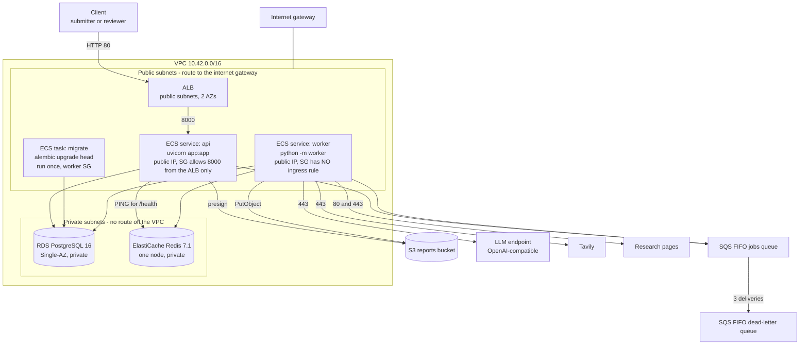

# Deployment — the temporary AWS environment (Phase 5 blocks A, B and C)

**What this is.** The Terraform in `infra/` deploys the two processes this repository already
runs — `uvicorn app:app` and `python -m worker` — onto AWS, together with the four stores they
already use. It is deployed, verified, screenshotted, and destroyed. **Expected life: about an
hour.**

**What this is not.** It is not a high-availability production environment and this document
never claims it is. The database is Single-AZ with no backups, there is one task of each
process, and unless you supply a certificate the load balancer speaks plain HTTP. Each of those
is a deliberate, listed trade with the production alternative written beside it in
[§9](#9-portfolio-versus-production).

**What block B changed** ([ADR 0020](adr/0020-cognito-jwt-validation-and-secret-injection.md)),
because three of block A's listed omissions were one problem:

- **No credential is in a task definition any more.** Secrets arrive through the task
  definition's `secrets` block, which names a Secrets Manager ARN rather than a value; the ECS
  agent fetches it at task start and the application still reads a plain environment variable.
- **RDS generates its own master password.** There is no `db_password` variable, nothing to
  export, and **no database password in `terraform.tfstate`**.
- **Authentication is Cognito by default.** The API verifies an access token itself — same
  `Authorization: Bearer …` header, same two roles, same `Identity` — and holds no shared secret.
  `auth_mode = "api_key"` still selects the Phase 2 key table.
- **HTTPS is available but not created.** Set `certificate_arn` to a certificate you already own
  and port 80 redirects to 443. Leave it empty, which is the default, and see
  [§4.6](#46-the-token-and-what-it-travels-over) for what that costs.

**What block C added** ([ADR 0021](adr/0021-stale-job-reconciliation-and-dlq-recovery.md)),
which is the operational half:

- **Six CloudWatch alarms**, every one of them reading a metric AWS already publishes, plus an
  optional SNS topic with **no subscription** — subscribing is one operator command.
- **Explicit short log retention** on all four log groups, because a group ECS creates on its own
  never expires and that is storage which charges after every task has stopped.
- **Three operator recovery tools** — `reconcile_jobs.py`, `inspect_dlq.py`, `replay_dlq.py` — and
  one `ops` task definition to run them in, because RDS has no public address and a laptop cannot
  reach the database they read.
- **`docs/runbook.md`**, thirteen conditions with a symptom, a place to look, a safe first action
  and what not to do.

**Nothing in this repository deploys anything.** CI formats and validates the Terraform and
never plans or applies. Every command below is run by a person who has decided to run it.

---

## 1. The runtime, mapped

| Local (docker-compose.yml) | AWS | Why this service |
|---|---|---|
| `api` container, `uvicorn app:app` | ECS Fargate service behind an ALB | Serverless containers: no instance to patch for an environment that lives an hour, and the same image runs unchanged |
| `worker` container, `python -m worker` | ECS Fargate service, no load balancer | It serves nothing. Fargate gives it the 120-second stop timeout ARCHITECTURE.md §19 requires |
| `migrate` container, `alembic upgrade head` | ECS task definition, run once with `aws ecs run-task` | guidelines §19: a one-off that must exit 0 before anything relies on the schema. Neither long-running process migrates |
| `postgres:16-alpine` | RDS PostgreSQL 16, `db.t4g.micro`, Single-AZ | The five application tables and LangGraph's checkpoint tables. No extension is required — nothing here uses pgvector |
| `redis:7-alpine` | ElastiCache Redis 7.1, `cache.t4g.micro`, one node | The two caches, the per-job URL set, and the **shared** rate limiter, which is the one that has to be shared |
| LocalStack SQS | SQS FIFO queue + FIFO DLQ | ADR 0010 decision 4: `MessageGroupId = job_id` is what keeps one job to one writer |
| LocalStack S3 | S3 bucket, all public access blocked | `reports/{job_id}.json`, written by the worker, presigned by the API |
| `competitive-research:local` | ECR, one repository, one image | ARCHITECTURE.md §19: one image, two entrypoints — three commands over identical bytes |

**Nothing was redesigned to fit AWS.** The queue attributes, the visibility window, the stop
timeout, the health endpoint, the migration ownership and the checkpointer ownership are the
ones already built in Phase 3.

---

## 2. The network



### Subnets

| | Count | AZs | Route table | What lives there |
|---|---|---|---|---|
| Public | 2 | two | `0.0.0.0/0` → internet gateway | The ALB, and both Fargate services |
| Private | 2 | two | **no routes at all** beyond `local` | RDS and ElastiCache |

**Two AZs, one of everything.** The ALB requires subnets in at least two AZs, and so do the RDS
and ElastiCache subnet groups. The *resources inside them* are deliberately single: `multi_az =
false`, `num_cache_nodes = 1`, `desired_count = 1`. The second AZ is an API requirement, not a
redundancy claim — read it as "AWS refuses to create the subnet group otherwise", not as "this
survives an AZ failure".

### The NAT-gateway decision

**There is no NAT gateway.** [ADR 0019](adr/0019-no-nat-gateway-in-the-temporary-aws-deployment.md)
is the record; the short version:

- The worker **must** reach the open internet — an OpenAI-compatible LLM endpoint, Tavily, and
  arbitrary third-party pages. That requirement does not go away in any design.
- The textbook answer (private subnets + a NAT gateway per AZ) adds roughly as much per-hour
  cost as every other resource here combined, plus per-GB processing, for an environment that
  lives an hour.
- So the two services run in **public subnets with public IPs** and egress through the internet
  gateway directly.

**What replaces the NAT gateway as a control is the security group, not the subnet.** A public
subnet means "has a route to the internet gateway". It does not mean "reachable from the
internet". Specifically:

| Group | Ingress | Egress |
|---|---|---|
| `alb` | 80 from `allowed_ingress_cidrs`, **and 443 from the same range only when a certificate is configured** | 8000 to the `api` group |
| `api` | **8000 from the `alb` group, and nothing else** | 443 anywhere, 53 inside the VPC, 5432 to `postgres`, 6379 to `redis` |
| `worker` | **none — no ingress rule exists** | 80 and 443 anywhere, 53 inside the VPC, 5432 to `postgres`, 6379 to `redis` |
| `postgres` | 5432 from `api` and `worker` **by group reference, never a CIDR** | none |
| `redis` | 6379 from `api` and `worker`, likewise | none |

**The trade, stated plainly:** the tasks have public IP addresses. If a security group were ever
loosened — an ingress rule with a CIDR, an inline `ingress` block — the task would be exposed
directly to the internet rather than protected by a subnet boundary. In a long-running
environment that margin is worth paying a NAT gateway for. For an hour-long deployment whose
security groups are asserted by
[`tests/test_infrastructure_terraform.py`](../tests/test_infrastructure_terraform.py), it is not.

**Also absent, deliberately:** VPC endpoints. Interface endpoints charge per hour per AZ, and
the tasks already have a free path to SQS, S3, ECR and CloudWatch through the internet gateway.
Production would add a gateway endpoint for S3 (free) and interface endpoints for the rest.

---

## 3. Startup order, and why the API is 503 at first

This is the one piece of behaviour that looks like a fault and is not.

`/health` reports three checks: `db`, `redis`, and `checkpoints`. **`checkpoints` is false until
a worker has started**, because LangGraph's checkpoint tables are created by `PostgresSaver.setup()`,
which only the worker calls — Alembic never touches them, and the API never calls `setup()`
(ADR 0012). A deployment whose checkpoint tables do not exist is one in which **no job can run**,
so 503 is the correct answer and the ALB is right not to route to it.

**Block B added nothing to `/health` and must not have.** The three checks are `db`, `redis` and
`checkpoints`; whether Cognito answers is not one of them. A check that failed because an identity
provider was slow would deregister an API that is working, and the API does not contact Cognito
until a caller presents a token — so an unreachable provider is a `401`, which is the correct
answer, rather than a `503` for everyone.

**Nothing here weakens that check to make ECS green.** The API service instead carries
`health_check_grace_period_seconds = 300`, which stops ECS *killing and replacing* the task
during the window. It does **not** make the target healthy and does **not** route traffic.

The order that results:

```text
terraform apply
  ↓
ECS starts the api and worker services in parallel
  ↓
aws ecs run-task  ->  alembic upgrade head  ->  exit 0        (the five application tables)
  ↓
the worker starts: check_queue, check_redis, PostgresSaver.setup()   (the checkpoint tables)
  ↓
/health answers 200                                            (db, redis, checkpoints all true)
  ↓
the ALB target passes 2 checks 15s apart and enters service
  ↓
end-to-end verification can begin
```

**Two failure modes worth recognising rather than debugging twice:**

- The API target never becomes healthy and the worker log says it refused to start → the worker
  is missing a credential, or Redis did not answer. The worker fails closed on Redis by design
  (the shared rate limiter), so no checkpoint tables are created and the API stays 503. Read the
  worker log group first, not the API's.
- `POST /jobs` succeeds and the job stays `queued` forever → the migration has not run, or no
  worker is consuming. `jobs.status = queued` is written by the API; only a worker moves it to
  `running`.

---

## 4. Deploy

**Prerequisites:** Terraform ≥ 1.5, the AWS CLI, Docker, and credentials for an AWS account you
are willing to create and destroy resources in. Nothing below is run automatically.

### 4.1 Set the variables

Every secret is passed through the environment, never a file in the repository. `terraform apply`
refuses to run without them, because none of them has a default.

```bash
export AWS_REGION=ap-south-1
export TF_VAR_llm_base_url='https://.../v1'
export TF_VAR_llm_model='...'
export TF_VAR_llm_api_key='...'
export TF_VAR_tavily_api_key='...'
```

**There is no `TF_VAR_db_password`, and that is block B.** RDS generates the master password into
a Secrets Manager secret it owns, so there is nothing to invent and nothing that could land in
state ([ADR 0020](adr/0020-cognito-jwt-validation-and-secret-injection.md) decision 1).

**There is no `TF_VAR_auth_keys` either, in the default mode.** `auth_mode` defaults to `cognito`,
which creates the user pool and leaves the API holding no shared secret. If you deliberately want
the Phase 2 key table instead, set both:

```bash
export TF_VAR_auth_mode=api_key
export TF_VAR_auth_keys='{"<sha256 of a throwaway key>":{"user_id":"...","role":"reviewer"}}'
```

and generate throwaway keys for it — the two development keys published in `.env.example` must
never be used here:

```bash
python -c "import hashlib,secrets; k=secrets.token_urlsafe(32); print(k, hashlib.sha256(k.encode()).hexdigest())"
```

**Optional: HTTPS.** Only if you already own a validated ACM certificate in this region. Nothing
here creates one — see [§4.6](#46-the-token-and-what-it-travels-over).

```bash
export TF_VAR_certificate_arn='arn:aws:acm:ap-south-1:...:certificate/...'
```

### 4.1a Where each secret ends up

| Value | Where it lives | Who may fetch it | In Terraform state? |
|---|---|---|---|
| Database password | Secrets Manager, **generated and owned by RDS** | the `api`, `worker` and `migrate` execution roles | **No** — Terraform never sees it |
| `LLM_API_KEY` | Secrets Manager, written by Terraform | the `worker` execution role only | Yes — see the warning in [§6](#6-teardown) |
| `TAVILY_API_KEY` | Secrets Manager, written by Terraform | the `worker` execution role only | Yes |
| `AUTH_KEYS` (`api_key` mode only) | Secrets Manager, written by Terraform | the `api` execution role only | Yes |
| Cognito pool id, client id, issuer | Plain task-definition environment | — | Yes, and none of the three is a secret |
| LLM endpoint and model ids | Plain task-definition environment | — | Yes, and none is a secret |

**Nothing inside either container can read a secret.** The application reads environment
variables, exactly as it does locally; the fetch is done by the ECS agent using the *execution*
role before the process starts. Neither task role carries a `secretsmanager` permission at all.

### 4.2 Create the image repository first

The task definitions reference an image tag, so the repository has to exist before the image can
be pushed. One targeted apply, then the full one:

```bash
terraform -chdir=infra init
```

```bash
terraform -chdir=infra apply -target=aws_ecr_repository.app -var image_tag=bootstrap
```

`terraform init` writes `.terraform.lock.hcl`, which pins each provider's version and hash —
commit it, for the same reason `uv.lock` is committed.

### 4.3 Build, tag and push the one image

One image serves the API, the worker and the migration (ARCHITECTURE.md §19). Tag it with the
commit SHA — never only `latest` — because rollback is redeploying the previous task definition
and `latest` cannot name one.

```bash
export IMAGE_TAG=$(git rev-parse --short HEAD)
```

```bash
export ECR_URL=$(terraform -chdir=infra output -raw ecr_repository_url)
```

```bash
aws ecr get-login-password --region "$AWS_REGION" | docker login --username AWS --password-stdin "${ECR_URL%%/*}"
```

```bash
docker build -t "$ECR_URL:$IMAGE_TAG" .
```

```bash
docker push "$ECR_URL:$IMAGE_TAG"
```

The image must be **linux/amd64**: the task definitions declare `X86_64`. On an ARM machine add
`--platform linux/amd64` to the build.

### 4.4 Review, then apply

```bash
terraform -chdir=infra plan -var image_tag="$IMAGE_TAG"
```

```bash
terraform -chdir=infra apply -var image_tag="$IMAGE_TAG"
```

RDS is the slow one — expect roughly 5–10 minutes for the whole apply.

### 4.5 Run the migration, once

```bash
aws ecs run-task \
  --cluster "$(terraform -chdir=infra output -raw ecs_cluster_name)" \
  --task-definition "$(terraform -chdir=infra output -raw migrate_task_definition)" \
  --launch-type FARGATE \
  --network-configuration "awsvpcConfiguration={subnets=[$(terraform -chdir=infra output -json task_subnet_ids | tr -d '[]"' )],securityGroups=[$(terraform -chdir=infra output -raw worker_security_group_id)],assignPublicIp=ENABLED}" \
  --query 'tasks[0].taskArn' --output text
```

Then wait for it and **check the exit code before going further**:

```bash
aws ecs wait tasks-stopped --cluster "$(terraform -chdir=infra output -raw ecs_cluster_name)" --tasks "<taskArn>"
```

```bash
aws ecs describe-tasks --cluster "$(terraform -chdir=infra output -raw ecs_cluster_name)" --tasks "<taskArn>" --query 'tasks[0].containers[0].exitCode'
```

`0` means the schema is current. Anything else: read `/ecs/competitive-research/migrate` and stop
— guidelines §19's rule is that the migration exits 0 *before* anything relies on the schema.

### 4.6 The token, and what it travels over

**Skip this section entirely if you set `auth_mode = "api_key"`** — then the credential is the
key whose hash you put in `TF_VAR_auth_keys`, and the rest of this document works unchanged.

Under the default `cognito` mode there is a user pool with two groups, `reviewer` and
`submitter`, and no users. **Every command below is run by you, deliberately, and nothing in this
repository runs them.** They create one throwaway account for the demo.

```bash
export POOL_ID=$(terraform -chdir=infra output -raw cognito_user_pool_id)
```

```bash
export CLIENT_ID=$(terraform -chdir=infra output -raw cognito_client_id)
```

Pick a throwaway username and generate a password rather than typing one — it has to satisfy the
pool's policy (12 characters, upper, lower, digit, symbol), and a password you invented for a demo
is a password you will reuse:

```bash
export DEMO_USER=demo-reviewer
```

```bash
export DEMO_PASSWORD="$(python -c "import secrets,string; a=string.ascii_letters+string.digits+'!@#%^&*'; print(''.join(secrets.choice(a) for _ in range(20))+'aA1!')")"
```

Create the user, set the password as permanent so there is no first-login challenge, and put them
in the `reviewer` group — which is what makes them a reviewer to the API:

```bash
aws cognito-idp admin-create-user --user-pool-id "$POOL_ID" --username "$DEMO_USER" --message-action SUPPRESS
```

```bash
aws cognito-idp admin-set-user-password --user-pool-id "$POOL_ID" --username "$DEMO_USER" --password "$DEMO_PASSWORD" --permanent
```

```bash
aws cognito-idp admin-add-user-to-group --user-pool-id "$POOL_ID" --username "$DEMO_USER" --group-name reviewer
```

Then exchange the password for a token. **This call goes to Cognito's own HTTPS endpoint, not to
this deployment**, and it needs no AWS credentials:

```bash
export TOKEN=$(aws cognito-idp initiate-auth --client-id "$CLIENT_ID" --auth-flow USER_PASSWORD_AUTH --auth-parameters USERNAME="$DEMO_USER",PASSWORD="$DEMO_PASSWORD" --query 'AuthenticationResult.AccessToken' --output text)
```

**It is the access token and not the id token.** The API accepts exactly one
([ADR 0020](adr/0020-cognito-jwt-validation-and-secret-injection.md) decision 3): the access token
is what says *this bearer may call this API*, and it is the one carrying `cognito:groups` and
`client_id`. An id token here answers `401`.

**A caller with no group is refused.** A user in the pool who is in neither `reviewer` nor
`submitter` authenticates to Cognito perfectly well and gets `401` from this API, which is
deliberate — the group is where the role comes from.

**What a token costs you if it leaks, and why that is bounded.** Without `certificate_arn` the ALB
speaks plain HTTP, so the token is observable in transit — exactly as an API key would be. Three
things bound it: the token expires in **one hour**, which is the intended life of the whole
deployment; `allowed_ingress_cidrs` can be narrowed to your own address; and the account is a
throwaway you delete at teardown. **The password never crosses the ALB at all** — only the token
does.

To upgrade: obtain a certificate for a domain you own, set `TF_VAR_certificate_arn`, re-apply, and
point the domain at the ALB. Port 80 then redirects to 443 and nothing else in this document
changes.

---

## 5. Verify

Fifteen checks, in the order the system actually works. **Ten to prove it works, and five to
prove you could tell if it stopped.**

```bash
export API=$(terraform -chdir=infra output -raw api_url)
```

**Every authenticated call below sends `Authorization: Bearer $TOKEN`**, and that is the same
header in both auth modes — a Cognito access token from [§4.6](#46-the-token-and-what-it-travels-over),
or a Phase 2 API key. That is the whole reason Cognito was a small change: the request contract did
not move. Under `api_key` mode, `export TOKEN=<the plaintext key>` and read on.

*(Earlier revisions of this runbook showed `x-api-key`. The API has never read that header; the
commands below are the ones that work.)*

**1. Migration.** The exit code above is `0`.

**2. API health.** Expect `{"status":"ok","checks":{"db":true,"redis":true,"checkpoints":true}}`.
If `checkpoints` is false, the worker has not started yet — see §3.

```bash
curl -s "$API/health"
```

**3. ALB target health.** `healthy`, not `initial` or `unhealthy`.

```bash
aws elbv2 describe-target-health --target-group-arn "$(aws elbv2 describe-target-groups --names competitive-research-api --query 'TargetGroups[0].TargetGroupArn' --output text)" --query 'TargetHealthDescriptions[].TargetHealth.State'
```

**4. Authentication.** No credential is `401`. So is a made-up one, a token from another
pool, an expired token, and a valid token whose user is in neither group — the API answers
the same way to all of them on purpose. A `submitter` on a reviewer route is `403`.

```bash
curl -s -o /dev/null -w '%{http_code}\n' "$API/jobs/00000000-0000-4000-8000-000000000000"
```

**5. Submit a job.** Expect `201` and `{"job_id": "...", "status": "queued"}`.

```bash
curl -s -X POST "$API/jobs" -H "Authorization: Bearer $TOKEN" -H 'content-type: application/json' \
  -d '{"question":"Compare TCS and Infosys on cloud strategy"}'
```

**6. SQS.** A message was enqueued and is being consumed — `ApproximateNumberOfMessages` drops to
0 and `NotVisible` is 1 while the worker holds it.

```bash
aws sqs get-queue-attributes --queue-url "$(terraform -chdir=infra output -raw jobs_queue_url)" \
  --attribute-names ApproximateNumberOfMessages ApproximateNumberOfMessagesNotVisible
```

**7. Worker.** The status moves `queued → running`, and the log shows the nodes executing.

```bash
aws logs tail /ecs/competitive-research/worker --follow
```

**8. Redis and PostgreSQL.** Both are proven by the job progressing at all: every LLM call takes
a token from the shared limiter (fail-closed — no Redis, no call), and every node writes a
checkpoint and an audit row. `GET /jobs/{id}` showing `revision_count` and a changing `phase` is
that evidence.

**9. The human gate.** The job reaches `awaiting_approval`; read what is being approved, then
approve it.

```bash
curl -s "$API/jobs/$JOB_ID/gate" -H "Authorization: Bearer $TOKEN"
```

```bash
curl -s -X POST "$API/jobs/$JOB_ID/approve" -H "Authorization: Bearer $TOKEN" \
  -H 'content-type: application/json' -d '{"decision":"approve"}'
```

Expect `200 {"status":"running"}` — the gate is answered and the work is queued
([ADR 0011](adr/0011-the-human-gate-resume-moves-to-the-worker.md) decision 5), not the outcome.

**10. S3 and the download.** After the export gate passes, the object exists and the presigned
URL works from outside AWS with no credentials.

```bash
aws s3 ls "s3://$(terraform -chdir=infra output -raw reports_bucket)/reports/"
```

```bash
curl -s "$API/jobs/$JOB_ID/report" -H "Authorization: Bearer $TOKEN"
```

```bash
curl -s "<the url from that response>" | head -c 400
```

**This last one is the point of the whole exercise:** the URL is signed against the real S3
endpoint, so unlike the local stack there is no `S3_PUBLIC_ENDPOINT_URL` and no rewriting — it
resolves and downloads as signed.

### Block C: the operational half

**None of these five needs a job to fail.** Each demonstrates a capability against the healthy
deployment you have just verified, which is the only honest way to demonstrate it — **do not
corrupt a row or delete a checkpoint to produce a symptom.**

**11. The alarms exist and are in a sensible state.** Expect six, all `OK` or
`INSUFFICIENT_DATA` on a deployment that has just run one job. `INSUFFICIENT_DATA` is not a
fault: SQS publishes queue metrics every five minutes and an idle queue publishes nothing.

```bash
aws cloudwatch describe-alarms --alarm-name-prefix competitive-research --query 'MetricAlarms[].[AlarmName,StateValue]' --output table
```

If you want notifications, subscribe now — nothing here created a subscription:

```bash
aws sns subscribe --topic-arn "$(terraform -chdir=infra output -raw alarms_topic_arn)" --protocol email --notification-endpoint you@example.com
```

**12. The reconciler dry-runs clean.** On a healthy deployment this should report zero
candidates, or report a live job as `owned`. **`owned` is the correct answer**, not an obstacle:
it means a worker holds that job's execution fence. The tooling runs as a one-off task, because
RDS has no public address:

```bash
aws ecs run-task --cluster "$CLUSTER" --task-definition "$(terraform -chdir=infra output -raw ops_task_definition)" --launch-type FARGATE --network-configuration "awsvpcConfiguration={subnets=[$(terraform -chdir=infra output -json task_subnet_ids | tr -d '[]\"' )],securityGroups=[$(terraform -chdir=infra output -raw worker_security_group_id)],assignPublicIp=ENABLED}"
```

```bash
aws logs tail /ecs/competitive-research/ops --since 5m
```

**Nothing was written.** The default command is the dry run and `--apply` is absent, which is
what makes running that task by accident harmless.

**13. The DLQ inspection tool answers.** On a healthy deployment the answer is "0 dead-letter
message(s)", and that is the check: the tool reached the queue, read nothing, and released
nothing. Override the command on the same task definition:

```bash
aws ecs run-task --cluster "$CLUSTER" --task-definition "$(terraform -chdir=infra output -raw ops_task_definition)" --launch-type FARGATE --network-configuration "awsvpcConfiguration={subnets=[$(terraform -chdir=infra output -json task_subnet_ids | tr -d '[]\"' )],securityGroups=[$(terraform -chdir=infra output -raw worker_security_group_id)],assignPublicIp=ENABLED}" --overrides '{"containerOverrides":[{"name":"ops","command":["python","scripts/inspect_dlq.py"]}]}'
```

**14. A worker restart is survivable, and this is the one to watch.** Submit a job, wait for the
worker log to show a node executing, then stop the task. The message was never deleted, so it
redelivers; the worker resumes from the checkpoint and does not replay the completed node.

```bash
aws ecs update-service --cluster "$CLUSTER" --service "$(terraform -chdir=infra output -raw worker_service_name)" --force-new-deployment
```

```bash
aws logs tail /ecs/competitive-research/worker --follow
```

What to look for: `delivery 2`, then the job continuing rather than starting again. That is
at-least-once delivery, the checkpoint and the execution fence all working at once, and it is the
single most convincing thing this deployment can show.

**15. The DLQ alarm can be observed, safely.** *Optional, and it is the only step that puts a
message anywhere by hand.* Send one **isolated test message** — a job id that does not exist —
directly to the dead-letter queue, watch the alarm turn, then remove it. It touches no real job
and no database row:

```bash
aws sqs send-message --queue-url "$(terraform -chdir=infra output -raw jobs_dlq_url)" --message-group-id alarm-test --message-deduplication-id "alarm-test-$(date +%s)" --message-body '{"job_id":"00000000-0000-4000-8000-000000000000","user_id":"00000000-0000-4000-8000-000000000000","idempotency_key":"alarm-test"}'
```

Within roughly five minutes the alarm state is `ALARM`. `inspect_dlq.py` will show the message
with `row=missing`, which is exactly right — there is no such job. Then delete it:

```bash
aws sqs receive-message --queue-url "$(terraform -chdir=infra output -raw jobs_dlq_url)" --query 'Messages[0].ReceiptHandle' --output text | xargs -I {} aws sqs delete-message --queue-url "$(terraform -chdir=infra output -raw jobs_dlq_url)" --receipt-handle {}
```

**Do not point this at a real job id.** `replay_dlq.py` would then be operating on a job whose
message was never genuinely dead-lettered, which proves nothing and risks a duplicate delivery.

---

## 6. Teardown

**Take every screenshot first.** `terraform destroy` deletes the report objects with the bucket
(`s3_force_destroy = true`) and skips the RDS final snapshot (`rds_skip_final_snapshot = true`).
Nothing else keeps the evidence.

```bash
terraform -chdir=infra destroy -var image_tag="$IMAGE_TAG"
```

### What destroy covers

| Category | Resource | Notes |
|---|---|---|
| Compute | ECS services (api, worker), the cluster, three task definitions | Task definitions are deregistered, not deleted — deregistered revisions are free |
| Load balancing | ALB, target group, listener | The ALB is a per-hour charge; it is the second most expensive thing here |
| Images | ECR repository **and its images** | `force_delete = true`; without it destroy fails on a non-empty repository |
| Database | RDS instance, subnet group | `skip_final_snapshot` decides whether a snapshot remains |
| Cache | ElastiCache cluster, subnet group | |
| Messaging | Both SQS queues | Free at rest; deleted anyway |
| Storage | S3 bucket **and its objects** | `force_destroy` decides |
| Logs | **Four** CloudWatch log groups | Terraform-managed on purpose — groups ECS creates itself survive destroy |
| Monitoring | **Six CloudWatch alarms and the SNS topic** | Terraform owns all seven; a subscription you added by hand goes with the topic |
| IAM | **Four execution roles**, **three** task roles, and their inline policies | Block B split the execution role per task definition; block C added the `ops` pair |
| Secrets | The LLM key, the search key, and the auth-keys secret in `api_key` mode | `recovery_window_in_days = 0`, so they are **deleted immediately, not scheduled** |
| Cognito | The user pool, its app client, and both groups — **and every user in it** | Deleting the pool deletes the demo account with it |
| Network | VPC, 4 subnets, 2 route tables, internet gateway, 5 security groups | |

### Deletion semantics worth knowing before you rely on them

**Secrets are deleted, not scheduled.** Secrets Manager's default is a 7-to-30-day recovery
window, during which the secret still appears in the console *and* its name cannot be reused —
which is how the second run of a demo fails. `recovery_window_in_days = 0` makes destroy final. It
is the right choice for a temporary environment and the wrong one for anything whose secret you
might need back.

**The RDS-managed database secret is not Terraform's.** RDS created it and RDS deletes it with the
instance. You will not see it in `terraform state list`, and it needs no separate teardown step —
but it does mean the password is unrecoverable the moment the instance goes, which is correct here
and is why `skip_final_snapshot` and this belong in the same conversation.

**The Cognito user pool takes its users with it.** There is no separate cleanup for the demo
account created in [§4.6](#46-the-token-and-what-it-travels-over) — but if you created users in a
pool you intend to keep, delete them first:
`aws cognito-idp admin-delete-user --user-pool-id "$POOL_ID" --username "$DEMO_USER"`.

**A certificate you supplied is not deleted**, and must not be: `certificate_arn` is an input,
Terraform did not create it, and destroy leaves it alone. ACM public certificates are free at rest.

**Messages left in the dead-letter queue go with the queue**, and the queue goes with destroy —
so **read them before you tear down**. `message_retention_seconds` is 14 days, which outlives the
demo and not the deployment. If a dead-lettered message is evidence you want to keep, run
`inspect_dlq.py` and save its output; nothing else preserves it.

**Alarm history is not preserved either.** Deleting an alarm deletes its state-change history, so
a screenshot of `describe-alarms` is the only record that it ever fired.

### The orphan checks

Run these **after** destroy reports success. Each names something that keeps charging.

```bash
terraform -chdir=infra state list
```

Empty is the goal. Then, per category:

```bash
aws rds describe-db-snapshots --snapshot-type manual --query 'DBSnapshots[].DBSnapshotIdentifier'
```

```bash
aws ec2 describe-nat-gateways --query 'NatGateways[?State!=`deleted`].NatGatewayId'
```

```bash
aws ec2 describe-addresses --query 'Addresses[].AllocationId'
```

```bash
aws ec2 describe-network-interfaces --filters Name=description,Values='*ECS*' --query 'NetworkInterfaces[].NetworkInterfaceId'
```

```bash
aws logs describe-log-groups --log-group-name-prefix /ecs/competitive-research --query 'logGroups[].logGroupName'
```

```bash
aws cloudwatch describe-alarms --alarm-name-prefix competitive-research --query 'MetricAlarms[].AlarmName'
```

```bash
aws sns list-topics --query 'Topics[?contains(TopicArn, `competitive-research`)].TopicArn'
```

```bash
aws ecr describe-repositories --query 'repositories[].repositoryName'
```

```bash
aws elbv2 describe-load-balancers --query 'LoadBalancers[].LoadBalancerName'
```

```bash
aws ec2 describe-vpcs --filters Name=tag:Project,Values=competitive-research --query 'Vpcs[].VpcId'
```

```bash
aws secretsmanager list-secrets --include-planned-deletion --query 'SecretList[?starts_with(Name, `competitive-research`)].[Name,DeletedDate]'
```

```bash
aws cognito-idp list-user-pools --max-results 60 --query 'UserPools[?starts_with(Name, `competitive-research`)].Id'
```

**Expected results:** no manual snapshot with this deployment's identifier, **no NAT gateway and
no Elastic IP at all** (this design creates neither, so anything found belongs to something
else), no ECS-described ENI left behind, no `/ecs/competitive-research/*` log group, no
repository, no load balancer, and no VPC carrying the `Project` tag.

**Expected results for the two block B checks:** no secret whose name starts with
`competitive-research` (an entry with a `DeletedDate` means the recovery window is not 0 — check
why), and no user pool with that prefix.

**Expected results for the two block C checks:** no alarm and no topic with that prefix. Both are
Terraform-owned, so anything found means destroy did not finish — re-run it rather than deleting
by hand. **An alarm costs a small amount per month whether or not it ever fires**, and an SNS
topic with a live email subscription outlives the deployment it was watching.

**Orphaned ENIs are the one that bites.** A Fargate task's ENI is deleted with the task, but a
VPC delete that fails usually fails because one ENI is still detaching. Wait a minute and re-run
destroy rather than deleting the VPC by hand.

### The last step, and it is not optional

```bash
rm -f infra/terraform.tfstate infra/terraform.tfstate.backup infra/terraform.tfvars
```

**`terraform.tfstate` is a credential store.** It is plain JSON, it is not encrypted, and after a
successful apply it holds the LLM key, the search key and — in `api_key` mode — the API key table,
because Terraform wrote those values into Secrets Manager and records everything it writes. It is
gitignored, which stops it being committed and does nothing about it sitting on the disk.

**It does not hold the database password**, and that is the one improvement block B made to this
paragraph rather than to the deployment: RDS generated it and Terraform never saw it
([ADR 0020](adr/0020-cognito-jwt-validation-and-secret-injection.md) decision 1).

Delete it once the environment is gone and the orphan checks are clean — the state of a destroyed
deployment describes nothing and protects nothing. Then `unset` the `TF_VAR_*` variables, and
`unset DEMO_PASSWORD` and `TOKEN` if you set them.

---

## 7. Cost

**These are cost *drivers*, not verified prices.** Rates differ by region and change; check the
AWS pricing pages for real numbers. What is reliable here is the **ranking** and the shape of the
risk.

| Resource | Charging model | ~1-hour deployment | If forgotten for a week |
|---|---|---|---|
| **Secrets Manager** | Per secret-month, prorated, plus per 10k API calls | Fractions of a cent for 3 secrets read a handful of times | Cents |
| **Cognito user pool** | Per monthly active user, with a large free tier | **$0** at one demo user | $0 |
| **ACM certificate** | Free for public certificates | $0, and none is created here | $0 |
| **RDS `db.t4g.micro`, Single-AZ** | Per hour + 20 GiB gp3 | Cents | The largest single line |
| **ElastiCache `cache.t4g.micro`** | Per hour | Cents | Comparable to RDS |
| **ALB** | Per hour + LCU | Cents | Charges with **zero traffic and zero tasks** |
| **Fargate** | Per vCPU-second and GB-second, 0.75 vCPU + 1.5 GB total | Cents | Scales with time, not with jobs |
| NAT gateway | Per hour + per GB | **$0 — none exists** | — |
| Elastic IP | Per hour when idle | **$0 — none exists** | — |
| CloudWatch Logs | Ingest + storage | Negligible at 1-day retention | Small but non-zero forever |
| **CloudWatch alarms** | Per alarm-month, prorated | Fractions of a cent for 6 alarms | **A few dollars a year, charging whether or not one ever fires** |
| **SNS topic** | Per million publishes, with a large free tier | **$0** — a topic with no subscription publishes nothing | $0, unless you subscribed something noisy |
| **The `ops` task** | Fargate per second, only while a recovery runs | **$0** unless you ran one; seconds if you did | $0 — nothing starts it |
| ECR storage | Per GB-month | Negligible for 1–2 images | Small but non-zero forever |
| SQS, S3, IGW, security groups, subnets | Per request / per GB | Effectively free at this volume | Effectively free |
| **RDS final snapshot** | Per GB-month | $0 while skipped | **Charges after everything else is gone** |

**The five that keep charging after the tasks stop:** the ALB, RDS, ElastiCache, anything
retained — a snapshot, a log group, an ECR image — and, new in block C, **the alarms**, which bill
per alarm-month regardless of state. The first three are why the destroy step is
part of the procedure rather than an afterthought; the last is why the log groups are
Terraform-managed and `force_delete` is on.

**Block C's own incremental cost for an hour is effectively nothing**: six alarms prorated over
an hour, an SNS topic that publishes nothing, native metrics that are already collected, and a
task that runs for seconds if it runs at all. What it adds to a *forgotten* deployment is the six
alarm-months, which is the one line worth checking after teardown.

**Rough expectation for a one-hour deployment: well under a dollar**, dominated by RDS,
ElastiCache and the ALB in roughly equal parts. **Rough expectation if left running for a month:
tens of dollars**, for exactly the same reason.

**Cost not on this table:** the LLM and Tavily calls the demo job makes. Those are provider
spend, not AWS.

---

## 8. What blocks A, B and C left out

**Block A's four deferrals are closed** ([ADR 0020](adr/0020-cognito-jwt-validation-and-secret-injection.md)):

| Was left out | What block B built |
|---|---|
| Secrets Manager | Three secrets plus the RDS-managed database credential, injected through the task definition's `secrets` block. No credential is in an `environment` entry, and no task role can read one |
| Cognito JWT | A user pool, an app client and two groups; the API verifies the access token itself — algorithm, signature, issuer, expiry, `token_use`, `client_id` — and maps a pool group to a role |
| IAM hardening | Three per-task execution roles instead of one shared, `secretsmanager:GetSecretValue` scoped to each task's own secret ARNs, and `aws:SourceAccount` / `aws:SourceArn` conditions on every trust policy |
| HTTPS | An optional HTTPS listener with a TLS 1.2 floor and an 80 → 443 redirect, from a certificate the operator supplies |

**What block B deliberately did not build**, each because it needs something outside this
configuration or costs more than an hour-long environment can justify:

| Left out | Why, and where it belongs |
|---|---|
| An ACM certificate, a domain, a Route 53 hosted zone | A public certificate needs a validated domain this repository does not own, and a hosted zone charges per month. **Supply an ARN instead** — §4.6 |
| A customer-managed KMS key | RDS storage, the bucket and every secret are already encrypted with AWS-managed keys, at no cost and with no grants. A CMK is a per-month charge and two more grants |
| Automated secret rotation | Rotation is a schedule, and a schedule needs an environment that outlives an hour. The values here are throwaway and the deployment is destroyed; `ignore_changes = [secret_string]` already permits manual rotation |
| MFA on the user pool | Right for an account that can approve an export, and also a phone number or an authenticator enrolment for a demo account that lives an hour |
| A permissions boundary, CloudTrail data events | Both need account-level setup this configuration cannot make on its own |
| ALB `authenticate-cognito` | Evaluated and rejected: a browser redirect flow with a session cookie, for an API whose callers are scripts. ADR 0020 decision 4 |
| A remote Terraform backend | One operator, one laptop, one apply. See §9 for when that stops being true |
| API Gateway in front of the ALB, autoscaling | Later, and only with a requirement behind each |

**Block C's three deferrals are closed** ([ADR 0021](adr/0021-stale-job-reconciliation-and-dlq-recovery.md)):

| Was left out | What block C built |
|---|---|
| CloudWatch alarms | Six, all on native metrics, plus an optional SNS topic with no subscription. **No dashboard** — a second place to keep true, for six alarms already visible in the console |
| Stale-job and DLQ recovery (ADR 0010 decision 9's sweep) | `reconcile_jobs.py`, `inspect_dlq.py` and `replay_dlq.py`, run as one-off `ops` tasks. Age selects a candidate and never authorises a change; every mutation needs the per-job execution fence, a fresh reread and outcome-specific evidence |
| Retention | Explicit 1-day log retention on all four groups, 14-day DLQ retention, no S3 expiry, and **no automatic database cleanup** |

**What block C deliberately did not build**, each for a stated reason:

| Left out | Why, and where it belongs |
|---|---|
| ECS `RunningTaskCount` alarms | The metric lives in the `ECS/ContainerInsights` namespace, which is a per-metric charge. The ALB unhealthy-target and queue-age alarms answer the same two questions from metrics already published free |
| A CloudWatch dashboard | Six alarms are already visible in the console, and a dashboard is a second place to keep true |
| A Lambda or EventBridge-scheduled reconciler | An always-on service, its own role and its own failure mode, for an environment that lives an hour |
| Automatic DLQ redrive (`StartMessageMoveTask`) | It cannot inspect a job's durable state before moving a message, and it moves all of them. A blind redrive is the outage that produced them, repeated |
| Gate expiry — closing a review nobody answered | Still deferred, and deliberately not reachable by the sweep: `awaiting_approval` is not a candidate status at all. It is a policy decision about someone else's review, not an engineering gap |
| An S3 expiry rule and a `RETENTION_DAYS` database sweep | Both would delete, on a schedule, the evidence the deployment exists to produce |

---

## 9. Portfolio versus production

| | This deployment | A long-running production deployment |
|---|---|---|
| Subnets for tasks | Public, with public IPs and restrictive security groups | Private, with controlled egress: a NAT gateway (or an egress-filtering proxy) plus VPC endpoints for S3, ECR, SQS and Logs |
| Database | Single-AZ, no backups, no final snapshot, no deletion protection | Multi-AZ, 7–35 day backups, deletion protection on, final snapshot on destroy |
| Cache | One node, no replica, no TLS, no auth token, `redis://` | Replication group with automatic failover, in-transit encryption and an auth token — `rediss://`, which `Redis.from_url` already understands, so still no code change |
| API tasks | 1 | 2+ across AZs, so a task restart is invisible |
| Worker tasks | 1 | 2, fixed (ARCHITECTURE.md §18). **Never autoscaled on queue depth** — the bound is the LLM rate limit |
| Entry | ALB on HTTP unless a certificate is supplied | HTTPS with an ACM certificate and a domain you own, HTTP redirecting; API Gateway in front if throttling and JWT authorization are wanted |
| Secrets | Secrets Manager, injected as `secrets`, **written by Terraform** and so present in state | Secrets Manager, populated out of band with `put-secret-value` and rotated on a schedule; a customer-managed KMS key with grants to the three execution roles |
| Authentication | Cognito access tokens, one hour, no MFA, one throwaway user | Cognito with MFA, a real user directory or federation, and shorter-lived tokens behind an authorizing gateway |
| Terraform state | Local file, gitignored, **deleted at teardown** | S3 backend with DynamoDB locking and bucket encryption, so two operators cannot apply at once and no credential sits on a laptop |
| Image tags | Commit SHA, mutable repository | Commit SHA, **immutable** repository — a tag that can move is a rollback target that can lie |
| Monitoring | Six alarms on native metrics, four log groups at 1-day retention, no dashboard | The same six plus **Container Insights** for real ECS task-count alarms, a 5xx *rate* rather than a count, ~30-day retention, and the §14 dashboard |
| Alerting | One SNS topic, no subscription — the alarms are read in the console | A subscription to a rota, and a distinction between what pages and what waits until morning |
| Operational recovery | Three scripts an operator runs as one-off tasks, all dry-run by default | The same three, run the same way. **This is not a shape production should change** — a reconciler that mutates durable state on a schedule, with nobody reading its evidence, is a worse idea at scale than at demo scale |
| Retention | 1-day logs, 14-day DLQ, no S3 expiry, no database sweep | 30-day logs; an S3 lifecycle rule matched to `RETENTION_DAYS`; the retention sweep itself, which is the one thing here that genuinely needs building |
| Deploy | `terraform apply` from a laptop | CI builds and pushes on merge; migration task, then service update, then watch the alarms (guidelines §19) |

**What does not change between the two columns**, and this is the part worth saying out loud in
an interview: the queue semantics, the visibility lease, the per-job execution fence, the
migration ownership, the checkpointer ownership, the health contract, the 120-second stop
timeout, and the presigned-URL behaviour. Those are properties of the application, and the
deployment shape does not get a vote.
