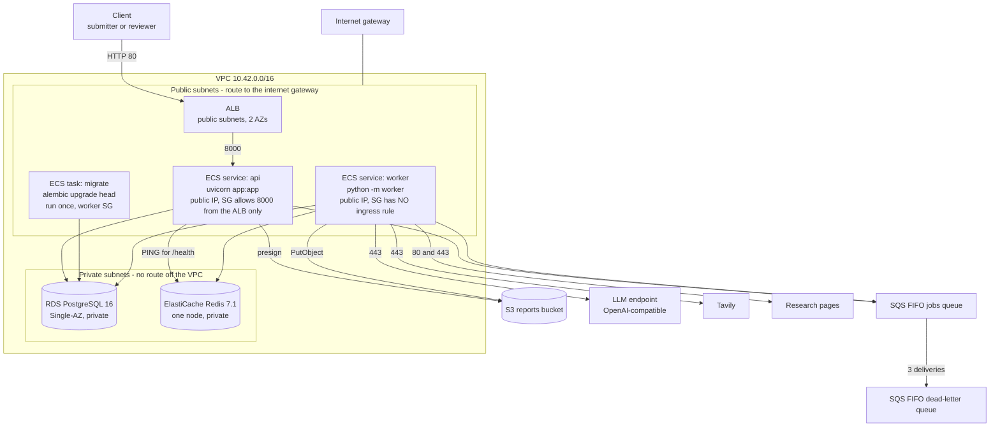

# Deployment — the temporary AWS environment (Phase 5 block A)

**What this is.** The Terraform in `infra/` deploys the two processes this repository already
runs — `uvicorn app:app` and `python -m worker` — onto AWS, together with the four stores they
already use. It is deployed, verified, screenshotted, and destroyed. **Expected life: about an
hour.**

**What this is not.** It is not a high-availability production environment and this document
never claims it is. The database is Single-AZ with no backups, there is one task of each
process, the load balancer speaks plain HTTP, and every credential is a plaintext environment
variable in a task definition. Each of those is a deliberate, listed trade with the production
alternative written beside it in [§9](#9-portfolio-versus-production).

**Nothing in this repository deploys anything.** CI formats and validates the Terraform and
never plans or applies. Every command below is run by a person who has decided to run it.

---

## 1. The runtime, mapped

| Local (docker-compose.yml) | AWS | Why this service |
|---|---|---|
| `api` container, `uvicorn app:app` | ECS Fargate service behind an ALB | Serverless containers: no instance to patch for an environment that lives an hour, and the same image runs unchanged |
| `worker` container, `python -m worker` | ECS Fargate service, no load balancer | It serves nothing. Fargate gives it the 120-second stop timeout ARCHITECTURE.md §19 requires |
| `migrate` container, `alembic upgrade head` | ECS task definition, run once with `aws ecs run-task` | guidelines §19: a one-off that must exit 0 before anything relies on the schema. Neither long-running process migrates |
| `postgres:16-alpine` | RDS PostgreSQL 16, `db.t4g.micro`, Single-AZ | The five application tables and LangGraph's checkpoint tables. No extension is required — nothing here uses pgvector |
| `redis:7-alpine` | ElastiCache Redis 7.1, `cache.t4g.micro`, one node | The two caches, the per-job URL set, and the **shared** rate limiter, which is the one that has to be shared |
| LocalStack SQS | SQS FIFO queue + FIFO DLQ | ADR 0010 decision 4: `MessageGroupId = job_id` is what keeps one job to one writer |
| LocalStack S3 | S3 bucket, all public access blocked | `reports/{job_id}.json`, written by the worker, presigned by the API |
| `competitive-research:local` | ECR, one repository, one image | ARCHITECTURE.md §19: one image, two entrypoints — three commands over identical bytes |

**Nothing was redesigned to fit AWS.** The queue attributes, the visibility window, the stop
timeout, the health endpoint, the migration ownership and the checkpointer ownership are the
ones already built in Phase 3.

---

## 2. The network



### Subnets

| | Count | AZs | Route table | What lives there |
|---|---|---|---|---|
| Public | 2 | two | `0.0.0.0/0` → internet gateway | The ALB, and both Fargate services |
| Private | 2 | two | **no routes at all** beyond `local` | RDS and ElastiCache |

**Two AZs, one of everything.** The ALB requires subnets in at least two AZs, and so do the RDS
and ElastiCache subnet groups. The *resources inside them* are deliberately single: `multi_az =
false`, `num_cache_nodes = 1`, `desired_count = 1`. The second AZ is an API requirement, not a
redundancy claim — read it as "AWS refuses to create the subnet group otherwise", not as "this
survives an AZ failure".

### The NAT-gateway decision

**There is no NAT gateway.** [ADR 0019](adr/0019-no-nat-gateway-in-the-temporary-aws-deployment.md)
is the record; the short version:

- The worker **must** reach the open internet — an OpenAI-compatible LLM endpoint, Tavily, and
  arbitrary third-party pages. That requirement does not go away in any design.
- The textbook answer (private subnets + a NAT gateway per AZ) adds roughly as much per-hour
  cost as every other resource here combined, plus per-GB processing, for an environment that
  lives an hour.
- So the two services run in **public subnets with public IPs** and egress through the internet
  gateway directly.

**What replaces the NAT gateway as a control is the security group, not the subnet.** A public
subnet means "has a route to the internet gateway". It does not mean "reachable from the
internet". Specifically:

| Group | Ingress | Egress |
|---|---|---|
| `alb` | 80 from `allowed_ingress_cidrs` | 8000 to the `api` group |
| `api` | **8000 from the `alb` group, and nothing else** | 443 anywhere, 53 inside the VPC, 5432 to `postgres`, 6379 to `redis` |
| `worker` | **none — no ingress rule exists** | 80 and 443 anywhere, 53 inside the VPC, 5432 to `postgres`, 6379 to `redis` |
| `postgres` | 5432 from `api` and `worker` **by group reference, never a CIDR** | none |
| `redis` | 6379 from `api` and `worker`, likewise | none |

**The trade, stated plainly:** the tasks have public IP addresses. If a security group were ever
loosened — an ingress rule with a CIDR, an inline `ingress` block — the task would be exposed
directly to the internet rather than protected by a subnet boundary. In a long-running
environment that margin is worth paying a NAT gateway for. For an hour-long deployment whose
security groups are asserted by
[`tests/test_infrastructure_terraform.py`](../tests/test_infrastructure_terraform.py), it is not.

**Also absent, deliberately:** VPC endpoints. Interface endpoints charge per hour per AZ, and
the tasks already have a free path to SQS, S3, ECR and CloudWatch through the internet gateway.
Production would add a gateway endpoint for S3 (free) and interface endpoints for the rest.

---

## 3. Startup order, and why the API is 503 at first

This is the one piece of behaviour that looks like a fault and is not.

`/health` reports three checks: `db`, `redis`, and `checkpoints`. **`checkpoints` is false until
a worker has started**, because LangGraph's checkpoint tables are created by `PostgresSaver.setup()`,
which only the worker calls — Alembic never touches them, and the API never calls `setup()`
(ADR 0012). A deployment whose checkpoint tables do not exist is one in which **no job can run**,
so 503 is the correct answer and the ALB is right not to route to it.

**Nothing here weakens that check to make ECS green.** The API service instead carries
`health_check_grace_period_seconds = 300`, which stops ECS *killing and replacing* the task
during the window. It does **not** make the target healthy and does **not** route traffic.

The order that results:

```text
terraform apply
  ↓
ECS starts the api and worker services in parallel
  ↓
aws ecs run-task  ->  alembic upgrade head  ->  exit 0        (the five application tables)
  ↓
the worker starts: check_queue, check_redis, PostgresSaver.setup()   (the checkpoint tables)
  ↓
/health answers 200                                            (db, redis, checkpoints all true)
  ↓
the ALB target passes 2 checks 15s apart and enters service
  ↓
end-to-end verification can begin
```

**Two failure modes worth recognising rather than debugging twice:**

- The API target never becomes healthy and the worker log says it refused to start → the worker
  is missing a credential, or Redis did not answer. The worker fails closed on Redis by design
  (the shared rate limiter), so no checkpoint tables are created and the API stays 503. Read the
  worker log group first, not the API's.
- `POST /jobs` succeeds and the job stays `queued` forever → the migration has not run, or no
  worker is consuming. `jobs.status = queued` is written by the API; only a worker moves it to
  `running`.

---

## 4. Deploy

**Prerequisites:** Terraform ≥ 1.5, the AWS CLI, Docker, and credentials for an AWS account you
are willing to create and destroy resources in. Nothing below is run automatically.

### 4.1 Set the variables

Every secret is passed through the environment, never a file in the repository. `terraform apply`
refuses to run without them, because none of them has a default.

```bash
export AWS_REGION=ap-south-1
export TF_VAR_db_password='...'
export TF_VAR_llm_base_url='https://.../v1'
export TF_VAR_llm_model='...'
export TF_VAR_llm_api_key='...'
export TF_VAR_tavily_api_key='...'
export TF_VAR_auth_keys='{"<sha256 of a throwaway key>":{"user_id":"...","role":"reviewer"}}'
```

**Generate throwaway API keys for this deployment.** The ALB speaks plain HTTP, so a key sent to
it travels in clear text, and the two development keys published in `.env.example` must never be
used here.

```bash
python -c "import hashlib,secrets; k=secrets.token_urlsafe(32); print(k, hashlib.sha256(k.encode()).hexdigest())"
```

### 4.2 Create the image repository first

The task definitions reference an image tag, so the repository has to exist before the image can
be pushed. One targeted apply, then the full one:

```bash
terraform -chdir=infra init
```

```bash
terraform -chdir=infra apply -target=aws_ecr_repository.app -var image_tag=bootstrap
```

`terraform init` writes `.terraform.lock.hcl`, which pins each provider's version and hash —
commit it, for the same reason `uv.lock` is committed.

### 4.3 Build, tag and push the one image

One image serves the API, the worker and the migration (ARCHITECTURE.md §19). Tag it with the
commit SHA — never only `latest` — because rollback is redeploying the previous task definition
and `latest` cannot name one.

```bash
export IMAGE_TAG=$(git rev-parse --short HEAD)
```

```bash
export ECR_URL=$(terraform -chdir=infra output -raw ecr_repository_url)
```

```bash
aws ecr get-login-password --region "$AWS_REGION" | docker login --username AWS --password-stdin "${ECR_URL%%/*}"
```

```bash
docker build -t "$ECR_URL:$IMAGE_TAG" .
```

```bash
docker push "$ECR_URL:$IMAGE_TAG"
```

The image must be **linux/amd64**: the task definitions declare `X86_64`. On an ARM machine add
`--platform linux/amd64` to the build.

### 4.4 Review, then apply

```bash
terraform -chdir=infra plan -var image_tag="$IMAGE_TAG"
```

```bash
terraform -chdir=infra apply -var image_tag="$IMAGE_TAG"
```

RDS is the slow one — expect roughly 5–10 minutes for the whole apply.

### 4.5 Run the migration, once

```bash
aws ecs run-task \
  --cluster "$(terraform -chdir=infra output -raw ecs_cluster_name)" \
  --task-definition "$(terraform -chdir=infra output -raw migrate_task_definition)" \
  --launch-type FARGATE \
  --network-configuration "awsvpcConfiguration={subnets=[$(terraform -chdir=infra output -json task_subnet_ids | tr -d '[]"' )],securityGroups=[$(terraform -chdir=infra output -raw worker_security_group_id)],assignPublicIp=ENABLED}" \
  --query 'tasks[0].taskArn' --output text
```

Then wait for it and **check the exit code before going further**:

```bash
aws ecs wait tasks-stopped --cluster "$(terraform -chdir=infra output -raw ecs_cluster_name)" --tasks "<taskArn>"
```

```bash
aws ecs describe-tasks --cluster "$(terraform -chdir=infra output -raw ecs_cluster_name)" --tasks "<taskArn>" --query 'tasks[0].containers[0].exitCode'
```

`0` means the schema is current. Anything else: read `/ecs/competitive-research/migrate` and stop
— guidelines §19's rule is that the migration exits 0 *before* anything relies on the schema.

---

## 5. Verify

Ten checks, in the order the system actually works.

```bash
export API=$(terraform -chdir=infra output -raw api_url)
```

**1. Migration.** The exit code above is `0`.

**2. API health.** Expect `{"status":"ok","checks":{"db":true,"redis":true,"checkpoints":true}}`.
If `checkpoints` is false, the worker has not started yet — see §3.

```bash
curl -s "$API/health"
```

**3. ALB target health.** `healthy`, not `initial` or `unhealthy`.

```bash
aws elbv2 describe-target-health --target-group-arn "$(aws elbv2 describe-target-groups --names competitive-research-api --query 'TargetGroups[0].TargetGroupArn' --output text)" --query 'TargetHealthDescriptions[].TargetHealth.State'
```

**4. Authentication.** No key is `401`; a submitter key on a reviewer route is `403`.

```bash
curl -s -o /dev/null -w '%{http_code}\n' "$API/jobs/00000000-0000-4000-8000-000000000000"
```

**5. Submit a job.** Expect `201` and `{"job_id": "...", "status": "queued"}`.

```bash
curl -s -X POST "$API/jobs" -H "x-api-key: $SUBMITTER_KEY" -H 'content-type: application/json' \
  -d '{"question":"Compare TCS and Infosys on cloud strategy"}'
```

**6. SQS.** A message was enqueued and is being consumed — `ApproximateNumberOfMessages` drops to
0 and `NotVisible` is 1 while the worker holds it.

```bash
aws sqs get-queue-attributes --queue-url "$(terraform -chdir=infra output -raw jobs_queue_url)" \
  --attribute-names ApproximateNumberOfMessages ApproximateNumberOfMessagesNotVisible
```

**7. Worker.** The status moves `queued → running`, and the log shows the nodes executing.

```bash
aws logs tail /ecs/competitive-research/worker --follow
```

**8. Redis and PostgreSQL.** Both are proven by the job progressing at all: every LLM call takes
a token from the shared limiter (fail-closed — no Redis, no call), and every node writes a
checkpoint and an audit row. `GET /jobs/{id}` showing `revision_count` and a changing `phase` is
that evidence.

**9. The human gate.** The job reaches `awaiting_approval`; read what is being approved, then
approve it.

```bash
curl -s "$API/jobs/$JOB_ID/gate" -H "x-api-key: $REVIEWER_KEY"
```

```bash
curl -s -X POST "$API/jobs/$JOB_ID/approve" -H "x-api-key: $REVIEWER_KEY" \
  -H 'content-type: application/json' -d '{"decision":"approve"}'
```

Expect `200 {"status":"running"}` — the gate is answered and the work is queued
([ADR 0011](adr/0011-the-human-gate-resume-moves-to-the-worker.md) decision 5), not the outcome.

**10. S3 and the download.** After the export gate passes, the object exists and the presigned
URL works from outside AWS with no credentials.

```bash
aws s3 ls "s3://$(terraform -chdir=infra output -raw reports_bucket)/reports/"
```

```bash
curl -s "$API/jobs/$JOB_ID/report" -H "x-api-key: $REVIEWER_KEY"
```

```bash
curl -s "<the url from that response>" | head -c 400
```

**This last one is the point of the whole exercise:** the URL is signed against the real S3
endpoint, so unlike the local stack there is no `S3_PUBLIC_ENDPOINT_URL` and no rewriting — it
resolves and downloads as signed.

---

## 6. Teardown

**Take every screenshot first.** `terraform destroy` deletes the report objects with the bucket
(`s3_force_destroy = true`) and skips the RDS final snapshot (`rds_skip_final_snapshot = true`).
Nothing else keeps the evidence.

```bash
terraform -chdir=infra destroy -var image_tag="$IMAGE_TAG"
```

### What destroy covers

| Category | Resource | Notes |
|---|---|---|
| Compute | ECS services (api, worker), the cluster, three task definitions | Task definitions are deregistered, not deleted — deregistered revisions are free |
| Load balancing | ALB, target group, listener | The ALB is a per-hour charge; it is the second most expensive thing here |
| Images | ECR repository **and its images** | `force_delete = true`; without it destroy fails on a non-empty repository |
| Database | RDS instance, subnet group | `skip_final_snapshot` decides whether a snapshot remains |
| Cache | ElastiCache cluster, subnet group | |
| Messaging | Both SQS queues | Free at rest; deleted anyway |
| Storage | S3 bucket **and its objects** | `force_destroy` decides |
| Logs | Three CloudWatch log groups | Terraform-managed on purpose — groups ECS creates itself survive destroy |
| IAM | Execution role, two task roles, two inline policies | |
| Network | VPC, 4 subnets, 2 route tables, internet gateway, 5 security groups | |

### The orphan checks

Run these **after** destroy reports success. Each names something that keeps charging.

```bash
terraform -chdir=infra state list
```

Empty is the goal. Then, per category:

```bash
aws rds describe-db-snapshots --snapshot-type manual --query 'DBSnapshots[].DBSnapshotIdentifier'
```

```bash
aws ec2 describe-nat-gateways --query 'NatGateways[?State!=`deleted`].NatGatewayId'
```

```bash
aws ec2 describe-addresses --query 'Addresses[].AllocationId'
```

```bash
aws ec2 describe-network-interfaces --filters Name=description,Values='*ECS*' --query 'NetworkInterfaces[].NetworkInterfaceId'
```

```bash
aws logs describe-log-groups --log-group-name-prefix /ecs/competitive-research --query 'logGroups[].logGroupName'
```

```bash
aws ecr describe-repositories --query 'repositories[].repositoryName'
```

```bash
aws elbv2 describe-load-balancers --query 'LoadBalancers[].LoadBalancerName'
```

```bash
aws ec2 describe-vpcs --filters Name=tag:Project,Values=competitive-research --query 'Vpcs[].VpcId'
```

**Expected results:** no manual snapshot with this deployment's identifier, **no NAT gateway and
no Elastic IP at all** (this design creates neither, so anything found belongs to something
else), no ECS-described ENI left behind, no `/ecs/competitive-research/*` log group, no
repository, no load balancer, and no VPC carrying the `Project` tag.

**Orphaned ENIs are the one that bites.** A Fargate task's ENI is deleted with the task, but a
VPC delete that fails usually fails because one ENI is still detaching. Wait a minute and re-run
destroy rather than deleting the VPC by hand.

Finally, `unset` the `TF_VAR_*` variables, and delete `infra/terraform.tfvars` if one was
created — it holds the credentials.

---

## 7. Cost

**These are cost *drivers*, not verified prices.** Rates differ by region and change; check the
AWS pricing pages for real numbers. What is reliable here is the **ranking** and the shape of the
risk.

| Resource | Charging model | ~1-hour deployment | If forgotten for a week |
|---|---|---|---|
| **RDS `db.t4g.micro`, Single-AZ** | Per hour + 20 GiB gp3 | Cents | The largest single line |
| **ElastiCache `cache.t4g.micro`** | Per hour | Cents | Comparable to RDS |
| **ALB** | Per hour + LCU | Cents | Charges with **zero traffic and zero tasks** |
| **Fargate** | Per vCPU-second and GB-second, 0.75 vCPU + 1.5 GB total | Cents | Scales with time, not with jobs |
| NAT gateway | Per hour + per GB | **$0 — none exists** | — |
| Elastic IP | Per hour when idle | **$0 — none exists** | — |
| CloudWatch Logs | Ingest + storage | Negligible at 1-day retention | Small but non-zero forever |
| ECR storage | Per GB-month | Negligible for 1–2 images | Small but non-zero forever |
| SQS, S3, IGW, security groups, subnets | Per request / per GB | Effectively free at this volume | Effectively free |
| **RDS final snapshot** | Per GB-month | $0 while skipped | **Charges after everything else is gone** |

**The four that keep charging after the tasks stop:** the ALB, RDS, ElastiCache, and anything
retained — a snapshot, a log group, an ECR image. The first three are why the destroy step is
part of the procedure rather than an afterthought; the last is why the log groups are
Terraform-managed and `force_delete` is on.

**Rough expectation for a one-hour deployment: well under a dollar**, dominated by RDS,
ElastiCache and the ALB in roughly equal parts. **Rough expectation if left running for a month:
tens of dollars**, for exactly the same reason.

**Cost not on this table:** the LLM and Tavily calls the demo job makes. Those are provider
spend, not AWS.

---

## 8. What Block A intentionally left out

| Left out | Where it belongs |
|---|---|
| Secrets Manager. Every credential is a plaintext task-definition environment variable, readable by anyone who can call `ecs:DescribeTaskDefinition` | **Block B**, with `secrets`/`valueFrom` and `secretsmanager:GetSecretValue` on the execution role |
| Cognito JWT. Authentication is still the Phase 2 API-key table | **Block B** |
| IAM hardening — trust-policy conditions (`aws:SourceArn`), a permissions boundary, a customer-managed KMS key. What exists is minimum-functional least privilege: named actions, scoped to this deployment's queue and `reports/*` | **Block B** |
| HTTPS, ACM, Route 53, a custom domain | **Block B** |
| CloudWatch alarms and dashboards — DLQ depth, task count, RDS connections | **Block C** |
| Stale-job and DLQ operational recovery (ADR 0010 decision 9's sweep) | **Block C** |
| Retention beyond minimal safe defaults — an S3 lifecycle expiry, the `RETENTION_DAYS` sweep | **Block C** |
| API Gateway in front of the ALB, autoscaling, a remote Terraform backend | Later, and only with a requirement behind each |

---

## 9. Portfolio versus production

| | This deployment | A long-running production deployment |
|---|---|---|
| Subnets for tasks | Public, with public IPs and restrictive security groups | Private, with controlled egress: a NAT gateway (or an egress-filtering proxy) plus VPC endpoints for S3, ECR, SQS and Logs |
| Database | Single-AZ, no backups, no final snapshot, no deletion protection | Multi-AZ, 7–35 day backups, deletion protection on, final snapshot on destroy |
| Cache | One node, no replica, no TLS, no auth token, `redis://` | Replication group with automatic failover, in-transit encryption and an auth token — `rediss://`, which `Redis.from_url` already understands, so still no code change |
| API tasks | 1 | 2+ across AZs, so a task restart is invisible |
| Worker tasks | 1 | 2, fixed (ARCHITECTURE.md §18). **Never autoscaled on queue depth** — the bound is the LLM rate limit |
| Entry | ALB on HTTP | HTTPS with an ACM certificate and a domain, HTTP redirecting to HTTPS; API Gateway in front if throttling and JWT authorization are wanted |
| Secrets | Plaintext task-definition environment | Secrets Manager, injected as `secrets`, rotated |
| Terraform state | Local file, gitignored | S3 backend with DynamoDB locking, so two operators cannot apply at once |
| Image tags | Commit SHA, mutable repository | Commit SHA, **immutable** repository — a tag that can move is a rollback target that can lie |
| Monitoring | Three log groups at 1-day retention | CloudWatch alarms on DLQ depth, task count, RDS connections and 5xx rate; longer retention; the §14 dashboard |
| Deploy | `terraform apply` from a laptop | CI builds and pushes on merge; migration task, then service update, then watch the alarms (guidelines §19) |

**What does not change between the two columns**, and this is the part worth saying out loud in
an interview: the queue semantics, the visibility lease, the per-job execution fence, the
migration ownership, the checkpointer ownership, the health contract, the 120-second stop
timeout, and the presigned-URL behaviour. Those are properties of the application, and the
deployment shape does not get a vote.
